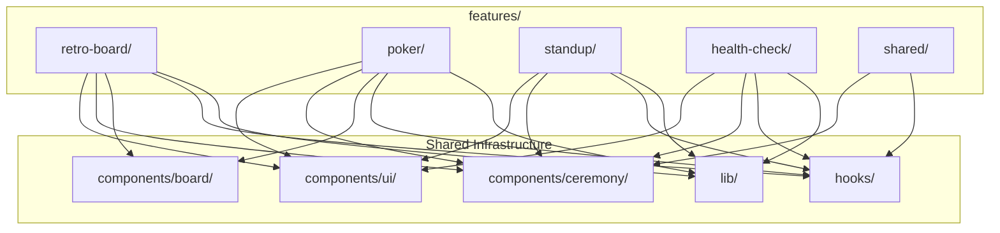
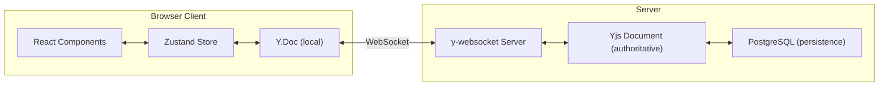
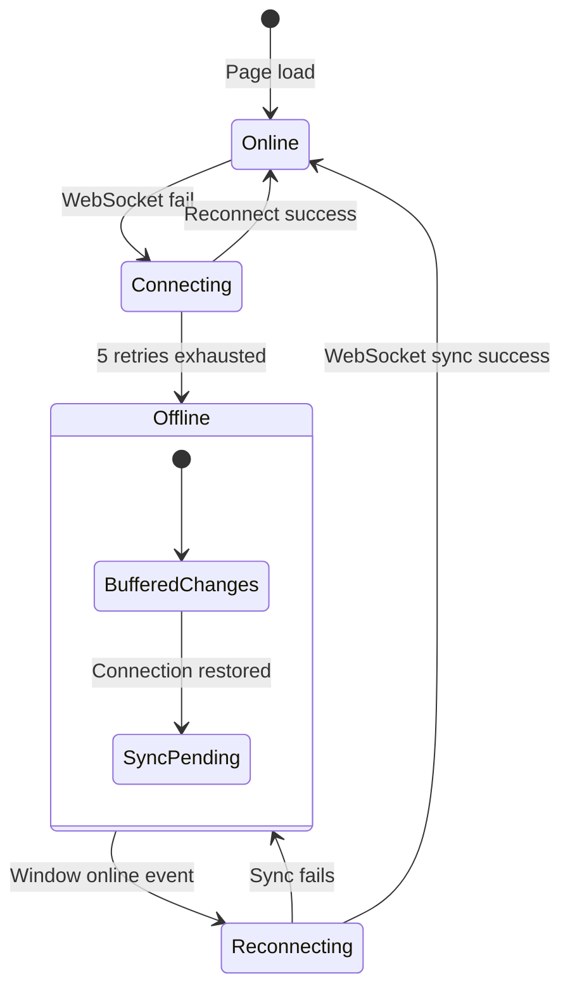
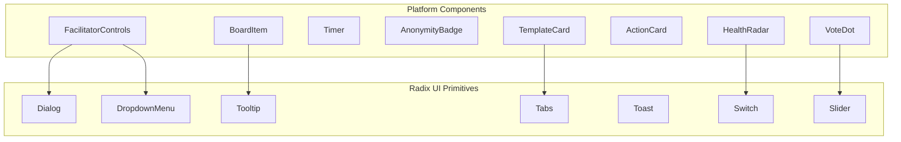
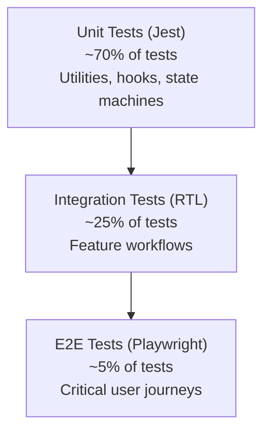

# Frontend Architecture Document
## Scrum Ceremony Platform — Frontend

---

**Document Version:** 1.0.0  
**Status:** Draft  
**Author:** Frontend Architecture Team  
**Last Updated:** June 2026  
**Audience:** Frontend Engineers, Solution Architects, UI/UX Engineering  
**Classification:** Internal

---

## Table of Contents

1. [Frontend Architecture Overview](#1-frontend-architecture-overview)
2. [Technology Stack](#2-technology-stack)
3. [Project Structure](#3-project-structure)
4. [Feature-Based Architecture](#4-feature-based-architecture)
5. [Real-Time Board Implementation](#5-real-time-board-implementation)
6. [Ceremony State Management](#6-ceremony-state-management)
7. [Component Library](#7-component-library)
8. [Anonymous Interaction Layer](#8-anonymous-interaction-layer)
9. [Responsive Design](#9-responsive-design)
10. [Performance Budget](#10-performance-budget)
11. [Accessibility (a11y)](#11-accessibility-a11y)
12. [Design System](#12-design-system)
13. [Testing Strategy](#13-testing-strategy)

---

## 1. Frontend Architecture Overview

### 1.1 Architectural Philosophy

The frontend follows a **feature-driven modular monorepo** architecture built on Next.js 15's App Router. The core design principle is **progressive enhancement by ceremony type** — a team member can participate in a retro with a basic browser, while a Scrum Master on desktop gets rich facilitation controls.

### 1.2 Monorepo Structure

```
scrum-ceremony-platform/
├── apps/
│   └── web/                    # Next.js 15 application
│       ├── app/                # App Router pages & layouts
│       ├── features/           # Feature modules
│       ├── components/         # Shared UI component library
│       ├── lib/                # Utility functions & configs
│       ├── hooks/              # Shared custom hooks
│       ├── stores/             # Zustand store modules
│       └── styles/             # Global styles & Tailwind config
├── packages/
│   ├── ui/                     # Shared Radix UI component primitives
│   ├── ceremony-types/         # TypeScript type definitions
│   ├── yjs-protocol/           # Yjs document model & sync helpers
│   └── testing-utils/          # Shared test factories & mocks
├── turbo.json                  # Turborepo configuration
└── package.json                # Root workspace config
```

### 1.3 App Router Layout

```mermaid
graph TD
    A[Root Layout<br/>app/layout.tsx] --> B[Auth Provider]
    A --> C[Query Provider]
    A --> D[Yjs Provider]
    A --> E[Theme Provider]
    
    B --> F[App Shell]
    C --> F
    D --> F
    E --> F
    
    F --> G[Route Groups]
    G --> H[(public)/<br/>Landing, Auth]
    G --> I[(app)/<br/>Dashboard, Ceremonies, Teams]
    G --> J[(ceremony)/<br/>Active ceremony room]
    G --> K[api/<br/>API routes]
    
    I --> L[Parallel Routes<br/>@board @facilitator @insights]
    J --> L
```

### 1.4 CSR vs SSR Boundaries

| Route Pattern | Rendering Strategy | Justification |
|---|---|---|
| `/`, `/pricing`, `/about` | **SSG** (Static Generation) | Marketing pages — cacheable, SEO-critical |
| `/login`, `/signup` | **SSR** with Clerk | Auth pages — user-specific, security-sensitive |
| `/dashboard` | **SSR + Streaming** | Personalized data, role-based layout |
| `/teams/[teamId]` | **ISR** (revalidate: 60s) | Team data changes infrequently |
| `/ceremonies/[id]` | **CSR** (Client-Side Rendered) | Real-time collaborative; SSR not useful |
| `/ceremonies/[id]/summary` | **SSR + Streaming** | AI summary streamed from server |
| `/settings/**` | **SSR** | User-specific configuration |
| `/api/**` | **Edge/Node Runtime** | Server-side API routes |

**Hybrid Strategy for Ceremony Room:**
```typescript
// app/ceremonies/[id]/page.tsx
export const dynamic = 'force-dynamic';

export default async function CeremonyPage({ params }) {
  // SSR: Load ceremony metadata for SEO & initial payload
  const ceremony = await getCeremonyMetadata(params.id);
  
  return (
    <CeremonyProvider ceremony={ceremony}>
      {/* CSR: Real-time collaborative board */}
      <CeremonyRoom ceremonyId={params.id} />
    </CeremonyProvider>
  );
}
```

---

## 2. Technology Stack

### 2.1 Core Dependencies

| Technology | Version | Purpose | Selection Rationale |
|---|---|---|---|
| **Next.js** | 15.x | Framework | App Router, RSC, streaming SSR, edge runtime |
| **React** | 19.x | UI library | Concurrent features, use() hook, improved Suspense |
| **TypeScript** | 5.4+ | Type safety | Strict mode, template literal types for routes |
| **TailwindCSS** | 4.x | Styling | Zero-runtime, CSS-first config, container queries |
| **Radix UI** |latest | Accessible primitives | WAI-ARIA compliant, composable, unstyled primitives |
| **Yjs** | 13.x | CRDT engine | Conflict-free real-time collaboration |
| **y-websocket** | 2.x | WebSocket provider | Standard Yjs WebSocket sync protocol |
| **XState** | 5.x | Ceremony FSM | Visual state modeling, guard conditions, actor model |
| **Zustand** | 5.x | Client state | Minimal boilerplate, React 19 concurrent compatible |
| **TanStack Query** | 5.x | Server state | Background refetching, optimistic updates, caching |
| **Clerk** | latest | Authentication | React components, JWT hooks, organizations |
| **Valtio** | 2.x | Proxy state | Snapshot-free state for Yjs document binding |

### 2.2 Supporting Libraries

| Library | Purpose |
|---|---|
| `react-beautiful-dnd` / `@dnd-kit` | Drag-and-drop for board items (mobile-friendly) |
| `framer-motion` | Layout animations, phase transitions |
| `date-fns` | Date formatting for action due dates |
| `lucide-react` | Consistent icon system |
| `zod` | Runtime validation for API responses |
| `@radix-ui/react-dialog` | Modal dialogs (facilitator controls) |
| `@radix-ui/react-toast` | Notification toasts |
| `@radix-ui/react-tabs` | Multi-panel ceremony room |
- **Next.js 15** — File-based routing, React Server Components streaming, edge runtime for geographically close API routes.
- **React 19** — Concurrent rendering for smooth interactions while Yjs syncs in background, `use()` hook for promise resolution in render.
- **TailwindCSS 4** — CSS-first configuration, zero build-time overhead, native CSS nesting, container queries for responsive board.
- **Radix UI** — Accessible dropdown menus, dialogs, tabs, tooltips, and accordions out-of-the-box with WAI-ARIA patterns.
- **Yjs + y-websocket** — Conflict-free replicated data types enabling real-time collaborative editing without merge conflicts.
- **XState** — Explicit finite state machine modeling ceremony phases with enforced transitions, side effects, and guard conditions.
- **Zustand** — Lightweight global state for UI concerns like sidebar open, user preferences, and anonymous identity.
- **TanStack React Query** — Declarative server state management with caching, background refetch, and optimistic mutations.

### 2.2 Dependency Justification

**Why XState over custom useReducer?**
- Explicit state machine prevents impossible states (e.g., voting during brainstorm phase)
- Guard conditions are testable in isolation
- Visual statechart enables product team to review ceremony flows
- Built-in support for "invoked services" (async phase transitions)

**Why Zustand over Redux?**
- 80% less boilerplate
- No provider wrapping needed
- Direct mutation in actions (simpler mental model)
- TypeScript inference without complex type gymnastics

**Why Radix UI over Material UI?**
- Unstyled primitives → complete design control
- Smaller bundle (tree-shakeable per component)
- First-class accessibility (tested with screen readers)
- No `@mui/material` 500KB penalty

---

## 3. Project Structure

### 3.1 Directory Layout

```
apps/web/
├── app/                          # Next.js App Router
│   ├── (public)/                 # Public pages (no auth required)
│   │   ├── page.tsx              # Landing page
│   │   ├── pricing/page.tsx
│   │   └── layout.tsx
│   ├── (auth)/                   # Authentication routes
│   │   ├── login/page.tsx
│   │   ├── signup/page.tsx
│   │   └── layout.tsx
│   ├── (app)/                    # Authenticated app shell
│   │   ├── layout.tsx            # App shell (sidebar + header)
│   │   ├── dashboard/page.tsx
│   │   ├── teams/[teamId]/page.tsx
│   │   ├── actions/page.tsx
│   │   ├── templates/page.tsx
│   │   └── settings/page.tsx
│   ├── (ceremony)/               # Ceremony room (real-time)
│   │   └── ceremonies/[id]/
│   │       ├── page.tsx          # Metadata shell (SSR)
│   │       ├── layout.tsx        # Ceremony layout with providers
│   │       ├── loading.tsx       # Suspense skeleton
│   │       ├── error.tsx         # Error boundary
│   │       ├── @board/           # Parallel route: board view
│   │       │   └── page.tsx
│   │       ├── @facilitator/     # Parallel route: facilitator panel
│   │       │   └── page.tsx
│   │       └── @insights/        # Parallel route: AI insights
│   │           └── page.tsx
│   ├── api/                      # Server-side API routes
│   │   ├── v1/                   # API versioning
│   │   ├── auth/[...clerk]/      # Clerk auth handlers
│   │   └── webhooks/
│   ├── globals.css               # Global styles entry
│   └── layout.tsx                # Root layout (providers)
├── features/                     # Feature modules (by ceremony type)
│   ├── retro-board/              # Retrospective feature
│   ├── poker/                    # Planning poker feature
│   ├── standup/                  # Daily standup feature
│   ├── health-check/             # Team health check feature
│   └── shared/                   # Cross-ceremony features
├── components/                   # Shared UI components
│   ├── board/                   # Board-specific components
│   ├── ceremony/                 # Ceremony-phase components
│   ├── layout/                   # Layout components
│   └── ui/                       # Base Radix UI wrappers
├── hooks/                        # Shared React hooks
│   ├── use-yjs.ts               # Yjs document binding
│   ├── use-ceremony.ts          # Ceremony state hook
│   ├── use-presence.ts          # Presence awareness hook
│   └── use-offline.ts           # Offline detection
├── lib/                          # Utility libraries
│   ├── api-client.ts            # Fetch wrapper with auth
│   ├── yjs-provider.ts          # Yjs WebSocket provider factory
│   ├── xstate/                  # XState machine definitions
│   └── utils.ts                 # General utilities
├── stores/                       # Zustand stores
│   ├── auth-store.ts
│   ├── ui-store.ts
│   └── ceremony-store.ts
├── styles/                       # Style configurations
│   └── tailwind/                # Tailwind theme extensions
└── types/                        # Global TypeScript types
    ├── ceremony.ts
    ├── board.ts
    └── api.ts
```

### 3.2 Feature Module Structure

Each ceremony feature module follows a consistent internal structure:

```
features/retro-board/
├── components/                  # Feature-specific React components
│   ├── RetroBoard.tsx           # Main board component
│   ├── StickyNote.tsx           # Individual note component
│   ├── NoteGroup.tsx            # Grouped notes cluster
│   ├── VoteDots.tsx             # Voting interface
│   ├── Timer.tsx                # Phase timer
│   └── PhaseIndicator.tsx       # Current phase display
├── hooks/                       # Feature-specific hooks
│   ├── use-retro-board.ts       # Board data & actions
│   ├── use-voting.ts            # Voting state & logic
│   └── use-phase-transition.ts  # Phase advance logic
├── lib/                         # Feature utilities
│   ├── clustering.ts            # Client-side clustering preview
│   └── animation.ts             # Layout animation helpers
├── stores/                      # Feature-specific stores
│   └── retro-store.ts           # Zustand store for retro state
├── types/                       # Feature-specific types
│   └── retro.ts
└── index.ts                     # Public API barrel export
```

---

## 4. Feature-Based Architecture

### 4.1 Feature Isolation Principles

| Principle | Implementation |
|---|---|
| **Domain-first grouping** | All retro-related code in `features/retro-board/` |
| **Explicit public APIs** | Each feature has an `index.ts` barrel with exports |
| **No cross-feature imports** | Features import only from `components/`, `hooks/`, `lib/` |
| **Lazy loading boundaries** | Each feature is a dynamic import in the ceremony router |

### 4.2 Feature Module Map



### 4.3 Ceremony Feature Specifications

#### 4.3.1 Retro Board (`features/retro-board/`)

| Aspect | Specification |
|---|---|
| **Board columns** | Configurable (default: "What went well", "What didn't", "Action items") |
| **Note creation** | Double-click to add, submit with Enter, auto-expand textarea |
| **Drag-and-drop** | `@dnd-kit/core` for reordering and cross-column movement |
| **Grouping** | Drag notes onto each other to create clusters; AI suggests groupings |
| **Voting** | Dot voting with configurable dot count (3 per person by default) |
| **Anonymity** | Author hidden during brainstorm; optionally revealed after voting |
| **Facilitator controls** | Phase advance, timer, focus mode (highlight one group), export |

#### 4.3.2 Planning Poker (`features/poker/`)

| Aspect | Specification |
|---|---|
| **Card deck** | Fibonacci (1,2,3,5,8,13,21,34,?,∞,☕) |
| **Reveal mechanism** | All votes hidden until facilitator reveals |
| **Consensus detection** | Visual indicator when votes are unanimous or spread |
| **Story source** | Manual entry or Jira issue import |
| **History** | Round-by-round comparison for the same story |

#### 4.3.3 Daily Standup (`features/standup/`)

| Aspect | Specification |
|---|---|
| **Async mode** | Team members post updates before standup time |
| **Sync mode** | Round-robin speaking with timer per person |
| **Blocker spotlight** | Blockers highlighted and auto-create action items |
| **Parking lot** | Off-topic items captured for later discussion |
| **Integration** | Slack prompt 2 hours before standup |

#### 4.3.4 Health Check (`features/health-check/`)

| Aspect | Specification |
|---|---|
| **Radar axes** | Customizable (default: Learning, Speed, Quality, Fun, Purpose) |
| **Scoring** | 1-5 scale per axis with anonymous submission |
| **Trend view** | Spider/radar chart showing current vs previous |
| **Trigger** | Scheduled monthly or pre-sprint-start |

### 4.4 Dynamic Feature Loading

```typescript
// app/(ceremony)/ceremonies/[id]/layout.tsx
import { notFound } from 'next/navigation';
import { Suspense } from 'react';

const CEREMONY_COMPONENTS: Record<CeremonyType, () => Promise<{ default: ComponentType }>> = {
  retro: () => import('@/features/retro-board'),
  poker: () => import('@/features/poker'),
  standup: () => import('@/features/standup'),
  'health-check': () => import('@/features/health-check'),
};

export default async function CeremonyLayout({ params, children }) {
  const ceremony = await getCeremonyType(params.id);
  
  if (!ceremony) notFound();
  
  const CeremonyComponent = CEREMONY_COMPONENTS[ceremony.type];
  
  return (
    <Suspense fallback={<CeremonySkeleton />}>
      <CeremonyComponent>
        {children}
      </CeremonyComponent>
    </Suspense>
  );
}
```

---

## 5. Real-Time Board Implementation

### 5.1 Yjs Document Architecture



### 5.2 Yjs Document Shape

```typescript
// lib/yjs/document-schema.ts
import * as Y from 'yjs';

export interface BoardDocument {
  // Y.Map per column → array of Y.Maps (sticky notes)
  columns: Y.Map<Y.Array<Y.Map<any>>>;
  
  // Y.Map of clusters: cluster_id → Y.Map
  clusters: Y.Map<{
    name: string;
    color: string;
    notes: Y.Array<string>; // note IDs
  }>;
  
  // Y.Map of votes: user_id → Y.Map(columnId, count)
  votes: Y.Map<Y.Map<number>>;
  
  // Y.Doc metadata
  metadata: Y.Map<{
    ceremonyId: string;
    phase: Phase;
    isAnonymous: boolean;
    facilitatorId: string;
  }>;
}

// Usage
export function createBoardDocument(ceremonyId: string): Y.Doc {
  const doc = new Y.Doc();
  
  const columns = doc.getMap('columns');
  columns.set('went-well', new Y.Array());
  columns.set('went-badly', new Y.Array());
  columns.set('action-items', new Y.Array());
  
  const metadata = doc.getMap('metadata');
  metadata.set('ceremonyId', ceremonyId);
  metadata.set('phase', 'brainstorm');
  
  return doc;
}
```

### 5.3 React Integration via useSyncExternalStore

```typescript
// hooks/use-yjs.ts
import { useSyncExternalStore, useCallback } from 'react';
import * as Y from 'yjs';

export function useYjsArray<T>(yArray: Y.Array<T>): T[] {
  const subscribe = useCallback(
    (callback: () => void) => {
      yArray.observe(callback);
      return () => yArray.unobserve(callback);
    },
    [yArray]
  );
  
  const getSnapshot = useCallback(() => yArray.toArray(), [yArray]);
  
  return useSyncExternalStore(subscribe, getSnapshot);
}

// Usage in component
function BoardColumn({ columnId, column }: { columnId: string; column: Y.Array<Y.Map<any>> }) {
  const items = useYjsArray(column);
  
  return (
    <div className="board-column">
      {items.map((item, index) => (
        <StickyNote key={item.get('id')} item={item} index={index} />
      ))}
    </div>
  );
}
```

### 5.4 WebSocket Provider with Reconnection

```typescript
// lib/yjs-provider.ts
import { WebsocketProvider } from 'y-websocket';
import { WebsocketConnection } from '@/lib/yjs-advanced-provider';

interface ProviderConfig {
  roomName: string;
  authToken: string;
  onStatusChange: (status: 'connected' | 'connecting' | 'disconnected') => void;
  onSync: () => void;
}

export function createWebSocketProvider(config: ProviderConfig): WebsocketConnection {
  const wsBase = process.env.NEXT_PUBLIC_WS_URL || 'wss://api.scrumplatform.internal/ws';
  
  const provider = new WebsocketConnection(
    wsBase,
    config.roomName,
    {
      params: { token: config.authToken },
      onStatus: (event: { status: string }) => {
        config.onStatusChange(event.status as any);
      },
      onSync: () => {
        config.onSync }
  );
  
  // Custom exponential backoff reconnect
  provider.on('connection-error', (event) => {
    console.error('[YWS] Connection error:', event);
  });
  
  provider.on('connection-close', (event) => {
    if (!event.wasClean) {
      // Automatic reconnect is built into y-websocket
      // but we add offline indicator
      config.onStatusChange('disconnected');
    }
  });
  
  return provider;
}
```

### 5.5 Presence Awareness

```typescript
// hooks/use-presence.ts
import { useEffect } from 'react';
import { useStore } from '@/stores/ceremony-store';

interface PresenceState {
  user: {
    id: string;
    name: string;
    avatar?: string;
    role: 'facilitator' | 'participant';
  };
  cursor?: { x: number; y: number };
  activeItem?: string;
  voteCount: number;
}

export function usePresence(roomName: string, user: UserContext) {
  const provider = useYjsProvider(roomName);
  const setParticipants = useStore((s) => s.setParticipants);
  
  useEffect(() => {
    const awareness = provider.awareness;
    
    // Announce self
    awareness.setLocalState<PresenceState>({
      user: {
        id: user.id,
        name: user.isAnonymous ? 'Anonymous' : user.name,
        avatar: user.isAnonymous ? undefined : user.avatar,
        role: user.role,
      },
      voteCount: 0,
    });
    
    // Listen for others
    const handleChange = () => {
      const participants = Array.from(awareness.getStates().values());
      setParticipants(participants);
    };
    
    awareness.on('change', handleChange);
    return () => awareness.off('change', handleChange);
  }, [provider, user]);
  
  // Update cursor position
  const updateCursor = useCallback((x: number, y: number) => {
    provider.awareness.setLocalStateField('cursor', { x, y });
  }, [provider]);
  
  return { updateCursor };
}
```

### 5.6 Reconnect Handling

```typescript
// hooks/use-offline.ts
import { useState, useEffect } from 'react';

export function useOffline() {
  const [isOffline, setIsOffline] = useState(false);
  
  useEffect(() => {
    const handleOnline = () => {
      setIsOffline(false);
      // Yjs provider auto-reconnects; show "Reconnected" toast
      toast.success('Reconnected — your changes are syncing');
    };
    
    const handleOffline = () => {
      setIsOffline(true);
      toast.warning('You're offline — changes will sync when reconnected');
    };
    
    window.addEventListener('online', handleOnline);
    window.addEventListener('offline', handleOffline);
    
    return () => {
      window.removeEventListener('online', handleOnline);
      window.removeEventListener('offline', handleOffline);
    };
  }, []);
  
  return { isOffline };
}
```

### 5.7 Offline Detection



### 5.8 Board Item Rendering with Virtual Scrolling

```typescript
// components/board/VirtualBoardColumn.tsx
import { useVirtualizer } from '@tanstack/react-virtual';
import { useRef } from 'react';
import { useYjsArray } from '@/hooks/use-yjs';

interface VirtualBoardColumnProps {
  column: Y.Array<Y.Map<any>>;
  columnId: string;
}

export function VirtualBoardColumn({ column, columnId }: VirtualBoardColumnProps) {
  const parentRef = useRef<HTMLDivElement>(null);
  const items = useYjsArray(column);
  
  const virtualizer = useVirtualizer({
    count: items.length,
    getScrollElement: () => parentRef.current,
    estimateSize: () => 120, // Estimated note height
    overscan: 5,
  });
  
  return (
    <div ref={parentRef} className="board-column h-full overflow-auto">
      <div style={{ height: `${virtualizer.getTotalSize()}px` }} className="relative">
        {virtualizer.getVirtualItems().map((virtualItem) => {
          const item = items[virtualItem.index];
          return (
            <div
              key={item.get('id')}
              className="absolute left-0 w-full"
              style={{
                transform: `translateY(${virtualItem.start}px)`,
              }}
            >
              <StickyNote
                item={item}
                columnId={columnId}
                isAnonymous={item.get('isAnonymous')}
              />
            </div>
          );
        })}
      </div>
    </div>
  );
}
```

---

## 6. Ceremony State Management

### 6.1 XState Machine Definition

```typescript
// lib/xstate/ceremony-machine.ts
import { setup, fromCallback, assign } from 'xstate';
import { CeremonyType, Phase, PhaseEvent } from '@/types/ceremony';

export const ceremonyMachine = setup({
  types: {} as {
    context: {
      ceremonyId: string;
      type: CeremonyType;
      phase: Phase;
      previousPhase: Phase | null;
      timerEndsAt: number | null;
      transitions: Array<{ from: Phase; to: Phase; event: PhaseEvent }>;
    };
    events:
      | { type: 'START' }
      | { type: 'NEXT_PHASE' }
      | { type: 'PREV_PHASE' }
      | { type: 'GO_TO_PHASE'; phase: Phase }
      | { type: 'TIMER_EXPIRED' }
      | { type: 'COMPLETE' }
      | { type: 'CANCEL' };
  },
  
  guards: {
    canTransition: ({ context, event }) => {
      if (event.type !== 'GO_TO_PHASE' && event.type !== 'NEXT_PHASE') return true;
      return context.allowedTransitions?.includes(event.phase) ?? false;
    },
    isTimerActive: ({ context }) => {
      return context.timerEndsAt !== null && Date.now() < context.timerEndsAt;
    },
    isFacilitator: ({ context, event }) => {
      // Check if current user has facilitator role
      return true; // Simplified; real implementation checks context
    },
  },
  
  actors: {
    phaseTimer: fromCallback<{ type: 'TIMER_EXPIRED' }>(({ sendBack }) => {
      const timeout = setTimeout(() => {
        sendBack({ type: 'TIMER_EXPIRED' });
      }, 60000); // Configurable per phase
      
      return () => clearTimeout(timeout);
    }),
  },
  
  schemas: {},
}).createMachine({
  id: 'ceremony',
  initial: 'idle',
  
  context: ({ input }) => ({
    ceremonyId: input.ceremonyId,
    type: input.type,
    phase: 'idle',
    previousPhase: null,
    timerEndsAt: null,
    transitions: [],
  }),
  
  states: {
    idle: {
      on: {
        START: {
          target: 'active',
          actions: assign({
            phase: 'brainstorm',
          }),
        },
      },
    },
    
    active: {
      initial: 'brainstorm',
      
      states: {
        brainstorm: {
          entry: 'startPhaseTimer',
          exit: 'stopPhaseTimer',
          on: {
            NEXT_PHASE: 'grouping',
            TIMER_EXPIRED: {
              target: 'grouping',
              actions: 'showTimerExpiredToast',
            },
          },
        },
        
        grouping: {
          entry: 'startPhaseTimer',
          exit: 'stopPhaseTimer',
          on: {
            PREV_PHASE: 'brainstorm',
            NEXT_PHASE: 'voting',
          },
        },
        
        voting: {
          entry: 'startPhaseTimer',
          exit: 'stopPhaseTimer',
          on: {
            PREV_PHASE: 'grouping',
            NEXT_PHASE: 'discussion',
          },
        },
        
        discussion: {
          entry: 'startPhaseTimer',
          exit: 'stopPhaseTimer',
          on: {
            PREV_PHASE: 'voting',
            NEXT_PHASE: 'actions',
          },
        },
        
        actions: {
          entry: 'startPhaseTimer',
          exit: 'stopPhaseTimer',
          on: {
            PREV_PHASE: 'discussion',
            NEXT_PHASE: 'completed',
          },
        },
      },
      
      on: {
        COMPLETE: 'completed',
        CANCEL: 'cancelled',
      },
    },
    
    completed: {
      type: 'final',
      entry: 'onCeremonyComplete',
    },
    
    cancelled: {
      type: 'final',
    },
  },
});
```

### 6.2 Phase Transition UI

```typescript
// components/ceremony/PhaseTransition.tsx
import { motion, AnimatePresence } from 'framer-motion';
import { useCeremonyPhase } from '@/hooks/use-ceremony';

const PHASE_LABELS: Record<Phase, string> = {
  brainstorm: 'Brainstorming',
  grouping: 'Grouping',
  voting: 'Voting',
  discussion: 'Discussion',
  actions: 'Action Items',
};

const PHASE_DESCRIPTIONS: Record<Phase, string> = {
  brainstorm: 'Share your thoughts freely — all ideas welcome',
  grouping: 'Cluster similar items and find themes',
  voting: 'Allocate your dots to prioritize topics',
  discussion: 'Discuss top-voted items in detail',
  actions: 'Define concrete, assignable action items',
};

export function PhaseTransition({ phase, onTransitionComplete }: PhaseProps) {
  return (
    <AnimatePresence mode="wait">
      <motion.div
        key={phase}
        initial={{ opacity: 0, y: 20 }}
        animate={{ opacity: 1, y: 0 }}
        exit={{ opacity: 0, y: -20 }}
        transition={{ duration: 0.4, ease: 'easeInOut' }}
        className="phase-banner"
      >
        <h2 className="phase-title">
          <PhaseIcon phase={phase} />
          {PHASE_LABELS[phase]}
        </h2>
        <p className="phase-description">{PHASE_DESCRIPTIONS[phase]}</p>
        
        <CountdownTimer onComplete={onTransitionComplete} />
        
        <button
          className="btn-primary"
          onClick={onTransitionComplete}
        >
          Start {PHASE_LABELS[phase]}
        </button>
      </motion.div>
    </AnimatePresence>
  );
}
```

### 6.3 Guard Condition Feedback

```typescript
// components/ceremony/GuardFeedback.tsx
interface GuardFeedbackProps {
  guardFailed: string;
  context: Record<string, unknown>;
}

export function GuardFeedback({ guardFailed, context }: GuardFeedbackProps) {
  const messages: Record<string, string> = {
    'mustBeFacilitator': 'Only the Scrum Master can advance phases',
    'phaseTimerLocked': 'Timer must finish before advancing',
    'minimumItemsRequired': `Need at least ${context.minItems} items before proceeding`,
    'votingClosed': 'Voting is locked during this phase',
    'boardLocked': 'Board is read-only during this phase',
  };
  
  return (
    <motion.div
      role="alert"
      initial={{ opacity: 0, x: -10 }}
      animate={{ opacity: 1, x: 0 }}
      className="guard-feedback bg-warning-50 border-warning-200 border rounded-md p-3"
    >
      <InfoIcon className="text-warning-500" />
      <span>{messages[guardFailed] || 'Action not available'}</span>
    </motion.div>
  );
}
```

### 6.4 Timer UI

```typescript
// components/ceremony/Timer.tsx
import { useEffect, useState } from 'react';
import { motion } from 'framer-motion';

interface TimerProps {
  durationSeconds: number;
  onExpire: () => void;
  isPaused?: boolean;
  showWarningAt?: number; // seconds remaining
}

export function Timer({ durationSeconds, onExpire, isPaused = false, showWarningAt = 30 }: TimerProps) {
  const [remaining, setRemaining] = useState(durationSeconds);
  const [isWarning, setIsWarning] = useState(false);
  
  useEffect(() => {
    if (isPaused) return;
    
    const interval = setInterval(() => {
      setRemaining((prev) => {
        if (prev <= 1) {
          clearInterval(interval);
          onExpire();
          return 0;
        }
        return prev - 1;
      });
    }, 1000);
    
    return () => clearInterval(interval);
  }, [isPaused, onExpire]);
  
  useEffect(() => {
    setIsWarning(remaining <= showWarningAt);
  }, [remaining, showWarningAt]);
  
  const minutes = Math.floor(remaining / 60);
  const seconds = remaining % 60;
  const progress = remaining / durationSeconds;
  
  return (
    <div className={`timer ${isWarning ? 'timer--warning' : ''}`}>
      <svg className="timer-ring" viewBox="0 0 36 36">
        <motion.circle
          cx="18"
          cy="18"
          r="15.915"
          fill="none"
          strokeWidth="2"
          stroke={isWarning ? 'var(--color-warning)' : 'var(--color-primary)'}
          strokeDasharray={`${progress * 100} 100`}
          initial={{ strokeDashoffset: 0 }}
          animate={{ strokeDashoffset: 100 - (progress * 100) }}
          transition={{ duration: 0.5 }}
        />
      </svg>
      <time className="timer-display" aria-live="polite">
        {minutes}:{seconds.toString().padStart(2, '0')}
      </time>
    </div>
  );
}
```

---

## 7. Component Library

### 7.1 Component Hierarchy



### 7.2 BoardItem Component

```typescript
// components/board/BoardItem.tsx
import { motion } from 'framer-motion';
import { useSortable } from '@dnd-kit/sortable';
import { CSS } from '@dnd-kit/utilities';
import * as Tooltip from '@radix-ui/react-tooltip';

interface BoardItemProps {
  id: string;
  content: string;
  votes: number;
  voters?: Array<{ id: string; name: string }>;
  isAnonymous: boolean;
  author?: { id: string; name: string; avatar?: string };
  color?: 'yellow' | 'blue' | 'green' | 'pink' | 'purple';
  isHighlighted?: boolean;
  clusterId?: string;
}

export const BoardItem = ({
  id,
  content,
  votes,
  voters = [],
  isAnonymous,
  author,
  color = 'yellow',
  isHighlighted,
}: BoardItemProps) => {
  const { attributes, listeners, setNodeRef, transform, transition, isDragging } = useSortable({ id });
  
  const style = {
    transform: CSS.Transform.toString(transform),
    transition,
  };
  
  return (
    <Tooltip.Root>
      <Tooltip.Trigger asChild>
        <motion.div
          ref={setNodeRef}
          style={style}
          layout
          initial={{ opacity: 0, scale: 0.9 }}
          animate={{ 
            opacity: 1, 
            scale: 1,
            boxShadow: isHighlighted ? '0 0 0 2px var(--color-primary)' : undefined 
          }}
          exit={{ opacity: 0, scale: 0.9 }}
          whileHover={{ scale: 1.02 }}
          className={`board-item board-item--${color} ${isDragging ? 'board-item--dragging' : ''}`}
          {...attributes}
          {...listeners}
        >
          <p className="board-item__content">{content}</p>
          
          <div className="board-item__footer">
            {!isAnonymous && author && (
              <span className="board-item__author">{author.name}</span>
            )}
            
            <div className="board-item__votes">
              {Array.from({ length: Math.min(votes, 5) }).map((_, i) => (
                <VoteDot key={i} filled />
              ))}
              {votes > 5 && <span className="vote-count">+{votes - 5}</span>}
            </div>
          </div>
        </motion.div>
      </Tooltip.Trigger>
      
      <Tooltip.Portal>
        <Tooltip.Content className="tooltip-content">
          {voters.length > 0 && (
            <div>
              <strong>Voted by:</strong>
              {voters.map((v) => (
                <span key={v.id}>{v.name}</span>
              ))}
            </div>
          )}
          <Tooltip.Arrow />
        </Tooltip.Content>
      </Tooltip.Portal>
    </Tooltip.Root>
  );
};
```

### 7.3 VoteDot Component

```typescript
// components/board/VoteDot.tsx
interface VoteDotProps {
  filled?: boolean;
  color?: string;
  onClick?: () => void;
  disabled?: boolean;
  ariaLabel?: string;
}

export function VoteDot({ filled = false, color, onClick, disabled, ariaLabel }: VoteDotProps) {
  const Component = onClick ? 'button' : 'span';
  
  return (
    <Component
      className={`vote-dot ${filled ? 'vote-dot--filled' : 'vote-dot--empty'}`}
      style={color ? { '--dot-color': color } : undefined}
      onClick={onClick}
      disabled={disabled}
      aria-label={ariaLabel || (filled ? 'Voted' : 'Not voted')}
      role={onClick ? 'checkbox' : undefined}
      aria-checked={onClick ? filled : undefined}
    >
      <svg viewBox="0 0 24 24" className="vote-dot__icon">
        <circle cx="12" cy="12" r="10" />
      </svg>
    </Component>
  );
}
```

### 7.4 FacilitatorControls Component

```typescript
// components/ceremony/FacilitatorControls.tsx
import * as Dialog from '@radix-ui/react-dialog';
import * as DropdownMenu from '@radix-ui/react-dropdown-menu';

interface FacilitatorControlsProps {
  ceremonyId: string;
  currentPhase: Phase;
  canAdvancePhase: boolean;
  onAdvancePhase: () => void;
  onPrevPhase: () => void;
  onSetTimer: (seconds: number) => void;
  onLockBoard: () => void;
  onTriggerAI: () => void;
}

export function FacilitatorControls({
  currentPhase,
  canAdvancePhase,
  onAdvancePhase,
  onSetTimer,
  onLockBoard,
  onTriggerAI,
}: FacilitatorControlsProps) {
  return (
    <div className="facilitator-controls">
      <div className="facilitator-controls__phases">
        <PhaseTimeline current={currentPhase} />
        
        <Button
          variant="primary"
          disabled={!canAdvancePhase}
          onClick={onAdvancePhase}
        >
          Advance Phase →
        </Button>
      </div>
      
      <DropdownMenu.Root>
        <DropdownMenu.Trigger asChild>
          <Button variant="ghost" icon={<SettingsIcon />} />
        </DropdownMenu.Trigger>
        
        <DropdownMenu.Portal>
          <DropdownMenu.Content className="dropdown-content">
            <DropdownMenu.Sub>
              <DropdownMenu.SubTrigger>Set Timer</DropdownMenu.SubTrigger>
              <DropdownMenu.SubContent>
                <DropdownMenu.Item onSelect={() => onSetTimer(120)}>2 minutes</DropdownMenu.Item>
                <DropdownMenu.Item onSelect={() => onSetTimer(300)}>5 minutes</DropdownMenu.Item>
                <DropdownMenu.Item onSelect={() => onSetTimer(600)}>10 minutes</DropdownMenu.Item>
                <DropdownMenu.Item onSelect={() => onSetTimer(0)}>No timer</DropdownMenu.Item>
              </DropdownMenu.SubContent>
            </DropdownMenu.Sub>
            
            <DropdownMenu.Separator />
            
            <DropdownMenu.Item onSelect={onLockBoard}>Lock Board</DropdownMenu.Item>
            <DropdownMenu.Item onSelect={onTriggerAI}>Run AI Clustering</DropdownMenu.Item>
            
            <DropdownMenu.Separator />
            
            <DropdownMenu.Item onSelect={() => {}} className="text-danger">
              Cancel Ceremony
            </DropdownMenu.Item>
          </DropdownMenu.Content>
        </DropdownMenu.Portal>
      </DropdownMenu.Root>
    </div>
  );
}
```

### 7.5 ActionCard Component

```typescript
// components/ActionCard.tsx
import { format, isPast, isFuture } from 'date-fns';

interface ActionCardProps {
  id: string;
  title: string;
  assignee?: { name: string; avatar?: string };
  dueDate?: Date;
  status: 'open' | 'in-progress' | 'completed' | 'overdue';
  jiraKey?: string;
  onStatusChange: (status: ActionCardProps['status']) => void;
}

export function ActionCard({ title, assignee, dueDate, status, jiraKey, onStatusChange }: ActionCardProps) {
  const isOverdue = dueDate && isPast(dueDate) && status !== 'completed';
  
  return (
    <div className={`action-card ${isOverdue ? 'action-card--overdue' : ''}`}>
      <Checkbox
        checked={status === 'completed'}
        onCheckedChange={(checked) => 
          onStatusChange(checked ? 'completed' : 'open')
        }
      />
      
      <div className="action-card__content">
        <p className="action-card__title">{title}</p>
        
        <div className="action-card__meta">
          {assignee && <Avatar user={assignee} size="sm" />}
          {dueDate && (
            <span className={`action-card__due ${isOverdue ? 'text-danger' : ''}`}>
              Due {format(dueDate, 'MMM d')}
            </span>
          )}
          {jiraKey && <Badge variant="outline">{jiraKey}</Badge>}
        </div>
      </div>
    </div>
  );
}
```

### 7.6 TemplateCard Component

```typescript
// components/TemplateCard.tsx
interface TemplateCardProps {
  template: {
    id: string;
    name: string;
    description: string;
    type: CeremonyType;
    columns: string[];
    isBuiltIn: boolean;
    usageCount: number;
  };
  onSelect: (id: string) => void;
  onFork?: (id: string) => void;
}

export function TemplateCard({ template, onSelect, onFork }: TemplateCardProps) {
  return (
    <article className="template-card">
      <header className="template-card__header">
        <Badge variant="secondary">{template.type}</Badge>
        {!template.isBuiltIn && <Badge variant="ghost">Custom</Badge>}
      </header>
      
      <h3 className="template-card__name">{template.name}</h3>
      <p className="template-card__desc">{template.description}</p>
      
      <div className="template-card__columns">
        {template.columns.map((col) => (
          <span key={col} className="template-column-tag">{col}</span>
        ))}
      </div>
      
      <footer className="template-card__footer">
        <span className="text-muted">{template.usageCount} uses</span>
        <div className="template-card__actions">
          <Button variant="ghost" size="sm" onClick={() => onFork?.(template.id)}>
            Fork
          </Button>
          <Button variant="primary" size="sm" onClick={() => onSelect(template.id)}>
            Use Template
          </Button>
        </div>
      </footer>
    </article>
  );
}
```

### 7.7 HealthRadar Component

```typescript
// components/HealthRadar.tsx
import { Radar, RadarChart, PolarGrid, PolarAngleAxis, ResponsiveContainer, Legend } from 'recharts';

interface HealthRadarProps {
  current: Array<{ axis: string; value: number }>;
  previous?: Array<{ axis: string; value: number }>;
  axes: string[];
}

export function HealthRadar({ current, previous, axes }: HealthRadarProps) {
  const data = axes.map((axis) => ({
    axis,
    current: current.find((c) => c.axis === axis)?.value ?? 0,
    previous: previous?.find((p) => p.axis === axis)?.value ?? 0,
  }));
  
  return (
    <div className="health-radar" role="img" aria-label="Team health radar chart">
      <ResponsiveContainer width="100%" height={320}>
        <RadarChart data={data}>
          <PolarGrid />
          <PolarAngleAxis dataKey="axis" tick={{ fontSize: 12 }} />
          <Radar
            name="Current Sprint"
            dataKey="current"
            stroke="var(--color-primary)"
            fill="var(--color-primary)"
            fillOpacity={0.3}
          />
          {previous && (
            <Radar
              name="Previous Sprint"
              dataKey="previous"
              stroke="var(--color-muted)"
              fill="var(--color-muted)"
              fillOpacity={0.1}
            />
          )}
          <Legend />
        </RadarChart>
      </ResponsiveContainer>
    </div>
  );
}
```

---

## 8. Anonymous Interaction Layer

### 8.1 Anonymity Configuration Model

```typescript
// types/anonymity.ts
export interface AnonymityConfig {
  /** Whether items are anonymous during creation */
  anonymousCreation: boolean;
  
  /** Whether author is revealed after voting completes */
  revealAfterVoting: boolean;
  
  /** Whether votes show voter identity */
  anonymousVoting: boolean;
  
  /** Whether facilitator can see anonymous authors */
  facilitatorCanDeanonymize: boolean;
  
  /** Whether participant count is visible */
  showParticipantCount: boolean;
  
  /** Whether to show "X people are typing" */
  showTypingIndicators: boolean;
}

export const DEFAULT_ANONYMITY: AnonymityConfig = {
  anonymousCreation: true,
  revealAfterVoting: false,
  anonymousVoting: true,
  facilitatorCanDeanonymize: false,
  showParticipantCount: true,
  showTypingIndicators: false,
};
```

### 8.2 Differential UI Rendering

```typescript
// components/board/AnonymousAwareAuthor.tsx
interface AnonymousAwareAuthorProps {
  author?: { id: string; name: string; avatar?: string };
  isAnonymous: boolean;
  userRole: 'facilitator' | 'participant';
  anonymityConfig: AnonymityConfig;
}

export function AnonymousAwareAuthor({
  author,
  isAnonymous,
  userRole,
  anonymityConfig,
}: AnonymousAwareAuthorProps) {
  // Case 1: Not anonymous — show author normally
  if (!isAnonymous && author) {
    return <AuthorDisplay user={author} />;
  }
  
  // Case 2: Anonymous, facilitator can de-anonymize
  if (anonymityConfig.facilitatorCanDeanonymize && userRole === 'facilitator') {
    return (
      <Tooltip>
        <Tooltip.Trigger>
          <span className="anonymous-label anonymous-label--revealed">
            <LockIcon size={12} /> Anonymous (reveal)
          </span>
        </Tooltip.Trigger>
        <Tooltip.Content>
          <span>Author: {author?.name || 'Unknown'}</span>
        </Tooltip.Content>
      </Tooltip>
    );
  }
  
  // Case 3: Fully anonymous
  return (
    <span className="anonymous-label">
      <UserIcon size={12} /> Anonymous
    </span>
  );
}
```

### 8.3 Vote Visibility Logic

```typescript
// hooks/use-vote-visibility.ts
interface VoteVisibility {
  canSeeVoters: boolean;
  canSeeVoteCount: boolean;
  canSeeVoteProgress: boolean;
}

export function useVoteVisibility(
  anonymityConfig: AnonymityConfig,
  userRole: 'facilitator' | 'participant',
  currentPhase: Phase
): VoteVisibility {
  const isVotingPhase = currentPhase === 'voting' || currentPhase === 'discussion';
  
  return {
    // Facilitators always see; participants only if not anonymous
    canSeeVoters: userRole === 'facilitator' || !anonymityConfig.anonymousVoting,
    
    // Always show counts (just numbers, no identity)
    canSeeVoteCount: true,
    
    // Show progress bar during voting phase
    canSeeVoteProgress: isVotingPhase,
  };
}
```

### 8.4 Participant Count Display

```typescript
// components/ceremony/ParticipantBadge.tsx
interface ParticipantBadgeProps {
  count: number;
  maxSeen: number;
  isAnonymous: boolean;
}

export function ParticipantBadge({ count, maxSeen, isAnonymous }: ParticipantBadgeProps) {
  if (isAnonymous) {
    // Show range, not exact count, to prevent identification
    const range = getAnonymousRange(count);
    return (
      <span className="participant-badge">
        <UsersIcon /> {range}
      </span>
    );
  }
  
  return (
    <span className="participant-badge">
      <UsersIcon /> {count} participants
    </span>
  );
}

function getAnonymousRange(count: number): string {
  if (count <= 3) return 'Few';
  if (count <= 8) return 'Several';
  if (count <= 15) return 'Many';
  return 'Large group';
}
```

---

## 9. Responsive Design

### 9.1 Mobile-First Strategy

| Breakpoint | Min Width | Primary Use |
|---|---|---|
| `xs` (default) | 0px | Mobile phone portrait |
| `sm` | 640px | Mobile landscape / large phone |
| `md` | 768px | Tablet portrait |
| `lg` | 1024px | Tablet landscape / small laptop |
| `xl` | 1280px | Desktop |
| `2xl` | 1536px | Large monitor |

### 9.2 Responsive Board Layout

```typescript
// components/board/ResponsiveBoard.tsx
export function ResponsiveBoard({ columns }: { columns: Column[] }) {
  return (
    <>
      {/* Mobile: Tab-based column switcher */}
      <div className="board-mobile md:hidden">
        <Tabs value={activeColumn} onChange={setActiveColumn}>
          <TabsList>
            {columns.map((col) => (
              <TabsTrigger key={col.id} value={col.id}>
                {col.name} <Badge>{col.itemCount}</Badge>
              </TabsTrigger>
            ))}
          </TabsList>
          <TabsContent value={activeColumn}>
            <VirtualBoardColumn column={columns.find((c) => c.id === activeColumn)!} />
          </TabsContent>
        </Tabs>
      </div>
      
      {/* Desktop: Multi-column grid */}
      <div className="board-desktop hidden md:grid md:grid-cols-2 lg:grid-cols-3 gap-4">
        {columns.map((col) => (
          <div key={col.id} className="board-column">
            <h3 className="column-header">{col.name}</h3>
            <VirtualBoardColumn column={col} />
          </div>
        ))}
      </div>
    </>
  );
}
```

### 9.3 Touch Interactions for Mobile Board

```typescript
// hooks/use-touch-board.ts
import { useSensor, useSensors, PointerSensor, TouchSensor } from '@dnd-kit/core';

export function useBoardSensors() {
  return useSensors(
    useSensor(PointerSensor, {
      activationConstraint: {
        distance: 8, // 8px movement threshold to start drag
      },
    }),
    useSensor(TouchSensor, {
      activationConstraint: {
        delay: 200, // 200ms hold to start drag on touch
        tolerance: 5, // Movement tolerance during delay
      },
    })
  );
}

// Mobile-friendly note creation
function MobileNoteCreator() {
  return (
    <Sheet>
      <SheetTrigger asChild>
        <Button
          className="fixed bottom-4 right-4 md:hidden rounded-full w-14 h-14"
          aria-label="Add note"
        >
          <PlusIcon />
        </Button>
      </SheetTrigger>
      <SheetContent position="bottom" size="content">
        <NoteEditor onSubmit={handleCreateNote} />
      </SheetContent>
    </Sheet>
  );
}
```

### 9.4 Desktop-Optimized Facilitator Controls

```typescript
// components/ceremony/FacilitatorSidebar.tsx
export function FacilitatorSidebar() {
  // Full sidebar visible on lg+ screens
  // Hidden behind hamburger on md
  const { isDesktop } = useMediaQuery('(min-width: 1024px)');
  
  return (
    <>
      {isDesktop ? (
        <aside className="facilitator-sidebar w-80 border-l h-screen overflow-y-auto">
          <FacilitatorPanelContent />
        </aside>
      ) : (
        <Drawer>
          <DrawerTrigger asChild>
            <Button className="fixed top-4 right-4 lg:hidden">
              Facilitator Panel
            </Button>
          </DrawerTrigger>
          <DrawerContent className="h-[80vh]">
            <FacilitatorPanelContent />
          </DrawerContent>
        </Drawer>
      )}
    </>
  );
}
```

---

## 10. Performance Budget

### 10.1 Core Web Vitals Targets

| Metric | Target | Measurement |
|---|---|---|
| **LCP** (Largest Contentful Paint) | < 2.5s | Real User Monitoring (Vercel Analytics) |
| **INP** (Interaction to Next Paint) | < 200ms | Web Vitals library |
| **CLS** (Cumulative Layout Shift) | < 0.1 | Real User Monitoring |
| **FCP** (First Contentful Paint) | < 1.5s | Lighthouse |
| **TTFB** (Time to First Byte) | < 200ms (edge) / < 600ms (origin) | Synthetic + RUM |

### 10.2 Bundle Size Limits

| Route | Initial JS | Total JS | Lazy-loaded Chunks |
|---|---|---|---|
| `/` (landing) | < 80KB | < 150KB | — |
| `/dashboard` | < 120KB | < 300KB | charts (40KB) |
| `/ceremonies/[id]` | < 150KB | < 400KB | yjs (60KB), dnd (30KB) |
| `/ceremonies/[id]/summary` | < 100KB | < 250KB | markdown (20KB) |
| `/poker/[id]` | < 140KB | < 350KB | yjs (60KB), poker-ui (25KB) |

### 10.3 Code Splitting Strategy

```typescript
// app/(ceremony)/ceremonies/[id]/page.tsx
import { lazy, Suspense } from 'react';

// Lazy-load ceremony-specific features
const RetroBoard = lazy(() => import('@/features/retro-board/components/RetroBoard'));
const PokerTable = lazy(() => import('@/features/poker/components/PokerTable'));
const StandupView = lazy(() => import('@/features/standup/components/StandupView'));
const HealthRadarView = lazy(() => import('@/features/health-check/components/HealthRadarView'));

// Lazy-load heavy UI components
const FacilitatorPanel = lazy(() => import('@/components/ceremony/FacilitatorPanel'));
const AIInsightsPanel = lazy(() => import('@/components/ceremony/AIInsightsPanel'));

// Preload on hover
function CeremonyPreloader({ type, ceremonyId }: { type: CeremonyType; ceremonyId: string }) {
  useEffect(() => {
    // Preload the ceremony feature chunk when user hovers the link
    const link = document.querySelector(`a[href="/ceremonies/${ceremonyId}"]`);
    const preload = () => {
      switch (type) {
        case 'retro':
          import('@/features/retro-board');
          break;
        case 'poker':
          import('@/features/poker');
          break;
      }
    };
    link?.addEventListener('mouseenter', preload, { once: true });
    return () => link?.removeEventListener('mouseenter', preload);
  }, [type, ceremonyId]);
}
```

### 10.4 Lazy Loading Strategy

| Technique | Implementation |
|---|---|
| **Route-level splitting** | Next.js automatic per-route code splitting |
| **Feature chunking** | Dynamic `import()` per ceremony type |
| **UI component lazy** | `React.lazy()` for heavy overlays (AI panel) |
| **Preload on hover** | Link hover triggers feature chunk preloading |
| **Prefetch on viewport** | `IntersectionObserver` to prefetch next likely route |
| **Image optimization** | `next/image` with AVIF/WebP, lazy loading below fold |
| **Font strategy** | `next/font` (zero layout shift), `font-display: swap` |

### 10.5Runtime Performance

```typescript
// Performance monitoring
// lib/perf/web-vitals.ts
import { onCLS, onFID, onLCP, onINP } from 'web-vitals';

export function reportWebVitals(metric: Metric) {
  // Send to analytics
  if (metric.value > BUDGET_THRESHOLD[metric.name]) {
    console.warn(`[Perf] ${metric.name} exceeded budget: ${metric.value}`);
    // Report to monitoring
    Sentry.captureMessage(`Performance budget exceeded: ${metric.name}`);
  }
  
  // Send to data layer for RUM
  window.dataLayer?.push({
    event: 'web_vital',
    metric_name: metric.name,
    metric_value: metric.value,
    metric_rating: metric.rating,
  });
}
```

---

## 11. Accessibility (a11y)

### 11.1 WCAG 2.1 AA Compliance Matrix

| Requirement | Implementation | Test Method |
|---|---|---|
| **1.3.1 Info & Relationships** | Semantic HTML, ARIA landmarks | axe-core automated |
| **1.3.2 Meaningful Sequence** | Logical DOM order, `tabIndex` management | Manual keyboard test |
| **1.4.3 Contrast (Minimum)** | All text ≥ 4.5:1 ratio | StyleDictionary validation |
| **1.4.4 Resize Text** | Rem-based sizing, no fixed px fonts | Browser zoom 200% |
| **2.1.1 Keyboard** | All interactions keyboard-accessible | Full keyboard navigation test |
| **2.4.3 Focus Order** | Visual focus matches DOM order | Tab-through recording |
| **2.4.7 Focus Visible** | 3px outline on focus ring | Visual inspection |
| **2.5.1 Pointer Gestures** | Drag-drop has button alternative | Touch device testing |
| **4.1.2 Name, Role, Value** | Radix UI provides names, custom labels | Screen reader testing |

### 11.2 Keyboard Navigation for Board

```typescript
// hooks/use-keyboard-navigation.ts
import { useCallback } from 'react';

interface KeyboardNavOptions {
  itemCount: number;
  columnsCount: number;
  onSelectItem: (index: number) => void;
  onColumnLeft: () => void;
  onColumnRight: () => void;
}

export function useKeyboardNavigation({
  itemCount,
  columnsCount,
  onSelectItem,
  onColumnLeft,
  onColumnRight,
}: KeyboardNavOptions) {
  const handleKeyDown = useCallback(
    (event: React.KeyboardEvent) => {
      switch (event.key) {
        case 'ArrowDown':
          event.preventDefault();
          focusNextItem(itemCount, onSelectItem);
          break;
        case 'ArrowUp':
          event.preventDefault();
          focusPrevItem(onSelectItem);
          break;
        case 'ArrowRight':
          event.preventDefault();
          onColumnRight();
          break;
        case 'ArrowLeft':
          event.preventDefault();
          onColumnLeft();
          break;
        case 'Enter':
        case ' ':
          event.preventDefault();
          // Activate current focused item
          break;
        case 'Escape':
          // Close any open editor
          break;
      }
    },
    [itemCount, columnsCount, onSelectItem, onColumnLeft, onColumnRight]
  );
  
  return { handleKeyDown };
}
```

### 11.3 Screen Reader Support for Anonymous Content

```typescript
// components/board/StickyNote.tsx
export function StickyNote({ item, isAnonymous }: { item: BoardItem; isAnonymous: boolean }) {
  return (
    <div
      role="article"
      aria-label={`
        ${isAnonymous ? 'Anonymous note' : `Note by ${item.author.name}`}.
        ${item.content}.
        ${item.votes} votes.
        ${item.isInCluster ? `In cluster ${item.clusterName}` : 'Not grouped'}
      `}
      tabIndex={0}
    >
      <p>{item.content}</p>
      
      <div className="sr-only">
        {/* Screen reader gets full author info even if visually hidden */}
        {!isAnonymous && <span>Author: {item.author.name}</span>}
      </div>
      
      <div aria-live="polite">
        <span className="vote-count" aria-label={`${item.votes} votes`}>
          ●●●
        </span>
      </div>
    </div>
  );
}

// Phase transition announcement
export function PhaseAnnouncement({ phase }: { phase: Phase }) {
  return (
    <div
      role="status"
      aria-live="polite"
      aria-atomic="true"
      className="sr-only"
    >
      Phase changed to {phase}. {getPhaseHelpText(phase)}
    </div>
  );
}
```

### 11.4 Focus Management During Phase Transitions

```typescript
// hooks/use-focus-management.ts
import { useRef, useEffect } from 'react';

export function useFocusOnPhaseChange(phase: Phase) {
  const headingRef = useRef<HTMLHeadingElement>(null);
  
  useEffect(() => {
    // When phase changes, move focus to the phase heading
    // This ensures screen readers announce the change immediately
    headingRef.current?.focus();
  }, [phase]);
  
  return headingRef;
}

// Usage
function CeremonyRoom() {
  const { phase } = useCeremonyPhase();
  const headingRef = useFocusOnPhaseChange(phase);
  
  return (
    <div className="ceremony-room">
      <h2 ref={headingRef} tabIndex={-1} className="phase-heading">
        {PHASE_LABELS[phase]}
      </h2>
      {/* ... board content */}
    </div>
  );
}
```

### 11.5 Accessibility Testing Checklist

```typescript
// __tests__/accessibility/board.a11y.test.tsx
import { render, screen } from '@testing-library/react';
import { axe, toHaveNoViolations } from 'jest-axe';
import { BoardPage } from '@/app/(ceremony)/ceremonies/[id]/page';

expect.extend(toHaveNoViolations);

describe('Board Accessibility', () => {
  it('should have no accessibility violations', async () => {
    const { container } = render(<BoardPage params={{ id: 'test-123' }} />);
    const results = await axe(container);
    expect(results).toHaveNoViolations();
  });
  
  it('should have accessible column regions', () => {
    render(<BoardPage params={{ id: 'test-123' }} />);
    const columns = screen.getAllByRole('region');
    expect(columns.length).toBeGreaterThan(0);
    columns.forEach((col) => {
      expect(col).toHaveAccessibleName();
    });
  });
  
  it('should announce phase changes to screen readers', async () => {
    const { userEvent } = renderWithUser(<CeremonyRoom />);
    await userEvent.click(screen.getByRole('button', { name: /advance phase/i }));
    expect(screen.getByRole('status')).toHaveTextContent(/phase changed/i);
  });
  
  it('should have keyboard-accessible drag-drop alternative', () => {
    render(<BoardPage params={{ id: 'test-123' }} />);
    const note = screen.getByRole('article', { name: /note/i });
    expect(note).toHaveAttribute('tabindex', '0');
  });
});
```

---

## 12. Design System

### 12.1 Color Tokens

```css
/* styles/design-system/colors.css */
:root {
  /* Primary */
  --color-primary-50: oklch(97% 0.01 250);
  --color-primary-100: oklch(93% 0.03 250);
  --color-primary-500: oklch(60% 0.15 250);
  --color-primary-600: oklch(52% 0.15 250);
  --color-primary-700: oklch(44% 0.13 250);
  
  /* Surface */
  --color-surface: oklch(100% 0.001 250);
  --color-surface-elevated: oklch(99% 0.005 250);
  --color-surface-overlay: oklch(0% 0 0 / 0.3);
  
  /* Text */
  --color-text-primary: oklch(20% 0.02 250);
  --color-text-secondary: oklch(45% 0.02 250);
  --color-text-inverse: oklch(98% 0.01 250);
  
  /* Status */
  --color-success: oklch(65% 0.15 145);
  --color-warning: oklch(75% 0.15 85);
  --color-danger: oklch(55% 0.20 25);
  --color-info: oklch(65% 0.13 230);
  
  /* Board Colors (sticky notes) */
  --board-yellow: oklch(88% 0.11 85);
  --board-blue: oklch(85% 0.08 230);
  --board-green: oklch(82% 0.10 145);
  --board-pink: oklch(85% 0.09 350);
  --board-purple: oklch(78% 0.10 295);
}

/* Dark mode — Scrum Masters often work late */
@media (prefers-color-scheme: dark) {
  :root:not([data-theme="light"]) {
    --color-surface: oklch(18% 0.01 250);
    --color-surface-elevated: oklch(22% 0.01 250);
    --color-text-primary: oklch(95% 0.01 250);
    --color-text-secondary: oklch(70% 0.02 250);
    
    /* Adjusted for dark backgrounds (boosted saturation) */
    --board-yellow: oklch(72% 0.12 85);
    --board-blue: oklch(68% 0.10 230);
    --board-green: oklch(65% 0.11 145);
  }
}
```

### 12.2 Spacing Scale

```css
/* 4px base unit */
:root {
  --space-0: 0;
  --space-1: 0.25rem;   /* 4px */
  --space-2: 0.5rem;    /* 8px */
  --space-3: 0.75rem;   /* 12px */
  --space-4: 1rem;      /* 16px */
  --space-5: 1.25rem;   /* 20px */
  --space-6: 1.5rem;    /* 24px */
  --space-8: 2rem;      /* 32px */
  --space-10: 2.5rem;   /* 40px */
  --space-12: 3rem;     /* 48px */
  --space-16: 4rem;     /* 64px */
  --space-20: 5rem;     /* 80px */
  --space-24: 6rem;     /* 96px */
  
  /* Semantic spacing */
  --space-component-gap: var(--space-4);
  --space-section-gap: var(--space-8);
  --space-page-padding: var(--space-6);
}
```

### 12.3 Typography Scale

```css
:root {
  /* Font families */
  --font-sans: 'Inter Variable', system-ui, sans-serif;
  --font-mono: 'JetBrains Mono', monospace;
  
  /* Type scale (modular, 1.125 ratio) */
  --text-xs: 0.64rem;    /* ~10px */
  --text-sm: 0.8rem;     /* ~13px */
  --text-base: 1rem;     /* 16px */
  --text-lg: 1.25rem;    /* 20px */
  --text-xl: 1.563rem;   /* 25px */
  --text-2xl: 1.953rem;  /* ~31px */
  --text-3xl: 2.441rem;  /* ~39px */
  --text-4xl: 3.052rem;  /* ~49px */
  
  /* Line heights */
  --leading-tight: 1.2;
  --leading-normal: 1.5;
  --leading-relaxed: 1.7;
  
  /* Letter spacing */
  --tracking-tight: -0.025em;
  --tracking-normal: 0;
  --tracking-wide: 0.025em;
}
```

### 12.4 Component Variants (CVA)

```typescript
// components/ui/button/button-variants.ts
import { cva } from 'class-variance-authority';

export const buttonVariants = cva(
  /* Base */
  'inline-flex items-center justify-center rounded-md font-medium transition-colors focus-visible:outline-none focus-visible:ring-2 focus-visible:ring-ring disabled:pointer-events-none disabled:opacity-50',
  {
    variants: {
      variant: {
        primary: 'bg-primary-600 text-white hover:bg-primary-700',
        secondary: 'bg-surface-elevated text-text-primary border hover:bg-primary-50',
        ghost: 'hover:bg-surface-elevated text-text-secondary',
        danger: 'bg-danger text-white hover:bg-danger/90',
        outline: 'border border-primary-300 text-primary-700 hover:bg-primary-50',
      },
      size: {
        sm: 'h-8 px-3 text-sm gap-1',
        md: 'h-10 px-4 text-base gap-2',
        lg: 'h-12 px-6 text-lg gap-2',
        icon: 'h-10 w-10',
      },
    },
         variant: 'primary',
      size: 'md',
    },
  }
);
```

### 12.5 Dark Mode Implementation

```typescript
// components/providers/ThemeProvider.tsx
'use client';

import { ThemeProvider as NextThemesProvider } from 'next-themes';

export function ThemeProvider({ children }: { children: React.ReactNode }) {
  return (
    <NextThemesProvider
      attribute="data-theme"
      defaultTheme="system"
      enableSystem
      disableTransitionOnChange
    >
      {children}
    </NextThemesProvider>
  );
}

// Usage in Tailwind config
// tailwind.config.ts
export default {
  darkMode: ['class', '[data-theme="dark"]'],
  theme: {
    extend: {
      colors: {
        surface: 'var(--color-surface)',
        'surface-elevated': 'var(--color-surface-elevated)',
        'text-primary': 'var(--color-text-primary)',
        'text-secondary': 'var(--color-text-secondary)',
      },
    },
  },
};
```

---

## 13. Testing Strategy

### 13.1 Testing Pyramid



### 13.2 Unit Testing — Jest + React Testing Library

```typescript
// __tests__/unit/hooks/use-ceremony-machine.test.ts
import { renderHook, act } from '@testing-library/react';
import { useCeremonyMachine } from '@/hooks/use-ceremony-machine';

describe('useCeremonyMachine', () => {
  it('transitions from idle to active on START', () => {
    const { result } = renderHook(() => useCeremonyMachine('test-id', 'retro'));
    
    expect(result.current.phase).toBe('idle');
    
    act(() => result.current.start());
    
    expect(result.current.phase).toBe('brainstorm');
  });
  
  it('does not advance past guard conditions', () => {
    const { result } = renderHook(() => 
      useCeremonyMachine('test-id', 'retro', { minItemsRequired: 3 })
    );
    
    act(() => result.current.start());
    act(() => result.current.nextPhase()); // Should fail guard
    
    expect(result.current.phase).toBe('brainstorm');
    expect(result.current.guardError).toBe('minimumItemsRequired');
  });
  
  it('records transitions in context history', () => {
    const { result } = renderHook(() => useCeremonyMachine('test-id', 'retro'));
    
    act(() => result.current.start());
    act(() => result.current.nextPhase());
    
    expect(result.current.transitionHistory).toContainEqual(
      expect.objectContaining({ from: 'brainstorm', to: 'grouping' })
    );
  });
});
```

### 13.3 Integration Testing — React Testing Library with MSW

```typescript
// __tests__/integration/retro-board.test.tsx
import { render, screen, waitFor } from '@testing-library/react';
import userEvent from '@testing-library/user-event';
import { http, HttpResponse } from 'msw';
import { setupServer } from 'msw/node';
import { RetroBoard } from '@/features/retro-board';

const server = setupServer(
  http.get('/api/ceremonies/:id', () => {
    return HttpResponse.json({
      id: 'test-123',
      type: 'retro',
      phase: 'brainstorm',
      columns: [{ id: 'went-well', name: 'Went Well', items: [] }],
    });
  })
);

describe('RetroBoard Integration', () => {
  it('allows adding a sticky note and syncs via Yjs mock', async () => {
    const user = userEvent.setup();
    const mockDoc = new Y.Doc();
    render(<RetroBoard ceremonyId="test-123" ydoc={mockDoc} />);
    
    // Click to add note
    await user.click(screen.getByRole('button', { name: /add note/i }));
    
    // Type content
    await user.type(screen.getByRole('textboard', { name: /note content/i }), 'Shipped the feature!');
    await user.keyboard('{Enter}');
    
    // Note appears in column
    expect(screen.getByText('Shipped the feature!')).toBeInTheDocument();
  });
  
  it('prevents voting outside of voting phase', async () => {
    const user = userEvent.setup();
    render(<RetroBoard ceremonyId="test-123" phase="brainstorm" />);
    
    const voteButton = screen.queryByRole('button', { name: /vote/i });
    expect(voteButton).not.toBeInTheDocument();
  });
});
```

### 13.4 E2E Testing — Playwright

```typescript
// e2e/retro-ceremony.spec.ts
import { test, expect } from '@playwright/test';

test.describe('Retrospective Ceremony', () => {
  test('full retro flow: create → brainstorm → group → vote → actions', async ({ page }) => {
    // Login as Scrum Master
    await page.goto('/login');
    await fillClerkAuth(page);
    
    // Create ceremony
    await page.goto('/dashboard');
    await page.click('text=New Retrospective');
    await page.fill('[name="ceremonyName"]', 'Sprint 42 Retro');
    await page.click('text=Create');
    
    // Verify landed in ceremony
    await expect(page).toHaveURL(/\/ceremonies\/.+/);
    await expect(page.locator('h2')).toContainText('Brainstorming');
    
    // Add some notes
    await page.dblclick('[data-testid="went-well-column"]');
    await page.fill('[data-testid="note-input"]', 'Velocity improved!');
    await page.press('[data-testid="note-input"]', 'Enter');
    
    // Advance phase
    await page.click('text=Advance Phase');
    
    // Verify phase changed
    await expect(page.locator('.phase-banner')).toContainText('Grouping');
  });
  
  test('two participants can vote in real-time', async ({ browser }) => {
    // Open two browser contexts (simulating two team members)
    const ctx1 = await browser.newContext();
    const ctx2 = await browser.newContext();
    const page1 = await ctx1.newPage();
    await page2.goto('/ceremonies/shared-test-id');
    
    // Both should see each other's votes
    await page1.click('[data-testid="vote-on-note-1"]');
    await expect(page2.locator('[data-testid="note-1-votes"]')).toContainText('1');
  });
});
```

### 13.5 Storybook Component Documentation

```typescript
// components/board/BoardItem.stories.tsx
import type { Meta, StoryObj } from '@storybook/react';
import { BoardItem } from '@/components/board/BoardItem';

const meta: Meta<typeof BoardItem> = {
  component: BoardItem,
  tags: ['autodocs'],
  parameters: {
    layout: 'padded',
    backgrounds: { default: 'board' },
  },
};
export default meta;

type Story = StoryObj<typeof BoardItem>;

export const Default: Story = {
  args: {
    id: '1',
    content: 'We improved our CI pipeline speed by 40%',
    votes: 3,
    isAnonymous: false,
    author: { id: 'u1', name: 'Sarah Chen', avatar: '/avatars/sarah.png' },
    color: 'green',
  },
};

export const Anonymous: Story = {
  args: {
    id: '2',
    content: 'Code review turnaround could be faster',
    votes: 5,
    isAnonymous: true,
    color: 'pink',
  },
};

export const Highlighted: Story = {
  args: {
    id: '3',
    content: 'Deploy process is smooth and reliable',
    votes: 8,
    isAnonymous: false,
    author: { id: 'u2', name: 'Alex Kumar' },
    color: 'blue',
    isHighlighted: true,
  },
}
```

### 13.6 Visual Regression Testing

```typescript
// playwright.config.ts
import { defineConfig, devices } from '@playwright/test';

export default defineConfig({
  testDir: './e2e',
  projects: [
    {
      name: 'chromium',
      use: { 
        ...devices['Desktop Chrome'],
      },
      // Visual regression: compare snapshots
      snapshotPathTemplate: '{testDir}/__screenshots__/{projectName}/{testFilePath}/{arg}{ext}',
    },
    {
      name: 'mobile',
      use: { 
        ...devices['iPhone 14'],
      },
    },
  ],
  // Use Argos or Chromatic for visual regression in CI
});
```

| Tool | Purpose | Stage |
|---|---|---|
| **Jest** | Unit testing (hooks, utils, state machines) | Pre-commit |
| **React Testing Library** | Integration testing (feature workflows) | PR checks |
| **Playwright** | E2E critical journeys | CI/CD pipeline |
| **Storybook** | Component development & documentation | Development |
| **axe-core** | Automated accessibility checking | PR checks + CI |
| **Lighthouse CI** | Performance budget enforcement | CI/CD pipeline |

---

## Document Control

| Version | Date | Author | Changes |
|---|---|---|---|
| 1.0.0 | June 2026 | Frontend Architecture Team | Initial document |
