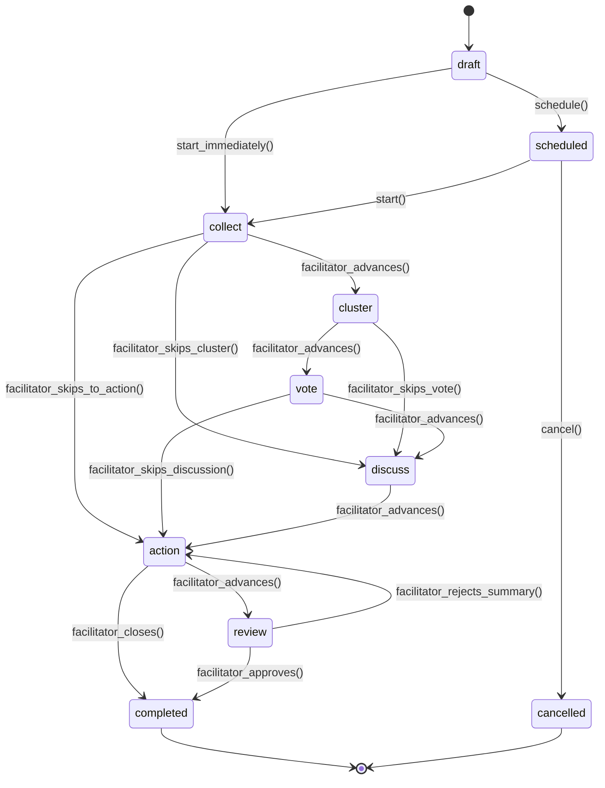
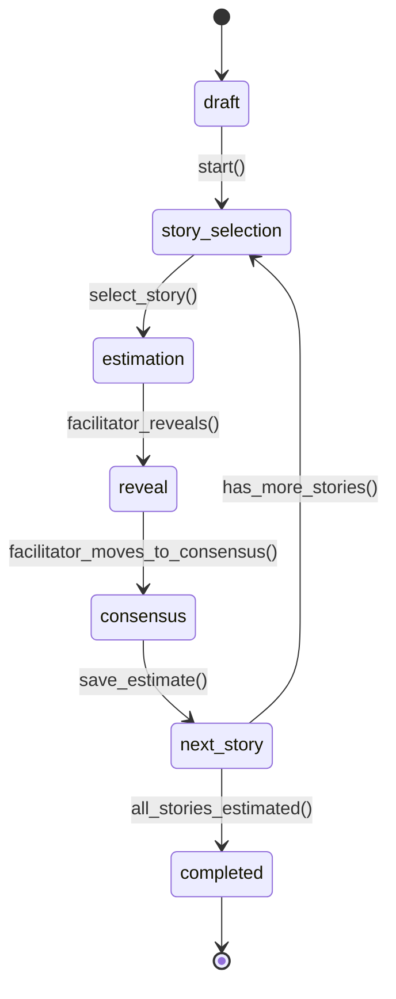
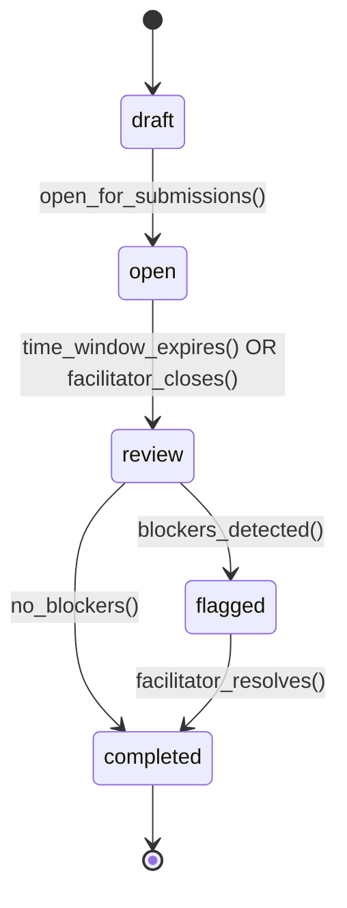
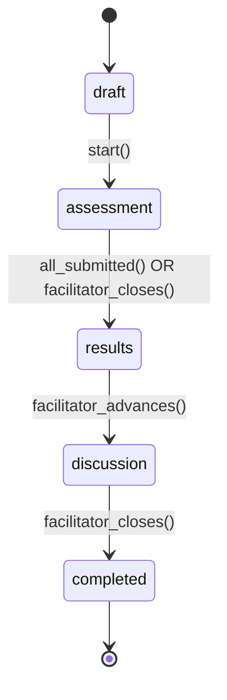

# Ceremony State Machine Specification ⚠️ RED ZONE

**Document ID:** SCP-DOC-006  
**Version:** 1.0  
**Status:** Draft  
**Date:** 2026-06-26  
**Classification:** RED ZONE — Spec-first, review-gated. Hermes must NOT modify this without explicit approval.

---

## 1. Retrospective State Machine

### States

| State | Description | User-Visible Label |
|-------|-------------|-------------------|
| `draft` | Ceremony created but not started | "Draft" |
| `scheduled` | Ceremony scheduled for future date/time | "Scheduled" |
| `collect` | Participants submitting notes | "📝 Collecting Input" |
| `cluster` | Facilitator grouping notes (with AI assist) | "🔍 Grouping & Clustering" |
| `vote` | Participants dot-voting on items/groups | "🗳️ Voting" |
| `discuss` | Team discussing top-voted items | "💬 Discussion" |
| `action` | Facilitator creating action items from decisions | "✅ Creating Actions" |
| `review` | Facilitator reviewing AI summary before closing | "📋 Review Summary" |
| `completed` | Ceremony finished, summary stored | "✅ Completed" |
| `cancelled` | Ceremony cancelled before completion | "❌ Cancelled" |

### Valid Transitions



### Transition Rules

| From | To | Trigger | Guard Conditions | Side Effects |
|------|----|---------|-----------------|-------------|
| `draft` | `scheduled` | `schedule()` | `scheduled_at IS NOT NULL` | Create calendar invite |
| `draft` | `collect` | `start_immediately()` | `facilitator = current_user` | Log `ceremony.started`, start timer |
| `scheduled` | `collect` | `start()` | `facilitator = current_user` | Log `ceremony.started`, notify participants |
| `scheduled` | `cancelled` | `cancel()` | `facilitator = current_user` | Notify participants, log |
| `collect` | `cluster` | `facilitator_advances()` | `board_items.count > 0` | Trigger AI clustering, lock note creation |
| `collect` | `discuss` | `facilitator_skips_cluster()` | `board_items.count > 0` | Lock note creation, log skip |
| `collect` | `action` | `facilitator_skips_to_action()` | `board_items.count > 0` | Lock note creation, log skip |
| `cluster` | `vote` | `facilitator_advances()` | `clusters.count > 0 OR items.count > 0` | Reset vote quota, lock clustering |
| `cluster` | `discuss` | `facilitator_skips_vote()` | — | Log skip |
| `vote` | `discuss` | `facilitator_advances()` | `total_votes > 0` (WARN if 0) | Sort items by vote count, lock voting |
| `vote` | `action` | `facilitator_skips_discussion()` | — | Log skip |
| `discuss` | `action` | `facilitator_advances()` | — | Lock discussion |
| `action` | `review` | `facilitator_advances()` | `actions.count > 0` (WARN if 0) | Trigger AI summary generation |
| `action` | `completed` | `facilitator_closes()` | `actions.count > 0` | Persist summary, detect recurring themes |
| `review` | `completed` | `facilitator_approves()` | — | Persist approved summary |
| `review` | `action` | `facilitator_rejects_summary()` | — | Return to action phase |

### Invalid Transitions (Must Be Blocked)

| From | To | Why Invalid |
|------|----|-------------|
| `collect` | `draft` | Cannot undo ceremony start |
| `vote` | `collect` | Cannot return to collection after voting |
| `completed` | ANY | Completed ceremonies are immutable |
| `cancelled` | ANY | Cancelled ceremonies cannot be resumed |
| `action` | `collect` | Cannot reopen collection |
| `review` | `collect` | Cannot reopen collection |
| ANY | `collect` | Only `draft` and `scheduled` can enter collect |

### XState Definition (TypeScript)

```typescript
import { createMachine, assign } from 'xstate';

const retroMachine = createMachine({
  id: 'retrospective',
  initial: 'draft',
  context: {
    boardItemCount: 0,
    clusterCount: 0,
    actionCount: 0,
    totalVotes: 0,
  },
  states: {
    draft: {
      on: {
        SCHEDULE: { target: 'scheduled', guard: 'hasScheduledAt' },
        START_IMMEDIATELY: { target: 'collect', guard: 'isFacilitator' },
      },
    },
    scheduled: {
      on: {
        START: { target: 'collect', guard: 'isFacilitator' },
        CANCEL: { target: 'cancelled', guard: 'isFacilitator' },
      },
    },
    collect: {
      on: {
        FACILITATOR_ADVANCES: { target: 'cluster', guard: 'hasBoardItems' },
        SKIP_CLUSTER: { target: 'discuss', guard: 'hasBoardItems' },
        SKIP_TO_ACTION: { target: 'action', guard: 'hasBoardItems' },
      },
    },
    cluster: {
      on: {
        FACILITATOR_ADVANCES: { target: 'vote' },
        SKIP_VOTE: { target: 'discuss' },
      },
    },
    vote: {
      on: {
        FACILITATOR_ADVANCES: { target: 'discuss' },
        SKIP_DISCUSSION: { target: 'action' },
      },
    },
    discuss: {
      on: {
        FACILITATOR_ADVANCES: { target: 'action' },
      },
    },
    action: {
      on: {
        FACILITATOR_ADVANCES: { target: 'review', guard: 'hasActions' },
        CLOSE: { target: 'completed', guard: 'hasActions' },
      },
    },
    review: {
      on: {
        APPROVE: { target: 'completed' },
        REJECT_SUMMARY: { target: 'action' },
      },
    },
    completed: { type: 'final' },
    cancelled: { type: 'final' },
  },
}, {
  guards: {
    isFacilitator: (ctx, event, { state }) => /* check current user */,
    hasScheduledAt: (ctx) => ctx.scheduledAt !== null,
    hasBoardItems: (ctx) => ctx.boardItemCount > 0,
    hasActions: (ctx) => ctx.actionCount > 0,
  },
});
```

---

## 2. Planning Poker State Machine

### States

| State | Description |
|-------|-------------|
| `draft` | Poker session created |
| `story_selection` | Facilitator selecting story to estimate |
| `estimation` | Participants submitting estimates (hidden) |
| `reveal` | Estimates revealed, discussion |
| `consensus` | Team agreeing on final estimate |
| `next_story` | Moving to next story |
| `completed` | All stories estimated |

### Valid Transitions



---

## 3. Async Standup State Machine

### States

| State | Description |
|-------|-------------|
| `draft` | Standup configured |
| `open` | Accepting updates (time-windowed) |
| `review` | Updates collected, team reviewing |
| `flagged` | Blockers flagged for follow-up |
| `completed` | Standup closed |

### Valid Transitions



---

## 4. Team Health Check State Machine

### States

| State | Description |
|-------|-------------|
| `draft` | Health check configured |
| `assessment` | Team rating dimensions (anonymous) |
| `results` | Aggregated results shown |
| `discussion` | Team discussing low-scoring areas |
| `completed` | Health check closed, radar saved |

### Valid Transitions



---

## 5. Guard Condition Implementations

| Guard | Implementation | Notes |
|-------|---------------|-------|
| `isFacilitator` | `current_user.id == ceremony.facilitator_id` | Only facilitator can advance phases |
| `hasBoardItems` | `board_items.where(ceremony_id).count > 0` | Warn if advancing with 0 items |
| `hasActions` | `actions.where(ceremony_id).count > 0` | Warn if closing with 0 actions |
| `allSubmitted` | `submitted_count >= team_members.count` | All members submitted before auto-advance |

---

## 6. Side Effects by Transition

| Transition | Side Effect | Async? |
|------------|------------|--------|
| `draft → collect` | Emit `ceremony.started` event; start timer; notify participants | Yes (notify) |
| `collect → cluster` | Lock note creation; trigger AI embedding + clustering job | Yes (AI) |
| `cluster → vote` | Reset vote quota; lock clustering UI | No |
| `vote → discuss` | Sort items by vote count descending; lock voting | No |
| `discuss → action` | Lock discussion; focus on top-voted items | No |
| `action → review` | Trigger AI summary generation; persist summary draft | Yes (AI) |
| `review → completed` | Persist approved summary; trigger recurring theme detection; emit `ceremony.completed` | Yes (analytics) |
| `action → completed` | Same as `review → completed` without summary approval | Yes |

---

## 7. Concurrency Rules

- **One ceremony per team** can be `in_progress` at a time
- **Only facilitator** can advance phases
- **All phase transitions** are logged with timestamp + actor + previous state
- **Reconnect handling**: On WebSocket reconnect, client receives current state + phase + all board items. No data loss.
- **Offline handling**: If facilitator disconnects, ceremony stays in current phase. Another facilitator can be assigned by org admin.

---

## 8. Test Requirements (MUST PASS)

Every state machine implementation MUST pass these test categories:

### 8.1 Valid Transitions
- Every valid transition in the table succeeds
- Correct side effects fire
- State persists after transition

### 8.2 Invalid Transitions
- Every invalid transition is rejected with 409 Conflict
- Error message includes valid transitions from current state
- State does not change on invalid transition

### 8.3 Guard Conditions
- Non-facilitator cannot advance phases (403 Forbidden)
- Advancing with 0 board items logs warning but proceeds
- Advancing with 0 actions logs warning but proceeds

### 8.4 Concurrent Access
- Two facilitators advancing simultaneously: first wins, second gets 409
- WebSocket reconnect preserves state
- Multiple participants adding notes simultaneously: all succeed (CRDT)

### 8.5 Phase-Specific Rules
- Notes cannot be added in `cluster`, `vote`, `discuss`, `action` phases
- Votes cannot be cast outside `vote` phase
- Actions can be created in `action` phase AND `discuss` phase

---

*This specification is RED ZONE. Implementation must be derived from this spec, not vice versa. Any change to states or transitions requires an ADR and re-running the full test suite.*
