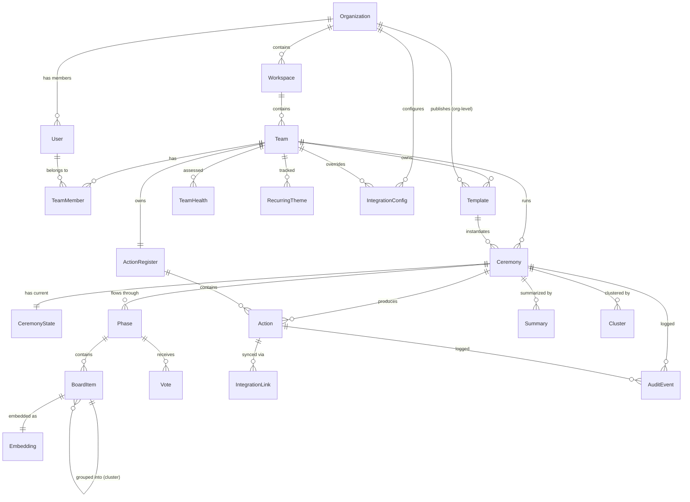
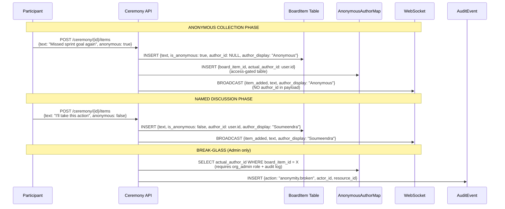

# Data Model + Domain Model — Scrum Ceremony Platform

**Document ID:** SCP-DOC-005  
**Version:** 1.0  
**Status:** Draft  
**Date:** 2026-06-26  

---

## 1. Domain-Driven Design: Bounded Contexts

The platform decomposes into **5 bounded contexts** with explicit boundaries and integration contracts.

```
┌──────────────────────────────────────────────────────────────────┐
│                    SCP — Bounded Context Map                     │
│                                                                  │
│  ┌─────────────┐  ┌──────────────┐  ┌─────────────────────┐    │
│  │  IDENTITY    │  │  CEREMONY    │  │  IMPROVEMENT         │    │
│  │  CONTEXT     │  │  CONTEXT     │  │  CONTEXT             │    │
│  │              │  │              │  │                       │    │
│  │ • Org        │  │ • Ceremony   │  │ • Action             │    │
│  │ • Workspace  │  │ • Board      │  │ • ActionRegister     │    │
│  │ • Team       │  │ • Template   │  │ • ImprovementGraph   │    │
│  │ • User       │  │ • Phase      │  │ • RetroDebt          │    │
│  │ • Role       │  │ • Vote       │  │ • OutcomeAttribution │    │
│  │ • Auth       │  │ • Timer      │  │ • Experiment         │    │
│  └──────┬──────┘  └──────┬───────┘  └──────────┬────────────┘    │
│         │                │                      │                 │
│  ┌──────┴────────────────┴──────────────────────┴────────────┐   │
│  │                     EVENT BUS                              │   │
│  └──────┬────────────────┬──────────────────────┬────────────┘   │
│         │                │                      │                 │
│  ┌──────┴──────┐  ┌──────┴───────┐  ┌──────────┴────────────┐   │
│  │ INTELLIGENCE│  │ INTEGRATION  │  │  ANALYTICS             │   │
│  │ CONTEXT     │  │ CONTEXT      │  │  CONTEXT               │   │
│  │             │  │              │  │                        │   │
│  │ • Embedding │  │ • JiraLink   │  │ • TeamHealth          │   │
│  │ • Cluster   │  │ • ERPNextSync│  │ • ParticipationMetric │   │
│  │ • Summary   │  │ • StripeEvent│  │ • RecurringTheme      │   │
│  │ • Sentiment │  │ • SlackNotif │  │ • CrossTeamHeatmap    │   │
│  │ • AIPrompt  │  │ • WebhookLog │  │ • MaturityScore       │   │
│  └─────────────┘  └──────────────┘  └────────────────────────┘   │
└──────────────────────────────────────────────────────────────────┘
```

### Context Interactions (Integration Contracts)

| Source Context | Target Context | Event | Contract |
|---------------|---------------|-------|----------|
| Identity | Ceremony | `team.created` | Team ID + member list |
| Ceremony | Improvement | `ceremony.completed` | Ceremony ID + actions + themes |
| Ceremony | Intelligence | `ceremony.notes_collected` | Ceremony ID + note texts |
| Intelligence | Ceremony | `ai.clusters_suggested` | Cluster suggestions (facilitator reviews) |
| Improvement | Integration | `action.created` / `action.updated` | Action ID + external sync payload |
| Integration | Improvement | `sync.status_updated` | External status change |
| Ceremony | Analytics | `ceremony.started` / `ceremony.completed` | Participation + timing metrics |
| Improvement | Analytics | `action.completed` / `action.overdue` | Completion + debt metrics |
| Identity | Integration | `org.subscription_changed` | Plan change for ERPNext sync |

---

## 2. Ubiquitous Language

| Term | Definition | Context |
|------|-----------|---------|
| **Organization** | The tenant boundary. A company or business unit that owns all data. | Identity |
| **Workspace** | A grouping layer within an org for departments or business units. | Identity |
| **Team** | The primary operating unit. One Scrum team that runs ceremonies. | Identity |
| **Ceremony** | A structured, guided session (retro, poker, standup, health check, etc.) | Ceremony |
| **Phase** | A discrete stage within a ceremony (Collect, Cluster, Vote, Decide, Action) | Ceremony |
| **Board Item** | A sticky note, card, or contribution within a ceremony phase. | Ceremony |
| **Cluster** | A semantic grouping of board items (manual or AI-suggested). | Ceremony / Intelligence |
| **Vote** | A participant's allocation of dot-votes to a board item or cluster. | Ceremony |
| **Anonymity Mode** | The visibility rule for a phase: anonymous, named, or hybrid. | Ceremony |
| **Template** | A reusable ceremony definition with phase structure and defaults. | Ceremony |
| **Action** | A concrete, owned, time-bounded commitment from a ceremony. | Improvement |
| **Action Register** | The team-level cross-ceremony list of all actions (open + closed). | Improvement |
| **Retro Debt** | Unresolved items carried forward across retrospectives. | Improvement |
| **Improvement Graph** | The linked structure: issue → action → ticket → outcome. | Improvement |
| **Recurring Theme** | A pattern detected across multiple ceremonies over time. | Intelligence / Analytics |
| **Team Health Radar** | A multi-dimensional team wellness assessment. | Analytics |
| **Facilitator** | The person running the ceremony (typically Scrum Master). | Ceremony |
| **Idempotency Key** | Unique key on integration requests to prevent duplicate operations. | Integration |

---

## 3. Entity-Relationship Diagram



---

## 4. Core Entity Definitions

### 4.1 Identity Context

#### Organization
| Field | Type | Constraints | Notes |
|-------|------|-------------|-------|
| id | UUID | PK | |
| name | VARCHAR(200) | NOT NULL | Company/business unit name |
| slug | VARCHAR(50) | UNIQUE, NOT NULL | URL-safe identifier |
| plan | ENUM | NOT NULL | free, team, business, enterprise |
| settings | JSONB | | Org-level settings (features, limits) |
| created_at | TIMESTAMP | NOT NULL | |
| updated_at | TIMESTAMP | NOT NULL | |

#### Workspace
| Field | Type | Constraints | Notes |
|-------|------|-------------|-------|
| id | UUID | PK | |
| org_id | UUID | FK → Organization, NOT NULL | |
| name | VARCHAR(200) | NOT NULL | |
| slug | VARCHAR(50) | UNIQUE per org | |
| settings | JSONB | | Workspace-level overrides |
| created_at | TIMESTAMP | NOT NULL | |

#### Team
| Field | Type | Constraints | Notes |
|-------|------|-------------|-------|
| id | UUID | PK | |
| workspace_id | UUID | FK → Workspace, NOT NULL | |
| name | VARCHAR(200) | NOT NULL | |
| cadence | ENUM | | weekly, biweekly, monthly |
| default_template_id | UUID | FK → Template (nullable) | Default retro template |
| linked_jira_project | VARCHAR(50) | | Jira project key |
| default_anonymity | ENUM | | anonymous, named, hybrid |
| settings | JSONB | | Team-level settings |
| created_at | TIMESTAMP | NOT NULL | |

#### User
| Field | Type | Constraints | Notes |
|-------|------|-------------|-------|
| id | UUID | PK | |
| clerk_id | VARCHAR(100) | UNIQUE, NOT NULL | Clerk external ID |
| email | VARCHAR(255) | UNIQUE, NOT NULL | |
| display_name | VARCHAR(200) | NOT NULL | |
| avatar_url | VARCHAR(500) | | |
| org_id | UUID | FK → Organization, NOT NULL | |
| role | ENUM | NOT NULL | org_admin, workspace_admin, team_facilitator, member, viewer |
| created_at | TIMESTAMP | NOT NULL | |

#### TeamMember
| Field | Type | Constraints | Notes |
|-------|------|-------------|-------|
| id | UUID | PK | |
| team_id | UUID | FK → Team, NOT NULL | |
| user_id | UUID | FK → User, NOT NULL | |
| role | ENUM | NOT NULL | facilitator, member |
| joined_at | TIMESTAMP | NOT NULL | |
| UNIQUE | | (team_id, user_id) | One membership per team |

---

### 4.2 Ceremony Context

#### Ceremony
| Field | Type | Constraints | Notes |
|-------|------|-------------|-------|
| id | UUID | FK → BoardItem (inherits), PK | BoardItem subclass |
| team_id | UUID | FK → Team, NOT NULL | |
| type | ENUM | NOT NULL | retrospective, planning_poker, async_standup, health_check, sprint_review, pi_planning |
| template_id | UUID | FK → Template | |
| title | VARCHAR(300) | NOT NULL | |
| status | ENUM | NOT NULL | draft, scheduled, in_progress, completed, cancelled |
| current_phase | ENUM | | collect, cluster, vote, decide, action, closed |
| mode | ENUM | NOT NULL | live, async, hybrid |
| anonymity_config | JSONB | | Phase-level anonymity rules |
| scheduled_at | TIMESTAMP | | For scheduled ceremonies |
| started_at | TIMESTAMP | | |
| completed_at | TIMESTAMP | | |
| facilitator_id | UUID | FK → User, NOT NULL | |
| sprint_ref | VARCHAR(50) | | Sprint identifier (e.g., "Sprint 24") |
| metadata | JSONB | | Type-specific metadata |
| tenant_id | UUID | NOT NULL, FK → Organization | RLS partition key |

#### Template
| Field | Type | Constraints | Notes |
|-------|------|-------------|-------|
| id | UUID | PK | |
| name | VARCHAR(200) | NOT NULL | |
| ceremony_type | ENUM | NOT NULL | Which ceremony type this template serves |
| scope | ENUM | NOT NULL | org, workspace, team |
| owner_id | UUID | | Org/Workspace/Team ID depending on scope |
| phases | JSONB | NOT NULL | Phase definitions with defaults |
| columns | JSONB | | Column structure (e.g., Start/Stop/Continue) |
| is_locked | BOOLEAN | DEFAULT false | Org templates can be locked |
| is_default | BOOLEAN | DEFAULT false | |
| created_by | UUID | FK → User | |
| tenant_id | UUID | NOT NULL | RLS partition key |

#### BoardItem
| Field | Type | Constraints | Notes |
|-------|------|-------------|-------|
| id | UUID | PK | |
| ceremony_id | UUID | FK → Ceremony, NOT NULL | |
| phase | ENUM | NOT NULL | Which phase this item belongs to |
| text | TEXT | NOT NULL | Note content |
| column_id | VARCHAR(50) | | Column within template (e.g., "start", "stop") |
| group_id | UUID | FK → BoardItem (self-ref, nullable) | Cluster/group parent |
| color | VARCHAR(7) | | Hex color |
| position | INTEGER | | Sort order within column/group |
| reactions | JSONB | | {emoji: count} map |
| is_anonymous | BOOLEAN | NOT NULL | Was this submitted anonymously? |
| author_id | UUID | FK → User (nullable) | NULL if anonymous; always stored in AnonymousAuthorMap if anonymous |
| author_display | VARCHAR(100) | | "Anonymous" or user's display name |
| created_at | TIMESTAMP | NOT NULL | |
| tenant_id | UUID | NOT NULL | RLS partition key |

**CRITICAL RULE:** When `is_anonymous = true`, `author_id` is NULL in this table. The real author is stored ONLY in `anonymous_author_map` which is access-controlled.

#### AnonymousAuthorMap ⚠️ RED ZONE
| Field | Type | Constraints | Notes |
|-------|------|-------------|-------|
| id | UUID | PK | |
| board_item_id | UUID | FK → BoardItem, NOT NULL | |
| ceremony_id | UUID | FK → Ceremony, NOT NULL | |
| actual_author_id | UUID | FK → User, NOT NULL | The real author |
| created_at | TIMESTAMP | NOT NULL | |

**Access Control:** This table is ONLY accessible to:
- Organization admins (break-glass, audited)
- Never exposed via API to team members or facilitators
- All reads are logged in AuditEvent

#### Vote
| Field | Type | Constraints | Notes |
|-------|------|-------------|-------|
| id | UUID | PK | |
| item_id | UUID | FK → BoardItem, NOT NULL | What is being voted on |
| voter_token | UUID | NOT NULL | Anonymous voter token (not user_id) |
| voter_id | UUID | FK → User (nullable) | NULL for anonymous votes |
| phase | ENUM | NOT NULL | Which voting phase |
| weight | INTEGER | DEFAULT 1 | For weighted voting |
| created_at | TIMESTAMP | NOT NULL | |
| UNIQUE | | (item_id, voter_token) | One vote per item per voter |
| tenant_id | UUID | NOT NULL | RLS partition key |

**Anti-double-vote:** For anonymous voting, we use `voter_token` — a per-ceremony random UUID assigned to each participant. This prevents double-voting without storing identity in the vote record.

#### CeremonyState
| Field | Type | Constraints | Notes |
|-------|------|-------------|-------|
| id | UUID | PK | |
| ceremony_id | UUID | FK → Ceremony, UNIQUE, NOT NULL | One state per ceremony |
| current_phase | ENUM | NOT NULL | |
| phase_history | JSONB | | [{phase, entered_at, exited_by, exited_at}] |
| timer_seconds | INTEGER | | Active timer value |
| timer_started_at | TIMESTAMP | | |
| phase_config | JSONB | | Current phase's runtime config |
| updated_at | TIMESTAMP | NOT NULL | |

---

### 4.3 Improvement Context

#### Action
| Field | Type | Constraints | Notes |
|-------|------|-------------|-------|
| id | UUID | PK | |
| team_id | UUID | FK → Team, NOT NULL | |
| ceremony_id | UUID | FK → Ceremony, NOT NULL | Source ceremony |
| source_item_id | UUID | FK → BoardItem (nullable) | Originating note |
| title | VARCHAR(300) | NOT NULL | |
| description | TEXT | | |
| owner_id | UUID | FK → User (nullable) | NULL = unassigned |
| due_date | DATE | | |
| status | ENUM | NOT NULL | open, in_progress, blocked, done, deferred |
| priority | ENUM | | low, medium, high, critical |
| category | VARCHAR(50) | | process, tooling, communication, technical, people |
| sprint_tag | VARCHAR(50) | | Sprint when action was created |
| carry_forward_count | INTEGER | DEFAULT 0 | How many retros this has been deferred |
| external_link_id | UUID | FK → IntegrationLink (nullable) | Jira/ADO ticket |
| resolved_at | TIMESTAMP | | |
| created_at | TIMESTAMP | NOT NULL | |
| tenant_id | UUID | NOT NULL | RLS partition key |

#### ActionRegister
| Field | Type | Constraints | Notes |
|-------|------|-------------|-------|
| id | UUID | PK | |
| team_id | UUID | FK → Team, UNIQUE, NOT NULL | One register per team |
| last_reviewed_at | TIMESTAMP | | |
| settings | JSONB | | Reminder config, aging thresholds |

#### IntegrationLink
| Field | Type | Constraints | Notes |
|-------|------|-------------|-------|
| id | UUID | PK | |
| action_id | UUID | FK → Action, NOT NULL | |
| tool | ENUM | NOT NULL | jira, azure_devops, linear, trello, asana |
| external_id | VARCHAR(200) | NOT NULL | External system's issue key |
| external_url | VARCHAR(500) | | Link to external issue |
| external_status | VARCHAR(50) | | Last known status from external system |
| sync_status | ENUM | NOT NULL | pending, synced, error |
| last_synced_at | TIMESTAMP | | |
| idempotency_key | UUID | NOT NULL, UNIQUE | Prevents duplicate sync |
| sync_error | TEXT | | Last error message |
| tenant_id | UUID | NOT NULL | RLS partition key |

---

### 4.4 Intelligence Context

#### Embedding
| Field | Type | Constraints | Notes |
|-------|------|-------------|-------|
| id | UUID | PK | |
| board_item_id | UUID | FK → BoardItem, UNIQUE, NOT NULL | |
| embedding | VECTOR(1024) | NOT NULL | pgvector — mxbai-embed-large dimension |
| model | VARCHAR(100) | NOT NULL | Embedding model name |
| created_at | TIMESTAMP | NOT NULL | |

#### Cluster
| Field | Type | Constraints | Notes |
|-------|------|-------------|-------|
| id | UUID | PK | |
| ceremony_id | UUID | FK → Ceremony, NOT NULL | |
| title | VARCHAR(200) | | AI-suggested or human-assigned label |
| item_ids | UUID[] | NOT NULL | Array of BoardItem IDs |
| source | ENUM | NOT NULL | ai_suggested, manual |
| ai_confidence | FLOAT | | 0-1 confidence score |
| approved_by | UUID | FK → User (nullable) | NULL until facilitator approves |
| created_at | TIMESTAMP | NOT NULL | |
| tenant_id | UUID | NOT NULL | RLS partition key |

#### Summary
| Field | Type | Constraints | Notes |
|-------|------|-------------|-------|
| id | UUID | PK | |
| ceremony_id | UUID | FK → Ceremony, NOT NULL | |
| content | TEXT | NOT NULL | Generated summary text |
| source | ENUM | NOT NULL | ai_generated, manual |
| sections | JSONB | | {top_themes, top_voted, proposed_actions, carry_forward} |
| ai_model | VARCHAR(100) | | "gemma3:9b" |
| approved_by | UUID | FK → User (nullable) | NULL until facilitator approves |
| created_at | TIMESTAMP | NOT NULL | |

---

### 4.5 Integration Context

#### IntegrationConfig
| Field | Type | Constraints | Notes |
|-------|------|-------------|-------|
| id | UUID | PK | |
| team_id | UUID | FK → Team (nullable) | NULL = org-level config |
| org_id | UUID | FK → Organization, NOT NULL | |
| tool | ENUM | NOT NULL | jira, erpnext, stripe, slack, teams, azure_devops |
| config | JSONB | NOT NULL | Tool-specific config (encrypted fields separate) |
| encrypted_secrets | BYTEA | | AES-256 encrypted OAuth tokens, API keys |
| is_active | BOOLEAN | DEFAULT true | |
| last_sync_at | TIMESTAMP | | |
| tenant_id | UUID | NOT NULL | RLS partition key |

#### AuditEvent
| Field | Type | Constraints | Notes |
|-------|------|-------------|-------|
| id | UUID | PK | |
| actor_id | UUID | FK → User, NOT NULL | Who performed the action |
| action | VARCHAR(100) | NOT NULL | e.g., "ceremony.created", "anonymity.broken" |
| resource_type | VARCHAR(50) | NOT NULL | e.g., "ceremony", "action" |
| resource_id | UUID | NOT NULL | |
| payload | JSONB | | Action-specific details |
| ip_address | INET | | |
| created_at | TIMESTAMP | NOT NULL | |

**IMMUTABLE:** AuditEvent rows are INSERT ONLY. No UPDATE or DELETE permitted. Enforced by RLS policy.

---

### 4.6 Analytics Context

#### TeamHealth
| Field | Type | Constraints | Notes |
|-------|------|-------------|-------|
| id | UUID | PK | |
| team_id | UUID | FK → Team, NOT NULL | |
| ceremony_id | UUID | FK → Ceremony (nullable) | Triggered by which ceremony |
| dimensions | JSONB | NOT NULL | {communication: 4.2, process: 3.8, ...} |
| overall_score | FLOAT | | Computed average |
| assessed_at | TIMESTAMP | NOT NULL | |
| tenant_id | UUID | NOT NULL | RLS partition key |

#### RecurringTheme
| Field | Type | Constraints | Notes |
|-------|------|-------------|-------|
| id | UUID | PK | |
| team_id | UUID | FK → Team, NOT NULL | |
| label | VARCHAR(200) | NOT NULL | |
| category | ENUM | | planning, requirements, quality, tech_debt, dependency, leadership, tooling, morale, workload |
| occurrence_count | INTEGER | DEFAULT 1 | |
| first_seen_at | TIMESTAMP | NOT NULL | |
| last_seen_at | TIMESTAMP | NOT NULL | |
| ceremony_ids | UUID[] | | Which ceremonies this appeared in |
| is_resolved | BOOLEAN | DEFAULT false | |
| resolved_at | TIMESTAMP | | |
| tenant_id | UUID | NOT NULL | RLS partition key |

---

## 5. Multi-Tenancy: Row-Level Security

Every table that contains tenant-scoped data includes a `tenant_id` column (FK → Organization.id).

### PostgreSQL RLS Policies

```sql
-- Enable RLS on all tenant-scoped tables
ALTER TABLE ceremony ENABLE ROW LEVEL SECURITY;
ALTER TABLE board_item ENABLE ROW LEVEL SECURITY;
ALTER TABLE action ENABLE ROW LEVEL SECURITY;
ALTER TABLE vote ENABLE ROW LEVEL SECURITY;
-- ... (all tables with tenant_id)

-- Policy: users can only see data in their own tenant
CREATE POLICY tenant_isolation ON ceremony
  USING (tenant_id = current_setting('app.current_tenant_id')::UUID);

-- Policy: org admins can see all data in their org
CREATE POLICY tenant_admin ON ceremony
  USING (
    tenant_id = current_setting('app.current_tenant_id')::UUID
    AND current_setting('app.user_role') IN ('org_admin')
  );
```

### Application-Level Enforcement

Every API request sets `app.current_tenant_id` and `app.user_role` as PostgreSQL session variables:

```python
# FastAPI middleware
async def set_tenant_context(request: Request, call_next):
    tenant_id = request.state.user.org_id
    user_role = request.state.user.role
    async with request.app.state.db.acquire() as conn:
        await conn.execute(
            f"SET LOCAL app.current_tenant_id = '{tenant_id}'"
        )
        await conn.execute(
            f"SET LOCAL app.user_role = '{user_role}'"
        )
    return await call_next(request)
```

---

## 6. Anonymity Data Flow ⚠️ RED ZONE



---

## 7. Yjs CRDT Document Schema ⚠️ RED ZONE

The ceremony board uses a Yjs shared document. The schema is:

```typescript
interface CeremonyBoardDoc {
  // Y.Map of all board items
  items: Y.Map<BoardItemYjs>;
  
  // Y.Map of vote state
  votes: Y.Map<VoteStateYjs>;
  
  // Y.Map of presence (who's online)
  presence: Y.Map<PresenceYjs>;
  
  // Ceremony state (singleton)
  ceremonyState: Y.Map<{
    currentPhase: Phase;
    timerSeconds: number | null;
    timerStartedAt: string | null;
    facilitatorId: string;
  }>;
}

interface BoardItemYjs {
  id: string;
  text: string;
  columnId: string;
  groupId: string | null;
  color: string;
  position: number;
  reactions: Record<string, number>;
  isAnonymous: boolean;
  authorDisplay: string;
  createdAt: string;
}

interface VoteStateYjs {
  itemId: string;
  totalVotes: number;
  voterTokens: string[];  // NOT user IDs
}

interface PresenceYjs {
  userId: string;
  displayName: string;
  cursor: { itemId: string } | null;
  connectedAt: string;
}
```

**Key rules:**
- `authorId` is NEVER in the Yjs document for anonymous items
- `voterTokens` prevents double-voting without identity exposure
- `presence` is ephemeral — NOT persisted in PostgreSQL (only in Redis)
- Board items are persisted to PostgreSQL on phase transitions (not on every keystroke)

---

## 8. Database Sizing Estimates

| Table | Rows (Year 1) | Row Size | Total Size | Indexes |
|-------|---------------|----------|------------|---------|
| organizations | 500 | 1 KB | 500 KB | slug |
| teams | 2,000 | 2 KB | 4 MB | workspace_id |
| ceremonies | 50,000 | 2 KB | 100 MB | team_id, status, scheduled_at |
| board_items | 500,000 | 1 KB | 500 MB | ceremony_id, group_id |
| votes | 1,000,000 | 0.2 KB | 200 MB | item_id, voter_token |
| actions | 200,000 | 1 KB | 200 MB | team_id, status, owner_id |
| embeddings | 500,000 | 5 KB | 2.5 GB | board_item_id, vector index |
| audit_events | 2,000,000 | 0.5 KB | 1 GB | actor_id, action, created_at |
| **Total** | | | **~4.5 GB** | |

pgvector embeddings dominate storage. A VECTOR(1024) index (HNSW) adds ~2 GB.

**Provisioning:** Start with a single PostgreSQL instance (4 vCPU, 16 GB RAM, 100 GB SSD). Scale to read replica for analytics queries in Phase 3.

---

*This data model is the authoritative schema reference. All API contracts and service implementations must conform to these entity definitions. Changes require Architecture Decision Record (ADR) approval.*
