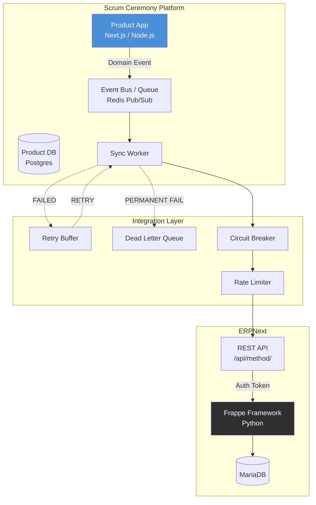
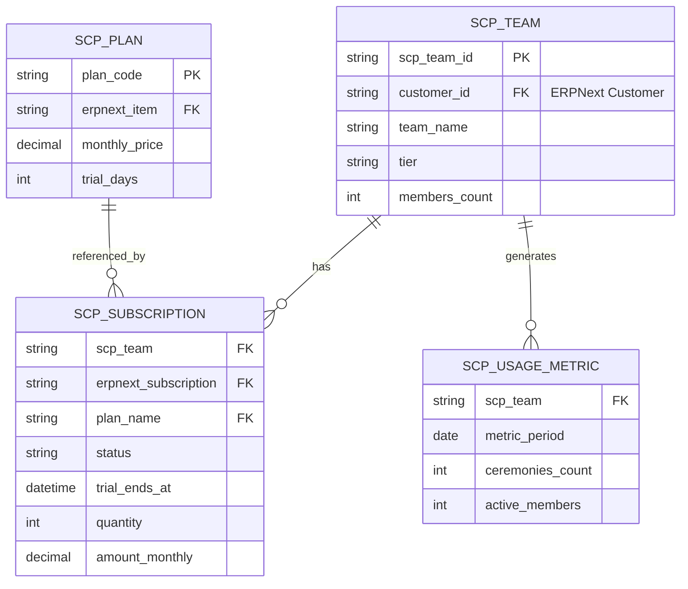
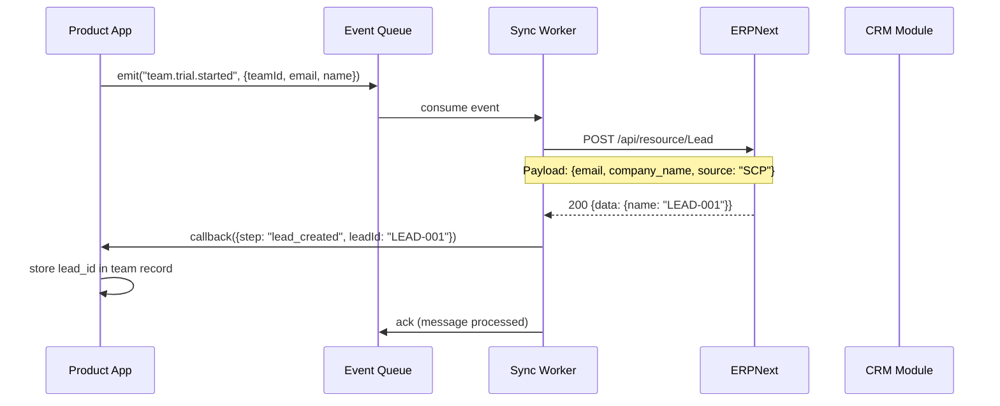
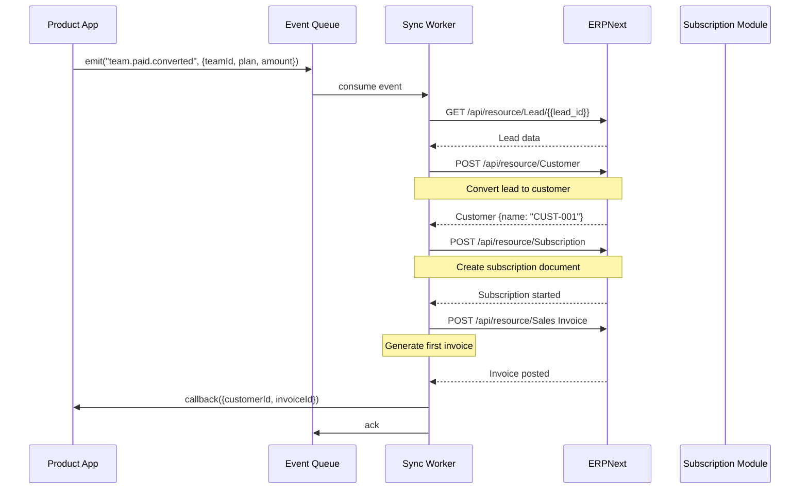
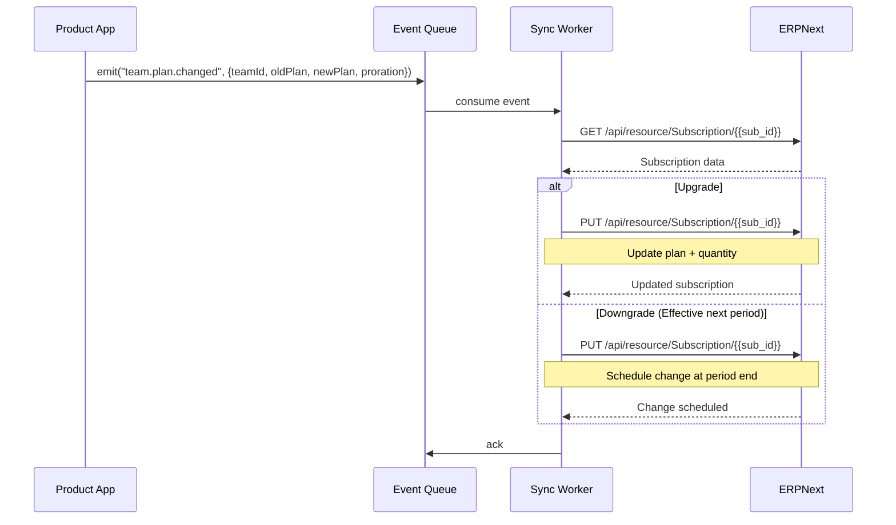
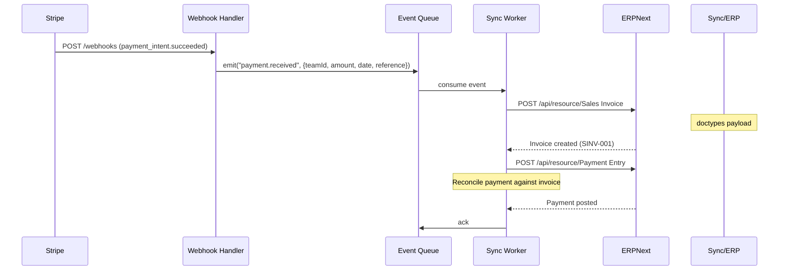
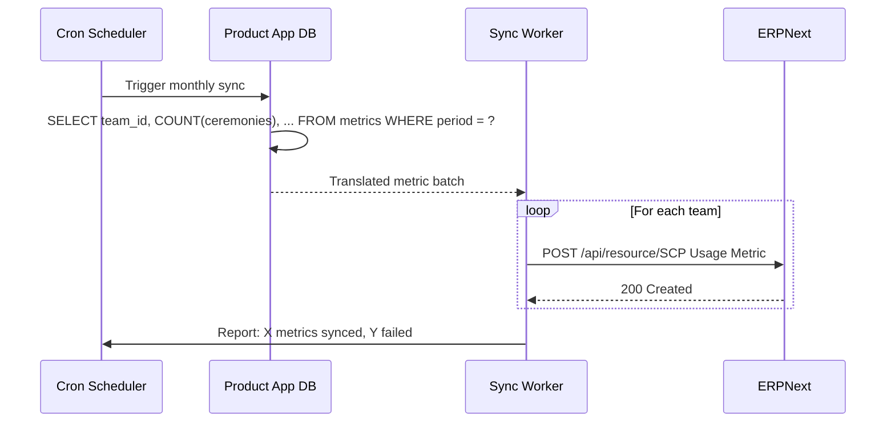
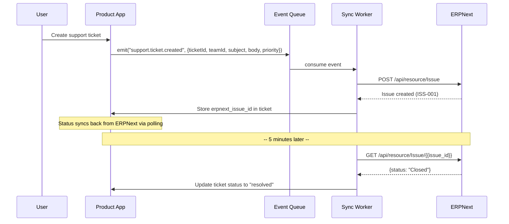
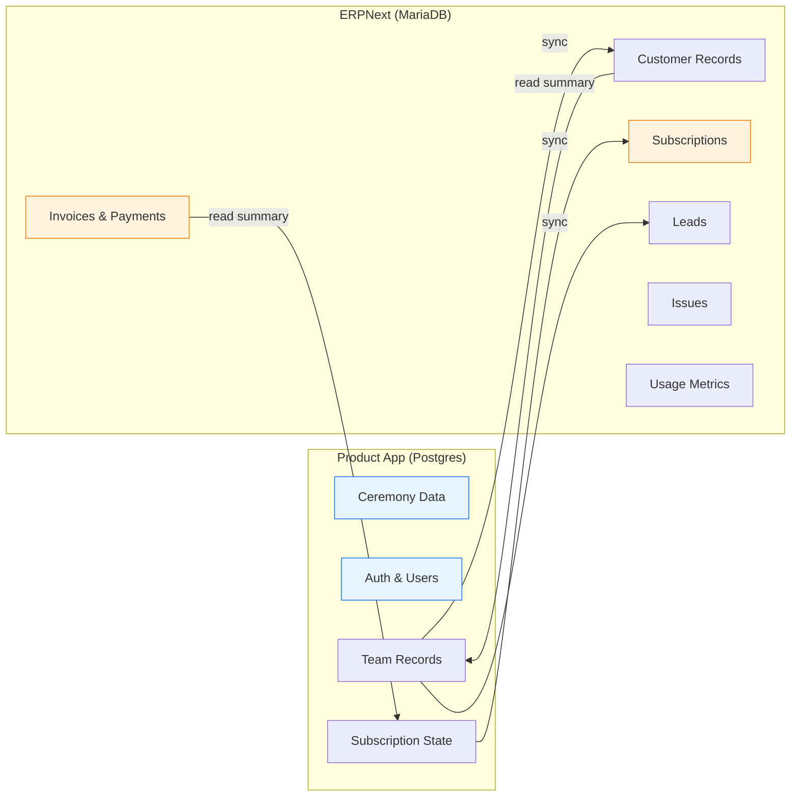
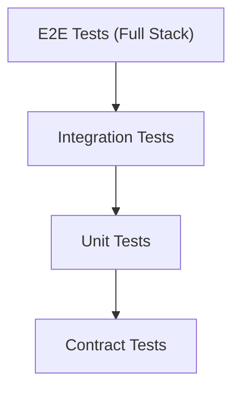

# ERPNext Integration Specification

**Version:** 1.0.0
**Last Updated:** 2026-06-27
**Status:** Draft
**Owner:** Platform Engineering

---

## Table of Contents

1. [Overview](#overview)
2. [Architecture](#architecture)
3. [Custom Doctypes](#custom-doctypes)
4. [Sync Flows](#sync-flows)
5. [API Endpoints](#api-endpoints)
6. [Error Handling](#error-handling)
7. [Data Boundaries](#data-boundaries)
8. [Deployment](#deployment)
9. [Testing Strategy](#testing-strategy)
10. [Appendices](#appendices)

---

## 1. Overview <a name="overview"></a>

### 1.1 Purpose

This document specifies the integration between the Scrum Ceremony Platform (SCP) product application and ERPNext, which serves as the system of record for CRM, financial, and operational data. The integration ensures commercial transactions, customer lifecycle events, and billing data flow reliably between the two systems.

### 1.2 Design Principles

| Principle | Description |
|-----------|-------------|
| **System Separation** | Product app is the system of engagement; ERPNext is the system of record |
| **Event-Driven** | All sync operations are asynchronous, triggered by domain events |
| **One-Way Ownership** | Each data entity has exactly one owning system |
| **At-Least-Once Delivery** | Events are retried until acknowledged; consumers must be idempotent |
| **No Cross-Queries** | Each system queries its own database exclusively |

### 1.3 Scope

**In Scope:**
- Lead and customer lifecycle management
- Subscription and plan management
- Invoice and payment processing
- Support ticket synchronization
- Usage metric reporting

**Out of Scope:**
- Real-time inventory management
- HR/payroll integration
- Manufacturing/supply chain workflows

---

## 2. Architecture <a name="architecture"></a>

### 2.1 High-Level Architecture



### 2.2 Component Descriptions

| Component | Technology | Responsibility |
|-----------|------------|----------------|
| Product App | Next.js / Node.js | Serves ceremony features; emits domain events |
| Event Bus | Redis Pub/Sub | Decouples event producers from consumers |
| Sync Worker | Node.js Bull MQ | Processes sync jobs with retry semantics |
| Circuit Breaker | Custom | Prevents cascading failures when ERPNext is unavailable |
| Rate Limiter | Token Bucket | Respects ERPNext API rate limits |
| DLQ | Redis Streams | Stores permanently failed events for manual inspection |

---

## 3. Custom Doctypes <a name="custom-doctypes"></a>

All ERPNext custom doctypes are implemented as a Frappe app: `scp_erpnext_bridge`.

### 3.1 App Structure

```
scp_erpnext_bridge/
├── scp_erpnext_bridge/
│   ├── __init__.py
│   ├── hooks.py
│   ├── modules.txt
│   ├── doctypes/
│   │   ├── scp_team/
│   │   │   ├── scp_team.json
│   │   │   └── scp_team.py
│   │   ├── scp_subscription/
│   │   │   ├── scp_subscription.json
│   │   │   └── scp_subscription.py
│   │   ├── scp_plan/
│   │   │   ├── scp_plan.json
│   │   │   └── scp_plan.py
│   │   └── scp_usage_metric/
│   │       ├── scp_usage_metric.json
│   │       └── scp_usage_metric.py
│   └── utils/
│       ├── sync.py
│       └── hashlib.py
├── setup.py
└── README.md
```

### 3.2 SCP Team

Represents a team (organization) in SCP mapped to an ERPNext Customer.

```json
{
  "doctype": "SCP Team",
  "name": "fieldname",
  "fields": [
    {
      "fieldname": "scp_team_id",
      "fieldtype": "Data",
      "label": "SCP Team UUID",
      "unique": true,
      "reqd": true
    },
    {
      "fieldname": "customer_id",
      "fieldtype": "Link",
      "label": "ERPNext Customer",
      "options": "Customer",
      "unique": true
    },
    {
      "fieldname": "team_name",
      "fieldtype": "Data",
      "label": "Team Name"
    },
    {
      "fieldname": "tier",
      "fieldtype": "Select",
      "label": "Subscription Tier",
      "options": "Free\nTeam\nBusiness\nEnterprise"
    },
    {
      "fieldname": "members_count",
      "fieldtype": "Int",
      "label": "Members Count"
    },
    {
      "fieldname": "billing_contact_email",
      "fieldtype": "Data",
      "label": "Billing Contact Email",
      "options": "Email"
    },
    {
      "fieldname": "address_json",
      "fieldtype": "JSON",
      "label": "Billing Address"
    },
    {
      "fieldname": "created_at",
      "fieldtype": "Datetime",
      "label": "Created At (UTC)"
    },
    {
      "fieldname": "status",
      "fieldtype": "Select",
      "label": "Status",
      "options": "Active\nSuspended\nChurned\nTrial",
      "default": "Trial"
    }
  ]
}
```

### 3.3 SCP Subscription

Tracks the current subscription state for a team.

```json
{
  "doctype": "SCP Subscription",
  "fields": [
    {
      "fieldname": "scp_team",
      "fieldtype": "Link",
      "label": "SCP Team",
      "options": "SCP Team",
      "reqd": true
    },
    {
      "fieldname": "erpnext_subscription",
      "fieldtype": "Link",
      "label": "ERPNext Subscription",
      "options": "Subscription"
    },
    {
      "fieldname": "plan_name",
      "fieldtype": "Link",
      "label": "Plan",
      "options": "SCP Plan"
    },
    {
      "fieldname": "status",
      "fieldtype": "Select",
      "label": "Status",
      "options": "Trialing\nActive\nPast Due\nCancelled\nExpired"
    },
    {
      "fieldname": "current_period_start",
      "fieldtype": "Datetime"
    },
    {
      "fieldname": "current_period_end",
      "fieldtype": "Datetime"
    },
    {
      "fieldname": "trial_ends_at",
      "fieldtype": "Datetime"
    },
    {
      "fieldname": "quantity",
      "fieldtype": "Int",
      "label": "Seat Count"
    },
    {
      "fieldname": "amount_monthly",
      "fieldtype": "Currency",
      "label": "Monthly Amount"
    },
    {
      "fieldname": "currency",
      "fieldtype": "Link",
      "options": "Currency",
      "default": "USD"
    }
  ]
}
```

### 3.4 SCP Plan

Defines available pricing plans mirrored from the product app.

```json
{
  "doctype": "SCP Plan",
  "fields": [
    {
      "fieldname": "plan_code",
      "fieldtype": "Data",
      "label": "Plan Code",
      "unique": true,
      "options": "free\nteam\nbusiness\nenterprise"
    },
    {
      "fieldname": "plan_name",
      "fieldtype": "Data",
      "reqd": true
    },
    {
      "fieldname": "erpnext_item",
      "fieldtype": "Link",
      "label": "ERPNext Item",
      "options": "Item"
    },
    {
      "fieldname": "monthly_price",
      "fieldtype": "Currency"
    },
    {
      "fieldname": "yearly_price",
      "fieldtype": "Currency"
    },
    {
      "fieldname": "billing_cycle",
      "fieldtype": "Select",
      "options": "Monthly\nYearly"
    },
    {
      "fieldname": "trial_days",
      "fieldtype": "Int",
      "default": 14
    },
    {
      "fieldname": "features_json",
      "fieldtype": "JSON",
      "label": "Feature Limits & Quotas"
    }
  ]
}
```

### 3.5 SCP Usage Metric

Stores periodic usage snapshots for billing and analytics.

```json
{
  "doctype": "SCP Usage Metric",
  "fields": [
    {
      "fieldname": "scp_team",
      "fieldtype": "Link",
      "options": "SCP Team",
      "reqd": true
    },
    {
      "fieldname": "metric_period",
      "fieldtype": "Date",
      "label": "Billing Period",
      "reqd": true
    },
    {
      "fieldname": "ceremonies_count",
      "fieldtype": "Int",
      "default": 0
    },
    {
      "fieldname": "active_members",
      "fieldtype": "Int",
      "default": 0
    },
    {
      "fieldname": "ai_summaries_generated",
      "fieldtype": "Int",
      "default": 0
    },
    {
      "fieldname": "storage_used_mb",
      "fieldtype": "Float",
      "default": 0
    },
    {
      "fieldname": "api_calls_count",
      "fieldtype": "Int",
      "default": 0
    },
    {
      "fieldname": "sync_status",
      "fieldtype": "Select",
      "options": "Pending\nSynced\nFailed",
      "default": "Pending"
    },
    {
      "fieldname": "synced_at",
      "fieldtype": "Datetime"
    }
  ]
}
```

### 3.6 Doctype Relationships



---

## 4. Sync Flows <a name="sync-flows"></a>

### 4.1 Trial Signup → Lead

When a new team signs up for a trial in the product app:



**Payload:**
```json
{
  "doctype": "Lead",
  "email_id": "{{billing_email}}",
  "company_name": "{{team_name}}",
  "source": "Website",
  "website": "https://app.scrumplatform.com/t/{{team_slug}}",
  "notes": "SCP Trial - {{tier}} tier. Signed up via {{referral_source}}"
}
```

### 4.2 Paid Conversion → Customer

When a team upgrades from trial to paid:



**Customer Create Payload:**
```json
{
  "doctype": "Customer",
  "customer_name": "{{team_name}}",
  "customer_type": "Company",
  "customer_group": "SCP Customers",
  "territory": "United States",
  "custom_scp_team_id": "{{scp_team_id}}",
  "custom_scp_tier": "{{plan_tier}}",
  "address_line1": "{{address.line1}}",
  "address_city": "{{address.city}}",
  "address_state": "{{address.state}}",
  "address_pincode": "{{address.zip}}",
  "address_country": "{{address.country}}"
}
```

### 4.3 Plan Change → Order Update

When a team changes their plan (upgrade/downgrade):



### 4.4 Payment Event → Invoice

When a payment is received (via Stripe → webhooks):



**Invoice Payload:**
```json
{
  "doctype": "Sales Invoice",
  "customer": "{{erpnext_customer_id}}",
  "company": "{{default_company}}",
  "currency": "USD",
  "posting_date": "{{payment_date}}",
  "due_date": "{{payment_date}}",
  "is_return": 0,
  "items": [
    {
      "item_code": "{{erpnext_item_code}}",
      "item_name": "SCP {{plan_name}} Subscription",
      "description": "Period: {{period_start}} to {{period_end}}",
      "qty": 1,
      "rate": "{{amount}}",
      "amount": "{{amount}}"
    }
  ],
  "payments": [
    {
      "mode_of_payment": "Credit Card",
      "amount": "{{amount}}",
      "reference": "{{stripe_payment_intent_id}}",
      "type": "Receive"
    }
  ],
  "update_stock": 0
}
```

### 4.5 Usage Metrics → Custom Doctype

Monthly usage snapshot pushed to ERPNext:



### 4.6 Support Ticket → ERPNext Issue

When a support ticket is created in the product app:



**Issue Payload:**
```json
{
  "doctype": "Issue",
  "subject": "{{ticket_subject}}",
  "description": "{{ticket_body}}",
  "customer": "{{erpnext_customer_id}}",
  "priority": "{{mapped_priority}}",
  "ticket_type": "Bug",
  "scp_ticket_id": "{{scp_ticket_uuid}}"
}
```

**Priority Mapping:**

| SCP Priority | ERPNext Priority |
|-------------|-----------------|
| urgent | Critical |
| high | High |
| medium | Medium |
| low | Low |

---

## 5. API Endpoints <a name="api-endpoints"></a>

### 5.1 ERPNext REST API Usage

All integration uses ERPNext's standard REST API with token authentication.

| Endpoint | Method | Usage | Rate Limit |
|----------|--------|-------|------------|
| `/api/resource/Lead` | POST, GET | Lead creation & lookup | 100/min |
| `/api/resource/Customer` | POST, GET | Customer conversion | 60/min |
| `/api/resource/Subscription` | POST, GET, PUT | Subscription lifecycle | 60/min |
| `/api/resource/Sales Invoice` | POST | Invoice generation | 30/min |
| `/api/resource/Payment Entry` | POST | Payment reconciliation | 30/min |
| `/api/resource/Issue` | POST, GET | Support ticket sync | 60/min |
| `/api/resource/SCP Usage Metric` | POST | Usage reporting | 120/min |
| `/api/resource/SCP Team` | POST, GET | Custom doctype CRUD | 60/min |
| `/api/resource/SCP Subscription` | PUT, GET | Subscription updates | 60/min |

### 5.2 Authentication

```bash
# Token-based authentication (preferred for server-to-server)
curl -X POST https://erpnext.company.com/api/resource/Customer \
  -H "Authorization: token {{api_key}}:{{api_secret}}" \
  -H "Content-Type: application/json" \
  -d '{"customer_name": "Acme Corp"}'
```

### 5.3 Python Client Implementation

```python
import httpx
from tenacity import retry, stop_after_attempt, wait_exponential

class ERPNextClient:
    def __init__(self, base_url: str, api_key: str, api_secret: str):
        self.base_url = base_url.rstrip('/')
        self.client = httpx.Client(
            headers={
                "Authorization": f"token {api_key}:{api_secret}",
                "Content-Type": "application/json"
            },
            timeout=30.0,
            limits=httpx.Limits(max_connections=20, max_keepalive_connections=10)
        )

    @retry(stop=stop_after_attempt(3), wait=wait_exponential(multiplier=1, min=2, max=30))
    def create_doctype(self, doctype: str, data: dict) -> dict:
        response = self.client.post(
            f"{self.base_url}/api/resource/{doctype}",
            json=data
        )
        response.raise_for_status()
        return response.json()["data"]

    @retry(stop=stop_after_attempt(3), wait=wait_exponential(multiplier=1, min=2, max=30))
    def get_doctype(self, doctype: str, name: str) -> dict:
        response = self.client.get(
            f"{self.base_url}/api/resource/{doctype}/{name}"
        )
        response.raise_for_status()
        return response.json()["data"]

    def get_list(self, doctype: str, filters: dict = None, limit: int = 100) -> list:
        response = self.client.get(
            f"{self.base_url}/api/resource/{doctype}",
            params={"limit_page_length": limit, **(filters or {})}
        )
        response.raise_for_status()
        return response.json()["data"]
```

---

## 6. Error Handling <a name="error-handling"></a>

### 6.1 Dead Letter Queue

Events that fail after all retries are moved to a Dead Letter Queue for manual inspection and replay.

```python
DLQ_SCHEMA = {
    "event_id": "uuid",
    "event_type": "string",
    "payload": "jsonb",
    "error_message": "text",
    "error_stack": "text",
    "failed_at": "timestamp",
    "retry_count": "integer",
    "originated_at": "timestamp",
    "status": "pending_review | replayed | abandoned"
}
```

**DLQ Operations:**
- **Inspect**: Admin dashboard shows DLQ entries with full error detail
- **Replay**: Manually trigger reprocessing of a specific event
- **Abandon**: Mark as resolved without processing (e.g., data issue fixed separately)

### 6.2 Retry with Exponential Backoff

```python
from tenacity import retry, stop_after_attempt, wait_exponential, RetryCallState
import structlog

logger = structlog.get_logger()

BACKOFF_CONFIG = {
    "stop": stop_after_attempt(5),
    "wait": wait_exponential(multiplier=2, min=4, max=300),  # 4s → 8s → 16s → 32s → 64s
    "retry_error_callback": lambda retry_state: logger.warning(
        "sync_retry",
        attempt=retry_state.attempt_number,
        exception=str(retry_state.outcome.exception()),
        event_id=retry_state.kwargs.get("event_id")
    )
}
```

**Retry Schedule:**

| Attempt | Delay | Jitter Range |
|---------|-------|-------------|
| 1 | 4s | 3-5s |
| 2 | 8s | 6-10s |
| 3 | 16s | 12-20s |
| 4 | 32s | 24-40s |
| 5 | 64s | 48-80s |
| Fail | → DLQ | — |

### 6.3 Circuit Breaker

Prevents overwhelming an unavailable ERPNext instance:

```mermaid
stateDiagram-v2
    [*] --> Closed
    Closed --> Open: failure_threshold exceeded
    Open --> Half-Open: timeout elapsed
    Half-Open --> Closed: success
    Half-Open --> Open: failure

    note right of Closed
        Normal operation
        Failure counter increments
    end note

    note right of Open
        All requests fail fast
        Wait for timeout (60s)
    end note

    note right of Half-Open
        Allow 3 probe requests
        All must pass to close
    end note
```

**Circuit Breaker Configuration:**

| Parameter | Value | Rationale |
|-----------|-------|-----------|
| `failure_threshold` | 5 consecutive failures | Avoids tripping on transient blips |
| `recovery_timeout` | 60 seconds | Allows ERPNext to recover |
| `half_open_max_calls` | 3 | Validates recovery without full load |
| `success_threshold` | 3 | Confirms recovery is stable |
| `timeout` | 30 seconds | Per-request timeout |

---

## 7. Data Boundaries <a name="data-boundaries"></a>

### 7.1 Ownership Matrix

| Data | Owning System | Storage | Sync Direction |
|------|--------------|---------|----------------|
| Ceremony data (notes, votes, outcomes) | Product App | Product Postgres | N/A |
| User accounts & authentication | Product App | Product Postgres | One-way to ERPNext (customer record only) |
| Team/organization records | Product App | Product Postgres | One-way to ERPNext (Customer doctype) |
| Subscription state | Product App | Product Postgres | One-way to ERPNext (Subscription doctype) |
| Invoices & payment records | ERPNext | ERPNext MariaDB | One-way to Product App (summary display) |
| Sales pipeline | ERPNext | ERPNext MariaDB | N/A |
| Support issues | ERPNext (after creation) | ERPNext MariaDB | Bidirectional (status) |
| Usage metrics | Product App | Product Postgres | One-way to ERPNext |

### 7.2 Rules

1. **Product DB owns all ceremony and engagement data.** ERPNext may store references but never primary copies.
2. **ERPNext MariaDB owns all commercial data.** Customer, invoice, payments, subscriptions.
3. **NEVER cross-query.** No JOINs between Product Postgres and ERPNext MariaDB. If cross-system data is needed, sync a copy to the owning system.
4. **Each field has one source of truth.** Conflicts are resolved by timestamp (see Section 6.3).

### 7.3 Data Flow Diagram



---

## 8. Deployment <a name="deployment"></a>

### 8.1 ERPNext Docker Compose

```yaml
version: '3.8'

services:
  db:
    image: mariadb:10.6
    restart: unless-stopped
    environment:
      MYSQL_ROOT_PASSWORD: ${DB_ROOT_PASSWORD}
      MYSQL_DATABASE: site1
      MYSQL_USER: erpnext
      MYSQL_PASSWORD: ${DB_PASSWORD}
    volumes:
      - db-data:/var/lib/mysql
    healthcheck:
      test: mysqladmin ping -h localhost -p${DB_ROOT_PASSWORD}
      interval: 10s
      timeout: 5s
      retries: 5

  redis:
    image: redis:7-alpine
    restart: unless-stopped
    volumes:
      - redis-data:/data
    healthcheck:
      test: redis-cli ping
      interval: 10s
      timeout: 3s
      retries: 5

  erpnext:
    image: frappe/erpnext:v15
    restart: unless-stopped
    depends_on:
      db:
        condition: service_healthy
      redis:
        condition: service_healthy
    environment:
      FRAPPE_PY: erpnext-python
      FRAPPE_PY_PORT: 8000
      FRAPPE_SOCKETIO: socket.io
      DB_TYPE: mariadb
      DB_HOST: db
      DB_PORT: "3306"
      DB_NAME: site1
      DB_PASSWORD: ${DB_PASSWORD}
      REDIS_CACHE: redis://redis:6379/0
      REDIS_QUEUE: redis://redis:6379/1
      REDIS_SOCKETIO: redis://redis:6379/2
      SOCKETIO_PORT: 9000
      AUTO_UPDATE: "0"
    volumes:
      - sites:/home/frappe/frappe-bench/sites
      - assets:/home/frappe/frappe-bench/sites/assets
      - ./scp_erpnext_bridge:/home/frappe/frappe-bench/apps/scp_erpnext_bridge
    ports:
      - "8080:8000"
      - "9000:9000"
    healthcheck:
      test: curl -f http://localhost:8000/api/method/ping || exit 1
      interval: 30s
      timeout: 10s
      retries: 3

  sync-worker:
    build: ./sync-worker
    restart: unless-stopped
    depends_on:
      erpnext:
        condition: service_healthy
    environment:
      ERPNEXT_URL: http://erpnext:8000
      ERPNEXT_API_KEY: ${ERP_API_KEY}
      ERPNEXT_API_SECRET: ${ERP_API_SECRET}
      PRODUCT_API_URL: https://api.scrumplatform.com
      REDIS_URL: redis://redis:6379/3
      LOG_LEVEL: info
    deploy:
      replicas: 2
      resources:
        limits:
          memory: 512M
          cpus: '0.5'

volumes:
  db-data:
  redis-data:
  sites:
  assets:
```

### 8.2 Frappe Framework Considerations

| Consideration | Details |
|---------------|---------|
| **App Installation** | Use `bench get-app` or place in `apps/` directory; run `bench --site site1 install-app scp_erpnext_bridge` |
| **Hook Registration** | Use `hooks.py` to attach custom event handlers to ERPNext events (e.g., `on_update` of Sales Invoice) |
| **Scheduler Integration** | Register tasks in `hooks.py` under `scheduler_events.daily` for reconciliation jobs |
| **Database Migrations** | Frappe handles migrations via `bench migrate`; custom fields defined in `.json` don't require manual DDL |
| **Permissions** | SCP Integration role with write access only to custom doctypes + Customer + Sales Invoice |
| **Multi-tenancy** | Single ERPNext site for SCP; use `company` field for multi-entity scenarios |

```python
# hooks.py
app_name = "scp_erpnext_bridge"
app_title = "SCP ERPNext Bridge"
app_publisher = "Scrum Ceremony Platform"
app_version = "1.0.0"

scheduler_events = {
    "daily": [
        "scp_erpnext_bridge.utils.sync.reconcile_subscriptions",
        "scp_erpnext_bridge.utils.sync.sync_usage_metrics",
        "scp_erpnext_bridge.utils.sync.replay_dlq"
    ]
}

doc_events = {
    "Sales Invoice": {
        "on_submit": "scp_erpnext_bridge.utils.events.on_invoice_submit",
        "on_cancel": "scp_erpnext_bridge.utils.events.on_invoice_cancel"
    },
    "Issue": {
        "on_update": "scp_erpnext_bridge.utils.events.on_issue_update"
    }
}
```

### 8.3 ERPNext Role & Permissions

| Role |doctype | Permissions |
|------|---------|-------------|
| SCP Integration | SCP Team | Create, Read, Write, Delete |
| SCP Integration | SCP Subscription | Create, Read, Write |
| SCP Integration | SCP Plan | Read |
| SCP Integration | SCP Usage Metric | Create, Read |
| SCP Integration | Customer | Create, Read, Write |
| SCP Integration | Sales Invoice | Create, Read |
| SCP Integration | Payment Entry | Create, Read, Write |
| SCP Integration | Issue | Create, Read, Write |
| SCP Integration | Lead | Create, Read |
| SCP Integration | Subscription | Create, Read, Write |
| SCP Integration | Item | Read |

---

## 9. Testing Strategy <a name="testing-strategy"></a>

### 9.1 Test Pyramid



### 9.2 Test Categories

#### Unit Tests

```python
# tests/unit/test_sync_transforms.py
def test_team_to_lead_payload():
    team = SCPTeam(
        team_id="t-123",
        name="Acme Corp",
        email="billing@acme.com",
        tier="Team"
    )
    payload = transform.team_to_lead_payload(team)
    assert payload["company_name"] == "Acme Corp"
    assert payload["email_id"] == "billing@acme.com"
    assert "SCP" in payload["notes"]

def test_circuit_breaker_threshold():
    cb = CircuitBreaker(failure_threshold=3, recovery_timeout=30)
    cb.record_failure()
    cb.record_failure()
    assert cb.state == "closed"
    cb.record_failure()
    assert cb.state == "open"
```

#### Integration Tests

```python
# tests/integration/test_erpnext_client.py
import responses

@responses.activate
def test_create_customer_success():
    responses.add(
        responses.POST,
        "https://erpnext-test.company.com/api/resource/Customer",
        json={"data": {"name": "CUST-TEST-001"}},
        status=200
    )
    client = ERPNextClient(
        "https://erpnext-test.company.com",
        "test_key",
        "test_secret"
    )
    result = client.create_doctype("Customer", {"customer_name": "Test"})
    assert result["name"] == "CUST-TEST-001"

@responses.activate
def test_create_customer_retry_on_500():
    responses.add(responses.POST, url, status=500)
    responses.add(responses.POST, url, status=500)
    responses.add(responses.POST, url, json={"data": {"name": "CUST-001"}}, status=200)
    
    client = ERPNextClient(url, "key", "secret")
    result = client.create_doctype("Customer", {"customer_name": "Test"})
    assert len(responses.calls) == 3
```

#### Contract Tests (Pact)

```python
# tests/contracts/test_erpnext_contract.py
import pact

pact = pact.Consumer('SCP-SyncWorker').has_pact_with(
    pact.Provider('ERPNext'),
    pact_dir='pacts'
)

def test_create_subscription_contract():
    expected = {
        "doctype": "SCP Subscription",
        "scp_team": "t-123",
        "plan_name": "team-monthly",
        "status": "Trialing",
        "quantity": 5
    }
    
    (pact
     .given('a team with id t-123 exists')
     .upon_receiving('a request to create subscription')
     .with_request('POST', '/api/resource/SCP Subscription', body=expected)
     .will_respond_with(200, body={"data": {"name": "SUB-001"}}))
    
    with pact:
        client.create_doctype("SCP Subscription", expected)
```

#### E2E Tests

```python
# tests/e2e/test_conversion_flow.py
@pytest.mark.e2e
def test_trial_to_paid_conversion_syncs_to_erpnext(env):
    # Setup: Create trial team via API
    team = create_trial_team(env.product_url, email="e2e@test.com")
    
    # Act: Simulate payment received
    trigger_stripe_webhook(
        env.stripe_test_endpoint,
        event_type="checkout.session.completed",
        customer_email="e2e@test.com"
    )
    
    # Assert: Verify ERPNext state
    wait_for(
        lambda: get_erpnext_customer_count(env.erpnext_url) == 1,
        timeout=30
    )
    customer = get_erpnext_customer(env.erpnext_url, email="e2e@test.com")
    assert customer["custom_scp_tier"] == "team"
    
    subscription = get_erpnext_subscription(env.erpnext_url, customer=customer["name"])
    assert subscription["status"] == "Active"
    
    invoice = get_erpnext_invoice(env.erpnext_url, customer=customer["name"])
    assert float(invoice["total"]) > 0
```

### 9.3 Test Environment Configuration

| Environment | ERPNext Instance | Database | Purpose |
|-------------|-----------------|----------|---------|
| CI | Docker Compose (ephemeral) | In-memory MariaDB | PR checks |
| Staging | Dedicated Docker host | Persistent MariaDB | Pre-release validation |
| Production | Customer-managed | Customer's MariaDB | Smoke tests only |

### 9.4 Test Checklist

- [ ] All 6 sync flows have unit tests with mocked ERPNext
- [ ] Circuit breaker behavior verified under simulated failure
- [ ] DLQ replay tested end-to-end
- [ ] ERPNext schema changes don't break client (contract test)
- [ ] Rate limiter does not exceed 60 req/min in load test
- [ ] Multi-replica sync worker handles concurrent events safely
- [ ] Data isolation: no cross-database queries in any test path

---

## 10. Appendices <a name="appendices"></a>

### Appendix A: Environment Variables

| Variable | Purpose | Example |
|----------|---------|---------|
| `ERPNEXT_URL` | ERPNext base URL | `https://erp.internal.acme.com` |
| `ERP_API_KEY` | API key for integration user | `abc123def456` |
| `ERP_API_SECRET` | API secret | `sec789ret012` |
| `SYNC_MAX_RETRIES` | Max retry attempts | `5` |
| `CB_FAILURE_THRESHOLD` | Circuit breaker trip point | `5` |
| `DLQ_MAX_SIZE` | Max DLQ entries before alerting | `1000` |

### Appendix B: Key Metrics

| Metric | Target | Alert Threshold |
|--------|--------|-----------------|
| Sync latency (p95) | < 30 seconds | > 2 minutes |
| Sync success rate | > 99.5% | < 98% |
| DLQ depth | < 10 entries | > 100 entries |
| Circuit breaker trip count | 0/week | > 2/day |
| ERPNext API response time | < 500ms | > 2 seconds |

### Appendix B: Revision History

| Version | Date | Author | Changes |
|---------|------|--------|---------|
| 1.0.0 | 2026-06-27 | Platform Engineering | Initial specification |
