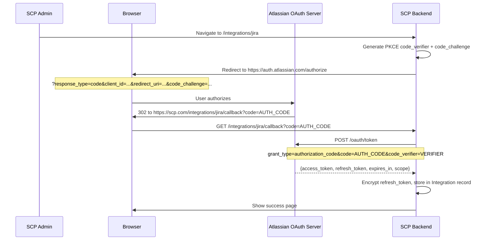
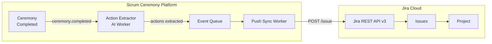
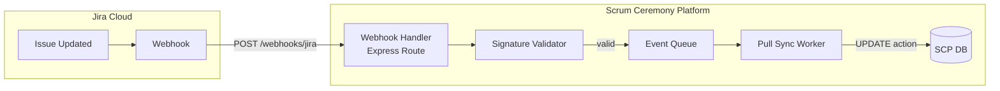
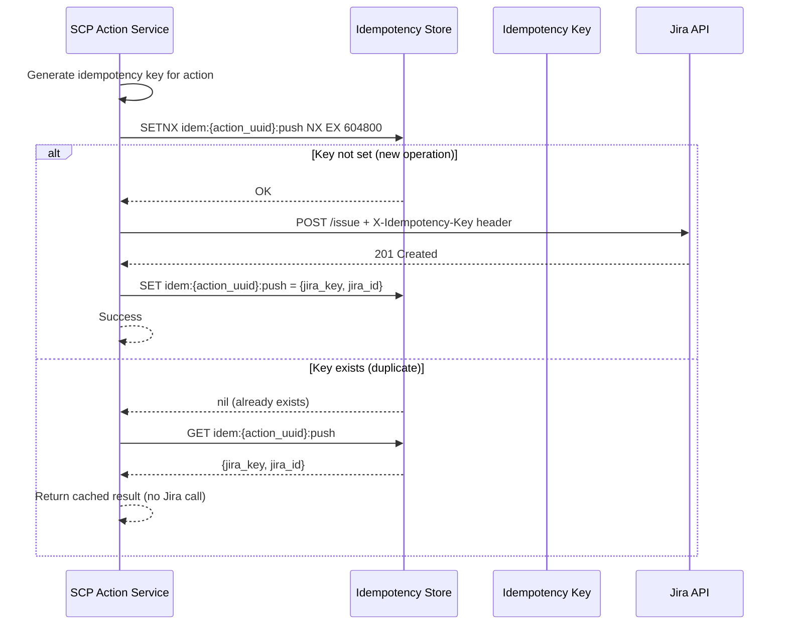
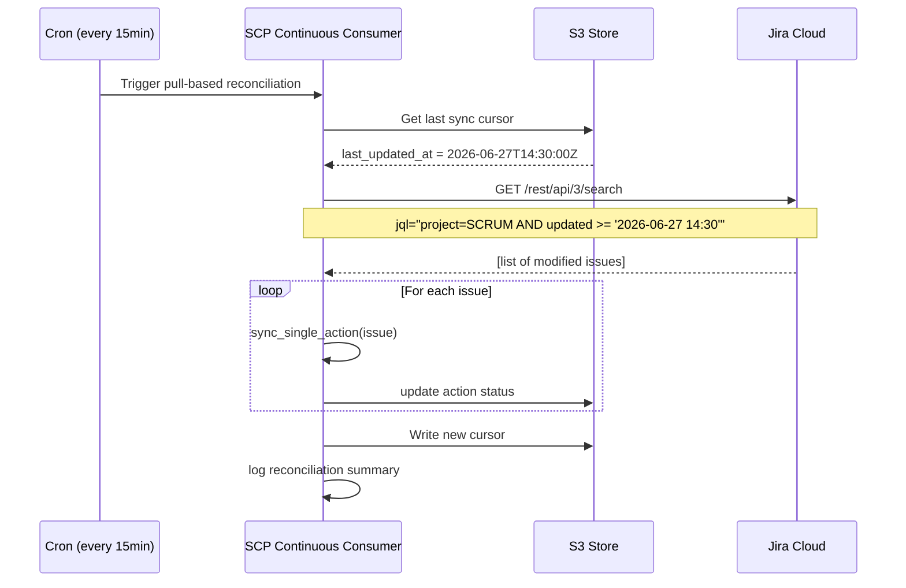

# Jira Cloud Integration Specification

**Version:** 1.0.0
**Last Updated:** 2026-06-27
**Status:** Draft
**Owner:** Platform Engineering

---

## Table of Contents

1. [Overview](#overview)
2. [OAuth 2.0 Authentication](#oauth-20-authentication)
3. [Push: SCP → Jira](#-push-scp--jira)
4. [Pull: Jira → SCP](#-pull-jira--scp)
5. [Idempotency](#idempotency)
6. [Conflict Resolution](#conflict-resolution)
7. [Rate Limiting](#rate-limiting)
8. [Webhook Reliability](#webhook-reliability)
9. [Security](#security)
10. [Testing Strategy](#testing-strategy)
11. [Appendices](#appendices)

---

## 1. Overview <a name="overview"></a>

### 1.1 Purpose

This document specifies the bidirectional synchronization between the Scrum Ceremony Platform (SCP) and Jira Cloud. The integration enables teams to use SCP for retrospective ceremonies while keeping Jira issues in sync with action items identified during those ceremonies.

### 1.2 Design Principles

| Principle | Description |
|-----------|-------------|
| **Bidirectional** | SCP actions push to Jira; Jira status changes pull to SCP |
| **Idempotent** | Every operation can be safely retried without side effects |
| **Eventually Consistent** | Synchronization is asynchronous; both systems may differ briefly |
| **Least Privilege** | Only request the minimum Jira API scopes needed |
| **Observable** | All sync operations are logged and traceable |

### 1.3 Scope

**In Scope:**
- Push SCP action items → Jira issues (create/update)
- Pull Jira issue status changes → SCP action status
- Field mapping and transformation
- Sprint association
- Webhook-based real-time sync

**Out of Scope:**
- Bidirectional comment sync
- Custom field creation in Jira
- Jira workflow modification

---

## 2. OAuth 2.0 Authentication <a name="oauth-20-authentication"></a>

### 2.1 Atlassian OAuth 2.0 Flow

We use direct OAuth 2.0 (3-legged) rather than Atlassian Connect (which is designed for marketplace apps).



### 2.2 Scopes

Only the minimum required scopes are requested:

| Scope | Purpose | Required |
|-------|---------|----------|
| `read:jira-work` | Read issue data for pull sync | ✅ |
| `write:jira-work` | Create/update issues (push sync) | ✅ |
| `read:jira-user` | Resolve Jira users to SCP users | ✅ |
| `manage:jira-webhook` | Register/unregister webhooks | ✅ |
| `read:resource:jira` | Retrieve app properties for health check | ✅ |

**NOT requested:**
- `delete:jira-work` — SCP never deletes Jira issues
- `write:jira-work:admin` — Admin-level mutations not needed

### 2.3 Token Lifecycle

| Phase | Token Type | TTL | Storage |
|-------|-----------|-----|---------|
| Initial auth | Authorization code | 10 min (single use) | In-memory only |
| Active session | Access token | 30 days | Encrypted at rest |
| Refresh | Refresh token | 365 days | AES-256 encrypted in DB |
| Refresh rotation | New refresh token | 365 days | Replaces previous |

### 2.4 Token Refresh

```python
import httpx
from cryptography.fernet import Fernet
from datetime import datetime, timedelta

class JiraTokenManager:
    def __init__(self, client_id: str, client_secret: str, encryption_key: bytes):
        self.client_id = client_id
        self.client_secret = client_secret
        self.cipher = Fernet(encryption_key)
        self._token_cache = {}  # In-memory cache for active access tokens
    
    async def get_access_token(self, integration_id: str) -> str:
        """Get a valid access token, refreshing if necessary."""
        integration = await self._get_integration(integration_id)
        
        # Check if current token is still valid (5 min buffer)
        if integration.access_token_expires_at > datetime.utcnow() + timedelta(minutes=5):
            return self.cipher.decrypt(integration.encrypted_access_token.encode()).decode()
        
        # Refresh needed
        async with httpx.AsyncClient() as client:
            response = await client.post(
                "https://auth.atlassian.com/oauth/token",
                json={
                    "grant_type": "refresh_token",
                    "client_id": self.client_id,
                    "client_secret": self.client_secret,
                    "refresh_token": self.cipher.decrypt(integration.encrypted_refresh_token.encode()).decode()
                }
            )
            response.raise_for_status()
            data = response.json()
        
        # Update integration record
        await self._update_tokens(
            integration_id=integration_id,
            access_token=data["access_token"],
            refresh_token=data["refresh_token"],
            expires_in=data["expires_in"]
        )
        
        return data["access_token"]
```

### 2.5 OAuth State & PKCE

```python
import hashlib
import base64
import secrets

def generate_pkce_challenge():
    """Generate PKCE code_verifier and code_challenge for OAuth flow."""
    # Generate a random code_verifier (43-128 chars)
    code_verifier = base64.urlsafe_b64encode(
        secrets.token_bytes(32)
    ).rstrip(b'=').decode('utf-8')
    
    # Compute S256 code_challenge
    code_challenge = base64.urlsafe_b64encode(
        hashlib.sha256(code_verifier.encode()).digest()
    ).rstrip(b'=').decode('utf-8')
    
    return code_verifier, code_challenge
```

---

## 3. Push: SCP → Jira <a name="push-scp--jira"></a>

### 3.1 Architecture



### 3.2 Field Mapping

| SCP Field | Jira Field | Direction | Transformation |
|-----------|-----------|-----------|----------------|
| `action.id` | `customfield_10001` (SCP UUID) | SCP→Jira | Store for idempotency |
| `action.title` | `summary` | SCP→Jira | Truncate to 255 chars |
| `action.description` | `description` | SCP→Jira | Markdown → Atlassian Doc Format |
| `action.projectKey` | `project` | SCP→Jira | Map via integration config |
| `action.issueType` | `issuetype` | SCP→Jira | Default: "Story" |
| `action.assignee.email` | `user.accountId` | SCP→Jira | Resolve via Jira user search |
| `action.sprintName` | `customfield_10002` | SCP→Jira | Map sprint name → sprint ID |
| `action.teamId` | `labels[]` | SCP→Jira | `scp-team-{team_id}` |
| `action.priority` | `priority` | SCP→Jira | Priority mapping table |
| `action.storyPoints` | `customfield_10003` | SCP→Jira | Direct number mapping |
| `action.labels` | `labels[]` | SCP→Jira | Prefix each with `scp-` |
| `action.parentIssue` | `parent.key` | SCP→Jira | For sub-task creation |

### 3.3 Priority Mapping

| SCP Priority | Jira Priority | Priority ID |
|-------------|---------------|-------------|
| Critical | Highest | 1 |
| High | High | 2 |
| Medium | Medium | 3 |
| Low | Low | 4 |
| Trivial | Lowest | 5 |

### 3.4 Description Format Transformation

SCP descriptions use Markdown; Jira uses Atlassian Document Format (ADF) or Wiki Markup.

**SCP Markdown:**
```markdown
## Action Item
Update the CI pipeline to skip parallel test execution when running hotfix deployments.

**Context:** Flaky tests failing on hotfix branch due to resource contention.
**Acceptance Criteria:**
- [ ] Pipeline detects hotfix pattern from branch name
- [ ] Runs tests sequentially when hotfix detected
- [ ] Reduces CI time by >20%
```

**Jira Output (Wiki Markup):**
```wiki
h3. Action Item
Update the CI pipeline to skip parallel test execution when running hotfix deployments.

*Context:* Flaky tests failing on hotfix branch due to resource contention.
*Acceptance Criteria:*
* Pipeline detects hotfix pattern from branch name
* Runs tests sequentially when hotfix detected
* Reduces CI time by >20%
```

### 3.5 Push Implementation

```python
class JiraPushSync:
    def __init__(self, token_manager: JiraTokenManager, idempotency_store):
        self.token_manager = token_manager
        self.idempotency = idempotency_store
    
    async def push_action(self, action: dict, integration_id: str) -> dict:
        """Push a single SCP action to Jira."""
        # Check idempotency
        existing = await self.idempotency.get(action["id"])
        if existing:
            return existing
        
        access_token = await self.token_manager.get_access_token(integration_id)
        
        payload = self._build_jira_payload(action)
        
        async with httpx.AsyncClient() as client:
            response = await client.post(
                "https://api.atlassian.com/ex/jira/{cloudId}/rest/api/3/issue",
                headers={
                    "Authorization": f"Bearer {access_token}",
                    "Content-Type": "application/json",
                    "X-Atlassian-Token": "no-check",
                    "X-Idempotency-Key": action["id"]
                },
                json=payload
            )
            response.raise_for_status()
            result = response.json()
        
        # Cache result for idempotency
        await self.idempotency.store(action["id"], {
            "jira_key": result["key"],
            "jira_id": result["id"],
            "sync_status": "synced",
            "synced_at": datetime.utcnow().isoformat()
        })
        
        return {"jira_key": result["key"], "jira_id": result["id"]}
    
    def _build_jackbar_payload(self, action: dict) -> dict:
        return {
            "fields": {
                "project": {"key": action["project_key"]},
                "summary": action["title"][:255],
                "description": self._markdown_to_jira(action["description"]),
                "issuetype": {"name": action.get("issue_type", "Story")},
                "priority": {"name": PRIORITY_MAP.get(action["priority"], "Medium")},
                "labels": [f"scp-team-{action['team_id']}"] + [f"scp-{l}" for l in action.get("labels", [])],
                "customfield_10001": action["id"],  # SCP UUID
                "customfield_10003": action.get("story_points"),
                "components": [{"name": action.get("component", "Scrum Ceremony Actions")}]
            }
        }
```

---

## 4. Pull: Jira → SCP <a name="pull-jira--scp"></a>

### 4.1 Architecture



### 4.2 Status Mapping

| Jira Status | SCP Action State | Description |
|-------------|-----------------|-------------|
| `Backlog` | `open` | Action identified |
| `To Do` | `open` | Action queued for sprint |
| `In Progress` | `in_progress` | Being worked on |
| `In Review` | `in_review` | Awaiting review |
| `Blocked` | `blocked` | Is a blocker |
| `Done` | `completed` | Successfully completed |
| `Won't Fix` | `cancelled` | Explicitly cancelled |
| `Duplicate` | `cancelled` | Duplicate of another action |

```python
JIRA_TO_SCP_STATUS = {
    "Backlog": "open",
    "To Do": "open",
    "In Progress": "in_progress",
    "In Review": "in_review",
    "Blocked": "blocked",
    "Done": "completed",
    "Won't Fix": "cancelled",
    "Duplicate": "cancelled",
    # Reverse mapping for bidirectional awareness
}

SCP_TO_JIRA_STATUS = {v: k for k, v in JIRA_TO_SCP_STATUS.items() if v != "cancelled"}
SCP_TO_JIRA_STATUS["cancelled"] = "Won't Fix"
```

### 4.3 Polling Reconciliation (Fallback for Missed Webhooks)

```python
class JiraPollingReconciliation:
    def __init__(self, jira_client, s3_client, bucket: str):
        self.jira_client = jira_client
        self.s3 = s3_client
        self.bucket = bucket
        self.logger = structlog.get_logger()
    
    async def get_last_sync_cursor(self) -> str:
        """Get the JQL cursor from the last successful sync."""
        try:
            response = await self.s3.get_object(Bucket=self.bucket, Key="jira-sync/cursor.json")
            cursor = json.loads(response["Body"].read())
            return cursor.get("cursor", "")
        except:  # noqa: E722
            return ""
    
    async def sync_single_action(self, issue_key: str, team_id: str) -> dict:
        """Update a single action based on Jira issue data."""
        issue = await self.jira_client.get_issue(issue_key)
        status = JIRA_TO_SCP_STATUS.get(issue.fields.status.name, "open")
        s3_key = generate_file_key(team_id=team_id, issue_key=issue_key)
        
        action_update = {
            "action_id": issue.fields.customfield_10001,
            "status": status,
            "jira_issue_key": issue_key,
            "last_synced_at": datetime.utcnow().isoformat()
        }
        
        await upload_to_s3(
            bucket=self.bucket,
            key=f"actions/{s3_key}",
            body=json.dumps(action_update),
            content_type="application/json"
        )
        return action_update
    
    async def reconcile_batch(self) -> dict:
        """Pull all modified issues and update SCP actions."""
        cursor = await self.get_last_sync_cursor()
        
        # Use JQL to find issues assigned to our SCP tracker project
        jql = "project = SCRUM AND status changed AFTER -15m ORDER BY updated DESC"
        
        # Search through all pages
        actions_synced = 0
        issues = await self.jira_client.search_issues(jql=jql, maxResults=100)
        self.logger.info(f"Pulling {len(issues)} modified Jira issues")
        
        for issue in issues:
            if issue.fields.customfield_10001:  # Has SCP UUID mapping
                try:
                    await self.sync_single_action(issue.key, team_id="unknown")
                    actions_synced += 1
                except Exception as e:
                    self.logger.error(
                        "sync_error",
                        issue=issue.key,
                        error=str(e)
                    )
        
        # Update cursor for next sync
        await self.s3.put_object(
            Bucket=self.bucket,
            Key="jira-sync/cursor.json",
            Body=json.dumps({"cursor": datetime.utcnow().isoformat(), "last_count": actions_synced})
        )
        
        return {"synced": actions_synced}
```

### 4.4 Owner Assignee Resolution

```python
# Reverse-lookup SCP assignee from Jira user
def resolve_jira_assignee_to_scp(jira_user: dict, team_id: str) -> str:
    """Find the SCP user ID for a Jira assignee."""
    # Strategy 1: Exact email match
    scp_user = find_scp_user_by_email(jira_user.get("emailAddress", ""))
    if scp_user:
        return scp_user["id"]
    
    # Strategy 2: External ID field (populated by SCP during setup)
    scp_external_id = jira_user.get("account_id")  # or custom field
    scp_user = find_scp_user_by_external_id(scp_external_id)
    if scp_user:
        return scp_user["id"]
    
    # Strategy 3: Fuzzy name match against known team members
    scp_user = fuzzy_match_user_name(display_name=jira_user.get("displayName", ""), team_id=team_id)
    if scp_user:
        return scp_user["id"]
    
    return None
```

---

## 5. Idempotency <a name="idempotency"></a>

### 5.1 Idempotency Key Strategy

Every sync operation carries an idempotency key that prevents duplicate processing of the same event.

**Key Generation:**

```python
import hashlib

def generate_idempotency_key(operation: str, entity_id: str, timestamp: str = None) -> str:
    """
    Generate a deterministic idempotency key.
    Format: sha256({operation}:{entity_id}:{period})
    """
    period = timestamp or datetime.utcnow().strftime("%Y-%m-%d-%H")
    raw = f"{operation}:{entity_id}:{period}"
    return hashlib.sha256(raw.encode()).hexdigest()[:32]
```

### 5.2 Idempotency Store

```python
class IdempotencyStore:
    def __init__(self, redis_client):
        self.redis = redis_client
        self.ttl = 86400 * 7  # 7 days
    
    async def is_processed(self, key: str) -> bool:
        """Check if an idempotency key has already been processed."""
        return await self.redis.exists(f"idemp:{key}")
    
    async def store_result(self, key: str, result: dict, ttl: int = None):
        """Store the result of a processed operation."""
        await self.redis.setex(
            f"idemp:{key}",
            ttl or self.ttl,
            json.dumps(result)
        )
    
    async def get_result(self, key: str) -> dict:
        """Retrieve a previously stored result."""
        data = await self.redis.get(f"idemp:{key}")
        return json.loads(data) if data else None
```

### 5.3 Push Idempotency Flow



### 5.4 Unique Constraint Enforcement

In addition to Redis-based idempotency, the `JiraIssueMapping` database table enforces `action_id` uniqueness as a final safeguard:

```sql
CREATE TABLE jira_issue_mappings (
    action_id UUID PRIMARY KEY,
    jira_issue_key VARCHAR(64) NOT NULL,
    jira_issue_id VARCHAR(24) NOT NULL,
    sync_created_at TIMESTAMP DEFAULT NOW(),
    sync_updated_at TIMESTAMP DEFAULT NOW()
);
```

---

## 6. Conflict Resolution <a name="conflict-resolution"></a>

### 6.1 Strategy: Last-Write-Wins with Audit Trail

When both systems modify the same record concurrently, we use a timestamp-based last-write-wins (LWW) strategy. All changes are logged to an immutable audit table.

### 6.2 Conflict Detection

```python
class ConflictDetector:
    def detect_conflict(self, scp_updated_at: datetime, jira_updated_at: datetime) -> bool:
        """
        Detect if both systems have modified a record since last sync.
        Returns True if conflict detected.
        """
        last_sync = self.get_last_sync_timestamp()
        scp_modified_after_sync = scp_updated_at > last_sync
        jira_modified_after_sync = jira_updated_at > last_sync
        return scp_modified_after_sync and jira_modified_after_sync
    
    async def resolve(self, action_id: str, scp_data: dict, jira_data: dict) -> dict:
        """Resolve using last-write-wins, preserving audit trail."""
        scp_time = datetime.fromisoformat(scp_data["updated_at"])
        jira_time = datetime.fromisoformat(jira_data["updated_at"])
        
        winner = "scp" if scp_time >= jira_time else "jira"
        
        # Write audit entry (immutable log)
        await self.audit_log.record({
            "action_id": action_id,
            "conflict_detected_at": datetime.utcnow().isoformat(),
            "scp_timestamp": scp_data["updated_at"],
            "jira_timestamp": jira_data["updated_at"],
            "winner": winner,
            "scp_value_snapshot": scp_data,
            "jira_value_snapshot": jira_data,
            "resolution_strategy": "last_write_wins"
        })
        
        if winner == "scp":
            await self.push_to_jira(action_id, scp_data)
        else:
            await self.pull_from_jira(action_id, jira_data)
        
        return {"winner": winner, "audit_id": ...}
```

### 6.3 Audit Table Schema

```sql
CREATE TABLE jira_sync_audit (
    id BIGSERIAL PRIMARY KEY,
    action_id UUID NOT NULL,
    sync_direction VARCHAR(20) NOT NULL,  -- 'push' or 'pull'
    conflict_detected_at TIMESTAMP,
    resolution_strategy VARCHAR(50),
    scp_value_snapshot JSONB,
    jira_value_snapshot JSONB,
    winner VARCHAR(10),  -- 'scp', 'jira', or null if no conflict
    created_at TIMESTAMP DEFAULT NOW()
);

-- Index for querying conflicts
CREATE INDEX idx_jira_sync_audit_conflict ON jira_sync_audit(conflict_detected_at)
WHERE conflict_detected_at IS NOT NULL;
```

---

## 7. Rate Limiting <a name="rate-limiting"></a>

### 7.1 Jira Cloud API Limits

Jira Cloud enforces per-method and per-app rate limits:

| Resource | Limit | Window | Scope |
|----------|-------|--------|-------|
| `GET /rest/api/3/issue/*` | 50/sec | Per IP | Read operations |
| `POST /rest/api/3/issue` | 30/min | Per user | Issue creation |
| `PUT /rest/api/3/issue/*` | 30/min | Per user | Issue updates |
| `GET /rest/api/3/search` | 60/min | Per user | JQL search |
| `POST /rest/api/3/webhook` | 100/day | Per app | Webhook management |

### 7.2 Adaptive Rate Limiting Strategy

```python
class JiraRateLimiter:
    def __init__(self):
        self.limiters = {
            "read": AsyncRateLimiter(rate=45, period=1),     # 50/sec with 10% buffer
            "write": AsyncRateLimiter(rate=25, period=60),    # 30/min with 17% buffer
            "search": AsyncRateLimiter(rate=50, period=60),   # 60/min with 17% buffer
        }
        self.retry_after = 0
    
    async def acquire(self, operation_type: str):
        """Acquire rate limit token, waiting if necessary."""
        limiter = self.limiters.get(operation_type, self.limiters["read"])
        await limiter.acquire()
    
    async def handle_429(self, response: httpx.Response):
        """Handle rate limit hit with exponential backoff."""
        retry_after = int(response.headers.get("Retry-After", "1"))
        # Add jitter
        wait_time = retry_after + random.uniform(0, 3)
        await asyncio.sleep(wait_time)
        return wait_time
```

### 7.3 Token Bucket Implementation

```python
import asyncio
import time

class AsyncRateLimiter:
    def __init__(self, rate: float, period: float = 1.0):
        self.rate = rate
        self.period = period
        self.tokens = rate
        self.last_refill = time.monotonic()
        self.lock = asyncio.Lock()
    
    async def acquire(self):
        async with self.lock:
            now = time.monotonic()
            elapsed = now - self.last_refill
            self.tokens = min(self.rate, self.tokens + elapsed * (self.rate / self.period))
            self.last_refill = now
            
            if self.tokens >= 1:
                self.tokens -= 1
                return
            
            # Wait for token
            wait_time = (1 - self.tokens) * (self.period / self.rate)
        
        await asyncio.sleep(wait_time)
        await self.acquire()
```

---

## 8. Webhook Reliability <a name="webhook-reliability"></a>

### 8.1 Webhook Registration

On integration setup, SCP registers one webhook per Jira instance:

```python
async def register_webhook(jira_cloud_id: str, access_token: str, webhook_url: str) -> dict:
    """Register a Jira webhook via REST API."""
    payload = {
        "url": webhook_url,
        "webhooks": [
            {
                "events": [
                    "jira:issue_created",
                    "jira:issue_updated",
                    "comment_created",
                    "comment_updated",
                    "issue_property_set"
                ],
                "jqlFilter": "project = SCRUM AND 'SCP UUID' is not EMPTY",
                "excludeBody": False
            }
        ]
    }
    
    async with httpx.AsyncClient() as client:
        response = await client.post(
            f"https://api.atlassian.com/ex/jira/{cloudId}/rest/api/3/webhook",
            headers={
                "Authorization": f"Bearer {access_token}",
                "Content-Type": "application/json"
            },
            json=payload
        )
        response.raise_for_status()
        return response.json()
```

### 8.2 Webhook Handler Implementation

```python
from fastapi import FastAPI, Request, HTTPException, Header
import hmac
import hashlib

app = FastAPI()

@app.post("/webhooks/jira")
async def handle_jira_webhook(
    request: Request,
    x_atlassian_webhook_id: str = Header(None),
    x_atlassian_webhook_identifier: str = Header(None)
):
    payload = await request.json()
    
    # Validate signature (Jira sends a JWT, not HMAC)
    validation_token = request.headers.get("X-Atlas-OIDC-Token", "")
    if not validate_atlassian_jwt(validation_token):
        raise HTTPException(status_code=403, detail="Invalid webhook signature")
    
    # Quick acknowledgment
    event_type = payload.get("webhookEvent", "")
    issue_key = payload.get("issue", {}).get("key")
    
    # Process asynchronously
    if event_type in ("jira:issue_updated", "jira:issue_created"):
        await event_queue.publish("jira.issue.updated", {
            "issue_key": issue_key,
            "payload": payload,
            "webhook_id": x_atlassian_webhook_id
        })
    
    return {"status": "accepted"}
```

### 8.3 Reconciliation Job

A scheduled job runs every 15 minutes to catch any missed events:



**Note:** The reconcile job only updates SCP with Jira status changes; it does not push changes to Jira (pull-only). Push is triggered by SCP events in real-time.

### 8.4 Webhook Health Monitoring

| Metric | Alert Threshold | Threshold |
|--------|-----------------|-----------|
| Webhook delivery success rate | < 99% | Critical |
| Webhook response time p95 | > 500ms | Warning |
| Reconciliation sync lag | > 20 minutes | Critical |
| Missed webhook events (per day) | > 10 | Warning |
| Webhook registration expired | Yes | Critical |

---

## 9. Security <a name="security"></a>

### 9.1 Token Storage

All tokens are encrypted at rest using AES-256-GCM before storage in Postgres.

```python
from cryptography.hazmat.primitives.ciphers.aead import AESGCM
import os
import base64

class TokenEncryptor:
    def __init__(self, master_key: bytes):
        """Initialize with master key from AWS KMS / HashiCorp Vault."""
        self.key = master_key[:32]  # AES-256
    
    def encrypt(self, plaintext: str) -> str:
        """Encrypt a token using AES-256-GCM with random nonce."""
        aesgcm = AESGCM(self.key)
        nonce = os.urandom(12)  # 96-bit nonce
        ciphertext = aesgcm.encrypt(nonce, plaintext.encode(), None)
        # Store nonce:ciphertext together
        return base64.b64encode(nonce + ciphertext).decode()
    
    def decrypt(self, encrypted: str) -> str:
        """Decrypt a token."""
        raw = base64.b64decode(encrypted)
        nonce, ciphertext = raw[:12], raw[12:]
        aesgcm = AESGCM(self.key)
        return aesgcm.decrypt(nonce, ciphertext, None).decode()
```

### 9.2 SCP Integration Token Table

```sql
CREATE TABLE jira_integration_tokens (
    id UUID PRIMARY KEY DEFAULT gen_random_uuid(),
    organization_id UUID NOT NULL REFERENCES organizations(id),
    -- Encrypted credentials
    encrypted_access_token TEXT NOT NULL,
    encrypted_refresh_token TEXT NOT NULL,
    -- Metadata
    cloud_id VARCHAR(24) NOT NULL,
    site_url VARCHAR(255) NOT NULL,
    scopes_granted TEXT[] NOT NULL,
    token_expires_at TIMESTAMP NOT NULL,
    webhook_id VARCHAR(20),
    -- Audit
    created_by UUID REFERENCES users(id),
    created_at TIMESTAMP DEFAULT NOW(),
    last_rotated_at TIMESTAMP,
    is_active BOOLEAN DEFAULT TRUE,
    
    CONSTRAINT uq_org_jira UNIQUE(organization_id, cloud_id)
);

-- Encryption key reference
CREATE TABLE encryption_key_refs (
    key_id UUID PRIMARY KEY,
    kms_provider VARCHAR(50) NOT NULL,  -- 'aws_kms', 'vault', etc.
    kms_key_arn VARCHAR(512) NOT NULL,
    data_ref VARCHAR(255) NOT NULL  -- Reference to where the key material lives
);
```

### 9.3 Scope Minimization

| Justification | Granted Scope | Not Requested |
|--------------|--------------|---------------|
| Read Jira user info for assignee mapping | `read:jira-user` | — |
| Create/update SCP action items as Jira issues | `write:jira-work` | `delete:jira-work` |
| Read issues for pull-based reconciliation | `read:jira-work` | — |
| Register/manage integration webhooks | `manage:jira-webhook` | — |
| Read-only health check | `read:resource:jira` | — |
| — | — | `write:jira-work:admin` |
| — | — | `manage:jira-project` |

### 9.4 HTTPS/TLS Requirements

- All API calls to Jira Cloud use TLS 1.2+ exclusively.
- Webhook endpoints must validate the `X-Atlas-OIDC-Token` JWT from Atlassian.
- Certificates must be from trusted CAs (no self-signed in production).

### 9.5 Audit Logging

All Jira API calls and webhook events are logged:

```python
@dataclass
class JiraAuditEntry:
    event_id: str
    organization_id: str
    action: str  # 'push.create', 'push.update', 'pull.sync', 'webhook.received'
    jira_issue_key: str
    scp_action_id: str
    status: str  # 'success', 'failure', 'conflict'
    error_message: str = None
    ip_address: str = None
    timestamp: datetime = field(default_factory=datetime.utcnow)
```

---

## 10. Testing Strategy <a name="testing-strategy"></a>

### 10.1 Test Pyramid

```
            ┌──────────┐
            │   E2E    │  2 tests (full cycle)
            ├──────────┤
            │ Integration│ 10 tests (mocked Jira API)
            ├──────────┤
            │   Unit   │  50+ tests (individual functions)
            └──────────┘
```

### 10.2 Mock Jira API Server

```python
# tests/mocks/jira_server.py
from fastapi import FastAPI
import json

mock_jira_app = FastAPI()

@mock_jira_app.post("/rest/api/3/issue")
async def create_issue(request: Request):
    body = await request.json()
    return {
        "id": "10001",
        "key": "SCRUM-42",
        "self": "https://api.atlassian.com/ex/jira/cloud123/rest/api/3/issue/10001"
    }

@mock_jira_app.get("/rest/api/3/issue/{issue_key}")
async def get_issue(issue_key: str):
    return {
        "id": "10001",
        "key": issue_key,
        "fields": {
            "summary": "Test issue",
            "status": {"name": "In Progress", "id": "3"},
            "assignee": {"accountId": "abc123", "emailAddress": "user@test.com"},
            "updated": "2026-06-27T14:30:00.000Z",
            "customfield_10001": "scp-action-uuid-123"
        }
    }

@mock_jira_app.get("/rest/api/3/search")
async def search_issues(jql: str = "", maxResults: int = 50):
    return {
        "issues": [],
        "total": 0
    }
```

### 10.3 Unit Tests

```python
# tests/unit/test_jira_push_sync.py
import pytest
from unittest.mock import AsyncMock, patch

@pytest.mark.asyncio
async def test_push_action_creates_jira_issue():
    """Test that pushing an SCP action creates a Jira issue with correct mapping."""
    # Arrange
    mock_token_manager = AsyncMock()
    mock_token_manager.get_access_token.return_value = "test-token"
    
    mock_idempotency = AsyncMock()
    mock_idempotency.get_result.return_value = None  # Not previously processed
    
    sync = JiraPushSync(token_manager=mock_token_manager, idempotency_store=mock_idempotency)
    
    action = {
        "id": "action-123",
        "title": "Improve CI pipeline reliability",
        "description": "## Action\nReduce flaky test failures",
        "project_key": "SCRUM",
        "team_id": "team-456",
        "issue_type": "Story",
        "priority": "High",
        "assignee_email": "dev@company.com",
        "story_points": 3,
        "labels": ["ci", "quality"]
    }
    
    # Mock Jira API response
    with patch("httpx.AsyncClient") as MockClient:
        mock_response = AsyncMock()
        mock_response.json.return_value = {
            "id": "10001",
            "key": "SCRUM-42"
        }
        mock_response.raise_for_status = lambda: None
        mock_client_instance = AsyncMock()
        mock_client_instance.post.return_value = mock_response
        MockClient.return_value.__aenter__ = AsyncMock(return_value=mock_client_instance)
        MockClient.return_value.__aexit__ = AsyncMock()
        
        # Act
        result = await sync.push_action(action, integration_id="int-1")
    
    # Assert
    assert result["jira_key"] == "SCRUM-42"
    mock_idempotency.store_result.assert_called_once()

@pytest.mark.asyncio
async def test_push_idempotent_duplicate(monkeypatch):
    """Test that re-pushing the same action returns cached result without API call."""
    mock_idempotency = AsyncMock()
    mock_idempotency.get_result.return_value = {
        "jira_key": "SCRUM-42",
        "jira_id": "10001"
    }
    
    sync = JiraPushSync(token_manager=AsyncMock(), idempotency_store=mock_idempotency)
    result = await sync.push_action({"id": "action-123"}, integration_id="int-1")
    
    assert result["jira_key"] == "SCRUM-42"
```

### 10.4 Integration Test

```python
# tests/integration/test_jira_client.py
import responses
import pytest

@responses.activate
def test_jira_client_gets_issue():
    responses.add(
        responses.GET,
        "https://api.atlassian.com/ex/jira/cloud123/rest/api/3/issue/SCRUM-42",
        json={
            "id": "10001",
            "key": "SCRUM-42",
            "fields": {
                "status": {"name": "Done", "id": "5"},
                "updated": "2026-06-27T14:30:00.000Z"
            }
        },
        status=200
    )
    
    client = JiraClient(cloud_id="cloud123", token="test-token")
    issue = client.get_issue("SCRUM-42")
    
    assert issue["fields"]["status"]["name"] == "Done"
    assert len(responses.calls) == 1

@responses.activate
def test_rate_limit_retry():
    responses.add(responses.GET, url, status=429, headers={"Retry-After": "2"})
    responses.add(responses.GET, url, json={"key": "SCRUM-1"}, status=200)
    
    limiter = JiraRateLimiter()
    client = JiraClient(cloud_id="cloud123", token="test-token", rate_limiter=limiter)
    issue = client.get_issue("SCRUM-1")
    
    assert len(responses.calls) == 2  # Initial + retry
```

### 10.5 Conflict Resolution Test

```python
# tests/unit/test_conflict_resolution.py
def test_conflict_detection_both_modified():
    detector = ConflictDetector()
    last_sync = datetime(2026, 6, 27, 14, 0, 0)
    scp_updated = datetime(2026, 6, 27, 14, 15, 0)  # After last sync
    jira_updated = datetime(2026, 6, 27, 14, 10, 0)  # After last sync
    
    with patch.object(detector, 'get_last_sync_timestamp', return_value=last_sync):
        assert detector.detect_conflict(scp_updated, jira_updated) is True

def test_conflict_resolution_lww():
    """Test last-write-wins resolution."""
    detector = ConflictDetector()
    scp_data = {"updated_at": "2026-06-27T14:15:00Z", "status": "in_progress"}
    jira_data = {"updated_at": "2026-06-27T14:10:00Z", "status": "done"}
    
    result = asyncio.run(detector.resolve("act-123", scp_data, jira_data))
    assert result["winner"] == "scp"  # SCP was updated later
```

### 10.6 E2E Test

```python
# tests/e2e/test_jira_sync_e2e.py
import pytest

@pytest.mark.e2e
@pytest.mark.jira
def test_full_push_pull_cycle(env):
    """Test complete cycle: action created → pushed to Jira → Jira updated → pulled to SCP."""
    # Step 1: Create action in SCP
    action = create_action(
        env.product_url,
        title="E2E Test Action",
        team_id=env.test_team_id
    )
    
    # Step 2: Wait for push to Jira
    wait_for(
        lambda: get_jira_issue_count(env.jira_url, env.jira_cloud_id) == 1,
        timeout=30
    )
    jira_issue_key = get_jira_issue_key_for_action(env.product_url, action["id"])
    
    # Step 3: Simulate Jira status change
    transition_jira_issue(env.jira_url, jira_issue_key, "Done")
    
    # Step 4: Wait for pull to SCP (via webhook or polling)
    wait_for(
        lambda: get_action_status(env.product_url, action["id"]) == "completed",
        timeout=60
    )
    
    # Step 5: Verify
    updated_action = get_action(env.product_url, action["id"])
    assert updated_action["status"] == "completed"
    assert updated_action["jira_issue_key"] == jira_issue_key
```

### 10.7 Test Checklist

- [ ] Mock Jira API server covers all endpoint patterns
- [ ] Idempotency key prevents duplicates in retry scenarios
- [ ] Rate limiter respects Jira Cloud 429 responses with Retry-After
- [ ] Conflict detection catches concurrent modifications
- [ ] Audit trail captures conflict resolutions
- [ ] Token refresh handled transparently before expiry
- [ ] Webhook signature validation rejects invalid payloads
- [ ] Polling reconciliation catches missed webhook events within 15 minutes
- [ ] All scopes documented and minimal
- [ ] Encryption/decryption of tokens round-trips correctly

---

## 11. Appendices <a name="appendices"></a>

### Appendix A: Jira Field IDs (Custom)

| Field | ID | Type | Purpose |
|-------|-----|------|---------|
| SCP UUID | `customfield_10001` | Text (single line) | Links Jira issue to SCP action |
| Sprint Name | `customfield_10002` | Text (single line) | Sprint association |
| Story Points | `customfield_10003` | Number | SCP story point mapping |

### Appendix B: Environment Variables

| Variable | Purpose | Example |
|----------|---------|---------|
| `JIRA_CLIENT_ID` | OAuth 2.0 Client ID | `com.scrumplatform.oauth` |
| `JIRA_CLIENT_SECRET` | OAuth 2.0 Client Secret | `abc123...` |
| `JIRA_ENCRYPTION_KEY` | AES-256 master key | (from Vault) |
| `JIRA_WEBHOOK_SECRET` | Webhook JWT validation key | `...` |
| `JIRA_RECONCILE_CRON` | Reconciliation schedule | `*/15 * * * *` |
| `JIRA_RATE_LIMIT_BUFFER` | % buffer below Jira's limit | `85` |

### Appendix C: Revision History

| Version | Date | Author | Changes |
|---------|------|--------|---------|
| 1.0.0 | 2026-06-27 | Platform Engineering | Initial specification |
