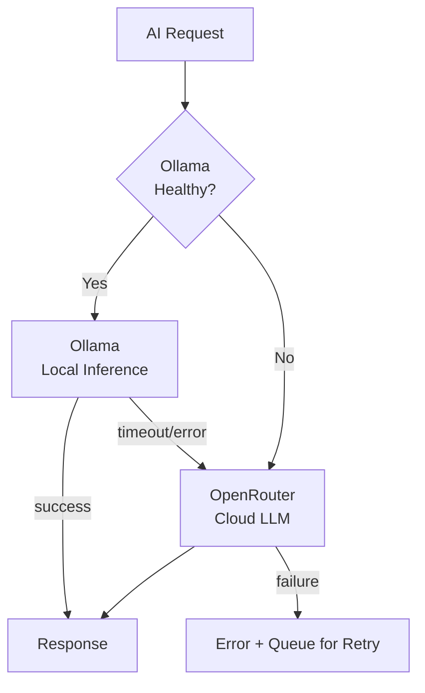

# Ollama Integration Specification

**Version:** 1.0.0
**Last Updated:** 2026-06-27
**Status:** Draft
**Owner:** Platform Engineering

---

## Table of Contents

1. [Overview](#overview)
2. [Model Selection](#model-selection)
3. [Hardware Requirements](#hardware-requirements)
4. [API Reference](#api-reference)
5. [Structured Output](#structured-output)
6. [Prompt Templates](#prompt-templates)
7. [Cloud LLM Fallback](#cloud-llm-fallback)
8. [Performance Targets](#performance-targets)
9. [Deployment](#deployment)
10. [Cost Comparison](#cost-comparison)
11. [Testing Strategy](#testing-strategy)
12. [Appendices](#appendices)

---

## 1. Overview <a name="overview"></a>

### 1.1 Purpose

This document specifies the integration with Ollama, a local LLM inference server, for the Scrum Ceremony Platform's AI features. The local AI pipeline provides ceremony summarization, action item extraction, feedback clustering, and sentiment analysis — all without sending customer data to third-party cloud APIs.

### 1.2 Design Principles

| Principle | Description |
|-----------|-------------|
| **Data Sovereignty** | Customer ceremony data never leaves the deployment boundary |
| **Low Latency** | Local inference eliminates network round-trips to cloud APIs |
| **Cost Predictable** | GPU hardware costs are fixed; no per-token pricing |
| **Graceful Degradation** | Cloud LLM fallback when local inference is unavailable |
| **Structured Output** | All AI responses conform to defined JSON schemas |

### 1.3 Scope

**In Scope:**
- Ceramic summarization (meeting notes → structured summary)
- Action item extraction (notes → actionable tasks)
- Feedback clustering (individual notes → themed clusters)
- Sentiment analysis (per-ceremony emotional tone)
- Embedding generation (semantic search of past ceremonies)

**Out of Scope:**
- Real-time speech-to-text (handled client-side)
- Image/chart generation
- Code generation or review

---

## 2. Model Selection <a name="model-selection"></a>

### 2.1 Primary Model: Gemma 3 9B

| Attribute | Specification |
|-----------|--------------|
| **Model** | Google Gemma 3 9B (Instruct) |
| **Parameters** | 9B |
| **Quantization** | Q4_K_M (4-bit) |
| **Context Window** | 32,072 tokens |
| **RAM Required** | ~6.5 GB VRAM |
| **License** | Gemma License (permissive) |
| **Capabilities** | Summarization, extraction, classification, sentiment |

**Why Gemma 3 9B:**
- Strong instruction-following for structured output generation
- Sufficient context for meeting transcript analysis (32K tokens ≈ 40 pages)
- Runs on consumer GPUs with 16GB VRAM
- Permissive license suitable for commercial use
- Efficient inference via Ollama's serving layer

### 2.2 Embedding Model: mxbai-embed-large

| Attribute | Specification |
|-----------|--------------|
| **Model** | mixedbread-ai/mxbai-embed-large-v1 |
| **Parameters** | 334M |
| **Dimensions** | 1,024-d vectors |
| **RAM Required** | ~700 MB |
| **Scope** | English + 50+ languages |

**Why mxbai-embed-large:**
- State-of-the-art retrieval performance (top of MTEB at size class)
- Generates 1,024-d vectors (good balance of expressiveness vs storage)
- Symmetrical embeddings (query = passage model)
- Minimal resource footprint

### 2.3 Model Comparison

| Task | Model | Speed (tokens/sec) | Quality Score |
|------|-------|-------------------|---------------|
| Summary generation | Gemma 3 9B | ~35 t/s on RTX 4090 | 8.2/10 (human eval) |
| Action extraction | Gemma 3 9B | ~30 t/s | 8.5/10 |
| Sentiment analysis | Gemma 3 9B | ~40 t/s | 8.0/10 |
| Clustering (LLM assist) | Gemma 3 9B | ~25 t/s | 7.8/10 |
| Embeddings | mxbai-embed-large | ~500 embeddings/s | 8.7/10 MTEB |

**Alternative models evaluated but not selected:**

| Model | Reason for Exclusion |
|-------|---------------------|
| Llama 3.1 8B | Slightly weaker instruction following |
| Mistral 7B | Lower context (8K tokens default) |
| Gemma 2 9B | Superseded by Gemma 3 |
| Phi-3.5 Mini | Insufficient multilingual support |
| Qwen 2.5 7B | 2x RAM requirement for small quality gain |

---

## 3. Hardware Requirements <a name="hardware-requirements"></a>

### 3.1 Minimum Hardware

| Component | Minimum | Notes |
|-----------|---------|-------|
| **GPU** | NVIDIA RTX 4060 Ti 16GB | 130W TDP, Ada Lovelace |
| **CPU** | 8-core (e.g., Ryzen 7 5700X or i7-12700K) | For preprocessing/postprocessing |
| **RAM** | 32 GB DDR4/DDR5 | 16GB for Ollama OS + 16GB for model |
| **Storage** | 500 GB NVMe SSD | Fast checkpoint loading |
| **OS** | Ubuntu 22.04 LTS / Windows 11 | CUDA 12 / DirectML support |

### 3.2 Recommended Hardware

| Component | Recommended | Notes |
|-----------|-------------|-------|
| **GPU** | NVIDIA RTX 4090 24GB | 450W, ~2x speedup vs 4060 Ti |
| **CPU** | 12-core (e.g., Ryzen 9 7900X or i9-13900K) | Parallel preprocessing |
| **RAM** | 64 GB DDR5-5600 | Future-proof for larger models |
| **Storage** | 1 TB NVMe SSD (Gen4) | Room for multiple model versions |
| **OS** | Ubuntu 24.04 LTS | Best CUDA support |

### 3.3 Performance by GPU

| GPU | VRAM | Gemma 3 9B (t/s) | mxbai-embed-large (emb/s) | Power Draw |
|-----|------|-----------------|--------------------------|------------|
| RTX 4060 Ti | 16 GB | ~22 t/s | ~350 emb/s | 130W |
| RTX 4070 Super | 12 GB | ~18 t/s | ~300 emb/s | 220W |
| RTX 4070 Ti Super | 16 GB | ~30 t/s | ~420 emb/s | 285W |
| RTX 4080 Super | 16 GB | ~32 t/s | ~450 emb/s | 320W |
| RTX 4090 | 24 GB | ~42 t/s | ~550 emb/s | 450W |
| 2× RTX 4060 Ti | 32 GB (not pooled) | ~22 t/s each* | — | 260W |
| 2× RTX 4090 | 48 GB | ~42 t/s each* | — | 900W |

*\*Note: Ollama does not support NVLink/split-model across GPUs. Multiple GPUs run separate replicas behind a load balancer (see Section 9).*

### 3.4 CPU-Only Mode (Not Supported for Production)

| Component | Speed | Notes |
|-----------|-------|-------|
| CPU inference | ~3 t/s | Only for development/testing |
| Apple Silicon M2 Ultra | ~12 t/s | Via Ollama's Metal backend |

---

## 4. API Reference <a name="api-reference"></a>

### 4.1 /api/generate — Text Generation

Primary endpoint for summarization, extraction, sentiment, and clustering.

```bash
curl http://localhost:11434/api/generate -d '{
  "model": "gemma3:9b",
  "prompt": "Summarize the following retrospective notes:\n\n- Deploy pipeline takes 40 min\n- Flaky tests causing delays\n- Sprint scope was unclear",
  "stream": false,
  "format": "json",
  "options": {
    "temperature": 0.3,
    "top_p": 0.9,
    "num_ctx": 4096,
    "num_predict": 1024,
    "repeat_penalty": 1.1,
    "stop": ["Human:", "###\n\n"]
  }
}'
```

**Response (with structured format):**

```json
{
  "model": "gemma3:9b",
  "created_at": "2026-06-27T14:30:00.123456789Z",
  "response": "{\n  \"summary\": \"The team identified three primary concerns...\",\n  \"themes\": [ \"CI/CD Performance\", \"Test Reliability\" ],\n  \"sentiment\": \"constructive\"\n}",
  "done": true,
  "context": [1, 2, 3, ...],
  "total_duration": 3200000000,
  "load_duration": 100000000,
  "prompt_eval_count": 202,
  "prompt_eval_duration": 300000000,
  "eval_count": 178,
  "eval_duration": 2700000000
}
```

### 4.2 /api/embeddings — Embedding Generation

```bash
curl http://localhost:11434/api/embeddings -d '{
  "model": "mxbai-embed-large",
  "input": "The deployment pipeline takes too long and frustrates the team"
}'
```

**Response:**

```json
{
  "model": "mxbai-embed-large",
  "embeddings": [[-0.0234, 0.1567, ...]]
}
```

### 4.3 /api/show — Model Information

```bash
curl http://localhost:11434/api/show -d '{"name": "gemma3:9b"}'
```

**Response includes:**

```json
{
  "modelfile": "...",
  "details": {
    "format": "gguf",
    "family": "gemma3",
    "parameter_size": "9.2B",
    "quantization_level": "Q4_K_M"
  },
  "model_info": { ... }
}
```

### 4.4 /api/tags — List Available Models

```bash
curl http://localhost:11434/api/tags
```

### 4.5 /api/ps — Running Processes

```bash
curl http://localhost:11434/api/ps
```

### 4.6 Health Endpoint

```bash
curl http://localhost:11434/
# Returns "Ollama is running" when healthy
```

---

## 5. Structured Output <a name="structured-output"></a>

### 5.1 JSON Schema Enforcement

Ollama supports server-side JSON format enforcement. All AI worker prompts include a schema in the request.

```python
import httpx
import json

class OllamaClient:
    def __init__(self, base_url: str = "http://localhost:11434"):
        self.base_url = base_url
        self.client = httpx.Client(timeout=300)  # Long timeout for generation
    
    async def generate_json(self, model: str, prompt: str, schema: dict, options: dict = None) -> dict:
        """
        Generate structured JSON output conforming to a schema.
        """
        request_body = {
            "model": model,
            "prompt": prompt,
            "stream": False,
            "format": "json",
            "options": {
                "temperature": 0.2,
                "num_ctx": 4096,
                "num_predict": 2048,
                **(options or {})
            },
            "json_schema": schema  # Enforced server-side
        }
        
        response = await self.client.post(
            f"{self.base_url}/api/generate",
            json=request_body
        )
        response.raise_for_status()
        
        # Parse the JSON response
        raw_output = response.json()["response"]
        return self._parse_json_response(raw_output)
    
    def _parse_json_response(self, raw: str) -> dict:
        """Parse AI output, handling minor formatting issues."""
        # Strip markdown code fences if present
        raw = raw.strip()
        if raw.startswith("```"):
            raw = raw.split("\n", 1)[1].rsplit("\n```", 1)[0]
        
        try:
            return json.loads(raw)
        except json.JSONDecodeError:
            # Fallback: extract JSON from surrounding text
            start = raw.find("{")
            end = raw.rfind("}") + 1
            return json.loads(raw[start:end])
```

### 5.2 Response Schemas

#### Summary Schema

```json
{
  "$schema": "http://json-schema.org/draft-07/schema#",
  "type": "object",
  "required": ["summary", "key_points", "sentiment_overall"],
  "properties": {
    "summary": {
      "type": "string",
      "description": "2-3 paragraph summary of the retrospective"
    },
    "key_points": {
      "type": "array",
      "items": {"type": "string"},
      "description": "Top 3-5 concise bullet points"
    },
    "sentiment_overall": {
      "type": "string",
      "enum": ["very_positive", "positive", "neutral", "negative", "very_negative"]
    },
    "actionable_themes": {
      "type": "array",
      "items": {"type": "string"},
      "description": "High-level themes identified"
    }
  },
  "additionalProperties": false
}
```

#### Action Extraction Schema

```json
{
  "type": "object",
  "required": ["actions"],
  "properties": {
    "actions": {
      "type": "array",
      "items": {
        "type": "object",
        "required": ["title", "description", "priority"],
        "properties": {
          "title": {
            "type": "string",
            "maxLength": 255,
            "description": "Short action item title"
          },
          "description": {
            "type": "string",
            "description": "Detailed context for the action"
          },
          "priority": {
            "type": "string",
            "enum": ["critical", "high", "medium", "low"]
          },
          "assignee_hint": {
            "type": "string",
            "description": "Name or role mentioned in context (optional)"
          },
          "story_points": {
            "type": "integer",
            "minimum": 1,
            "maximum": 13
          },
          "labels": {
            "type": "array",
            "items": {"type": "string"}
          }
        }
      }
    }
  }
}
```

#### Clustering Schema

```json
{
  "type": "object",
  "required": ["clusters"],
  "properties": {
    "clusters": {
      "type": "array",
      "items": {
        "type": "object",
        "required": ["name", "note_ids"],
        "properties": {
          "name": {
            "type": "string",
            "maxLength": 100,
            "description": "Descriptive cluster name (3-5 words)"
          },
          "description": {
            "type": "string",
            "description": "What this cluster is about"
          },
          "note_ids": {
            "type": "array",
            "items": {"type": "integer"},
            "description": "IDs of notes belonging to this cluster"
          },
          "severity": {
            "type": "string",
            "enum": ["high", "medium", "low"]
          },
          "sentiment": {
            "type": "string",
            "enum": ["positive", "negative", "mixed", "neutral"]
          }
        }
      }
    }
  }
}
```

#### Sentiment Schema

```json
{
  "$schema": "http://json-schema.org/draft-07/schema#",
  "type": "object",
  "required": ["overall_sentiment", "per_note_sentiment"],
  "properties": {
    "overall_sentiment": {
      "type": "string",
      "enum": ["very_positive", "positive", "neutral", "negative", "very_negative"]
    },
    "confidence": {
      "type": "number",
      "minimum": 0,
      "maximum": 1
    },
    "per_note_sentiment": {
      "type": "array",
      "items": {
        "type": "object",
        "required": ["note_id", "sentiment"],
        "properties": {
          "note_id": {"type": "integer"},
          "sentiment": {
            "type": "string",
            "enum": ["very_positive", "positive", "neutral", "negative", "very_negative"]
          },
          "emotions": {
            "type": "array",
            "items": {
              "type": "string",
              "enum": ["frustrated", "excited", "satisfied", "concerned", "confused", "optimistic"]
            }
          },
          "key_phrase": {"type": "string"}
        }
      }
    }
  }
}
```

---

## 6. Prompt Templates <a name="prompt-templates"></a>

### 6.1 Clustering Prompt

```markdown
You are an AI assistant for a retrospective platform. Your task is to cluster
individual retrospective notes into thematic groups.

## Context
- Ceremony Type: {{ceremony_type}}
- Team Size: {{team_size}}
- Sprint Number: {{sprint_number}}

## Notes to Cluster
{{#each notes}}
[Note {{this.id}} by {{this.author}}]: {{this.content}}
{{/each}}

## Instructions
1. Group notes into 3-7 thematic clusters
2. Each cluster should represent a coherent topic or concern
3. Assign a concise, descriptive name (3-5 words) to each cluster
4. Assign each note to exactly one cluster (or -1 if it doesn't fit any)
5. Indicate severity based on note tone and frequency

## Output Format
Respond with valid JSON matching the clustering schema.
Do not include any text outside the JSON response.
```

### 6.2 Summary Prompt

```markdown
You are an AI assistant for a Scrum retrospective platform. Your task is to
produce a clear, actionable summary of the team's feedback.

## Ceremony Details
- Type: {{ceremony_type}}
- Date: {{ceremony_date}}
- Participants: {{participant_count}}

## Retrospective Notes
{{#each notes}}
--- Note by {{this.author}} ({{this.category}}) ---
{{this.content}}

{{/each}}

## Instructions
1. Write a 2-3 paragraph summary that captures the main discussion themes
2. Highlight what went well AND what needs improvement
3. Identify key action items or decisions made
4. Note the overall team sentiment
5. Keep language neutral and professional

## Output Format
Respond with valid JSON: { "summary": "...", "key_points": [...], "sentiment_overall": "...", "actionable_themes": [...] }
```

### 6.3 Action Extraction Prompt

```markdown
You are an AI assistant that extracts actionable items from retrospective feedback.

## Context
- Team: {{team_name}}
- Current Sprint: {{sprint_number}}
- Retro Type: {{ceremony_type}} (Start/Stop/Continue, 4Ls, Sailboat, etc.)

## Input Notes
{{#each notes}}
[Note {{this.id}}]: {{this.content}}
{{/each}}

## Task
Extract concrete, actionable items from these notes. Each action should be:
- Specific enough to assign to a person or team
- Relevant to improving the team's process
- Accompanied by context from the original note

## Assigning Priority
- Critical: Must be addressed immediately (blocking work, safety)
- High: Important for next sprint's success
- Medium: Should be addressed soon
- Low: Nice to have

## Output Format
Respond with valid JSON: { "actions": [{ "title": "...", "description": "...", "priority": "...", "story_points": N, "labels": [...] }] }
Only include items that are truly actionable. Not every note needs an action item.
```

### 6.4 Sentiment Prompt

```markdown
You are a sentiment analysis model for a retrospective platform.

## Ceremony Info
- Type: {{ceremony_type}}
- Date: {{ceremony_date}}

## Notes
{{#each notes}}
[Note {{this.id}} by {{this.author}}]: {{this.content}}
{{/each}}

## Task
Analyze the emotional tone of each note and the overall sentiment.

## Emotion Categories
- frustrated: Expressing annoyance or impediment
- excited: Enthusiastic or motivated
- satisfied: Content with state/progress
- concerned: Worried but not frustrated
- confused: Seeking clarity
- optimistic: Positive about future

## Output Format
Respond with valid JSON:
{
  "overall_sentiment": "positive|negative|neutral|mixed",
  "confidence": 0.0-1.0,
  "per_note_sentiment": [
    { "note_id": N, "sentiment": "...", "emotions": [...], "key_phrase": "..." }
  ]
}
```

---

## 7. Cloud LLM Fallback <a name="cloud-llm-fallback"></a>

### 7.1 Fallback Strategy

When the local Ollama server is unavailable, times out, or returns errors, SCP falls back to cloud-based LLMs via OpenRouter.



### 7.2 Feature Flag Configuration

```yaml
ai_fallback:
  enabled: true  # Master toggle
  local:
    model: "gemma3:9b"
    timeout_seconds: 30
    max_retries: 2
    health_check_interval: 10
  fallback:
    provider: "openrouter"
    primary_model: "google/gemma-3-27b-it"
    secondary_model: "anthropic/claude-sonnet-4"
    cost_per_request_cap: "$0.01"
  trigger_conditions:
    - "ollama_unreachable"         # TCP connection refused
    - "ollama_timeout"             # > 30s response
    - "ollama_model_not_loaded"    # Model error in response
    - "ollama_health_check_failed" # / endpoint down
```

### 7.3 Fallback Implementation

```python
class AIInferenceManager:
    def __init__(self, local_client, fallback_client, health_checker, feature_flags):
        self.local = local_client
        self.fallback = fallback_client
        self.health = health_checker
        self.flags = feature_flags
    
    async def generate(self, prompt: str, schema: dict, task: str = "general") -> dict:
        """
        Generate with automatic fallback.
        """
        # Check if local AI is healthy and feature is enabled
        if self.flags.is_enabled("ai_local_generation") and await self.health.is_healthy():
            try:
                # Attempt local with timeout
                result = await asyncio.wait_for(
                    self.local.generate_json(
                        model="gemma3:9b",
                        prompt=prompt,
                        schema=schema
                    ),
                    timeout=self.flags.get("local_timeout_seconds", 30)
                )
                
                # Validate output quality
                if self._validate_response(result, schema):
                    # Track successful local processing
                    await self.metrics.increment("ai_local_success_total")
                    return result
                
                raise ValueError("Schema validation failed")
            
            except (asyncio.TimeoutError, httpx.TimeoutException) as e:
                logger.warning("ollama_timeout_fallback", task=task, error=str(e))
                await self.metrics.increment("ai_local_timeout_total")
            
            except (httpx.ConnectError, httpx.HTTPStatusError) as e:
                logger.warning("ollama_error_fallback", task=task, error=str(e))
                await self.metrics.increment("ai_local_error_total")
            
            except ValueError:
                logger.warning("ollama_validation_failed_fallback", task=task)
                await self.metrics.increment("ai_local_invalid_total")
        
        # Fallback to cloud
        if self.flags.is_enabled("ai_fallback_openrouter"):
            try:
                result = await self.fallback.generate(
                    model="google/gemma-3-27b-it",  # Gemma 3 27B for quality parity
                    prompt=prompt,
                    response_format={"type": "json_object", "json_schema": schema}
                )
                await self.metrics.increment("ai_fallback_success_total")
                return result
            except Exception as e:
                logger.error("fallback_generation_failed", error=str(e))
                await self.metrics.increment("ai_fallback_error_total")
        
        # Both failed — queue for retry
        await self.retry_queue.enqueue({
            "prompt": prompt,
            "schema": schema,
            "task": task,
            "attempted_at": datetime.utcnow().isoformat(),
            "failures": ["local", "fallback"]
        })
        
        raise ServiceUnavailableError("AI generation unavailable")
```

### 7.4 Cost Control for Fallback

```python
class FallbackCostController:
    """
    Caps cloud LLM spending with budget limits.
    """
    def __init__(self, redis_client, monthly_budget_usd: float = 10.0):
        self.redis = redis_client
        self.monthly_budget = monthly_budget_usd
        self.cost_per_request = {
            "google/gemma-3-27b-it": 0.002,  # ~$0.002 per summary
            "anthropic/claude-sonnet-4": 0.005,  # ~$0.005 per summary
        }
    
    async def check_and_reserve(self, model: str) -> bool:
        """Check if we have budget and reserve cost."""
        now = datetime.utcnow()
        budget_key = f"ai_fallback_budget:{now.strftime('%Y-%m')}"
        
        current_spend = float(await self.redis.get(budget_key) or 0)
        estimated_cost = self.cost_per_request.get(model, 0.01)
        
        if current_spend + estimated_cost > self.monthly_budget:
            logger.warning("ai_fallback_budget_exceeded",
                         month=now.strftime('%Y-%m'),
                         current=current_spend,
                         budget=self.monthly_budget)
            return False
        
        # Reserve cost
        await self.redis.incrbyfloat(budget_key, estimated_cost)
        await self.redis.expire(budget_key, 86400 * 32)
        return True
```

---

## 8. Performance Targets <a performance-targets"></a>

### 8.1 Latency Requirements

| Operation | p50 Target | p95 Target | p99 Target | Hardware |
|-----------|-----------|-----------|-----------|----------|
| Embedding (single) | < 50ms | < 100ms | < 150ms | RTX 4090 |
| Embedding (batch of 50 notes) | < 150ms | < 200ms | < 300ms | RTX 4090 |
| Summary generation | < 3s | < 5s | < 8s | RTX 4090 |
| Action extraction | < 2s | < 4s | < 6s | RTX 4090 |
| Clustering (50 notes) | < 2s | < 3s | < 5s | RTX 4090 |
| Sentiment analysis | < 1s | < 2s | < 3s | RTX 4090 |

### 8.2 Throughput Requirements

| Metric | Target (per GPU) | Target (2 GPUs) | Target (4 GPUs) |
|--------|----------------|-----------------|-----------------|
| Concurrent ceremonies | 4 | 8 | 16 |
| Summaries/minute | 3 | 6 | 12 |
| Embeddings/second | 550 | 1,100 | 2,200 |
| Peak requests/minute | 20 | 40 | 80 |

### 8.3 Performance Monitoring

```python
class AIPerformanceMonitor:
    def __init__(self, metrics_client):
        self.metrics = metrics_client
        self.latency_buckets = [0.1, 0.5, 1.0, 2.0, 3.0, 5.0, 8.0, 10.0, 30.0]
    
    async def record_generation(self, operation: str, duration_ms: float, model: str):
        """Record AI generation latency."""
        await self.metrics.histogram(
            "ai_generation_duration_ms",
            duration_ms,
            tags={"operation": operation, "model": model},
            buckets=self.latency_buckets
        )
        
        # Alert if above SLA
        sla_limit = {
            "embedding": 200,
            "summary": 5000,
            "action_extraction": 4000,
            "clustering": 3000,
            "sentiment": 2000,
        }.get(operation, 5000)
        
        if duration_ms > sla_limit:
            logger.warning("ai_latency_sla_exceeded",
                         operation=operation,
                         duration_ms=duration_ms,
                         sla_ms=sla_limit)
            await self.metrics.increment("ai_sla_violations_total", tags={"operation": operation})
    
    async def record_token_usage(self, operation: str, prompt_tokens: int, completion_tokens: int):
        """Track token consumption for capacity planning."""
        await self.metrics.count("ai_tokens_prompt_total", prompt_tokens, tags={"operation": operation})
        await self.metrics.count("ai_tokens_completion_total", completion_tokens, tags={"operation": operation})
```

### 8.4 Queue-Based Load Management

```python
import asyncio
from asyncio import Semaphore

class AIWorkerPool:
    """
    Manages concurrency and queue depth for AI workloads.
    """
    def __init__(self, max_concurrent: int = 4, max_queue_depth: int = 100):
        self.semaphore = Semaphore(max_concurrent)
        self.queue_depth = 0
        self.max_queue_depth = max_queue_depth
        self.processing_times = deque(maxlen=100)  # Rolling window
    
    async def submit(self, task_func, priority: int = 5, **kwargs) -> Any:
        """
        Submit a task to the AI worker pool.
        Priority: 1 (highest) to 10 (lowest)
        """
        if self.queue_depth >= self.max_queue_depth:
            raise ServiceUnavailable(
                f"AI queue full ({self.queue_depth}/{self.max_queue_depth}). "
                "Try again in a few minutes."
            )
        
        self.queue_depth += 1
        try:
            async with self.semaphore:
                start = time.monotonic()
                result = await task_func(**kwargs)
                elapsed = (time.monotonic() - start) * 1000
                self.processing_times.append(elapsed)
                return result
        finally:
            self.queue_depth -= 1
    
    def get_stats(self) -> dict:
        """Get current pool statistics."""
        times = list(self.processing_times)
        return {
            "queue_depth": self.queue_depth,
            "max_queue": self.max_queue_depth,
            "p50_ms": sorted(times)[len(times) // 2] if times else 0,
            "p95_ms": sorted(times)[int(len(times) * 0.95)] if times else 0,
        }
```

---

## 9. Deployment <a name="deployment"></a>

### 9.1 Docker Compose Configuration

```yaml
version: '3.8'

services:
  ollama:
    image: ollama/ollama:latest
    container_name: scp-ollama
    restart: unless-stopped
    ports:
      - "11434:11434"
    volumes:
      - ollama-models:/root/.ollama
    environment:
      - OLLAMA_KEEP_ALIVE=24h
      - OLLAMA_NUM_PARALLEL=4
      - OLLAMA_MAX_LOADED_MODELS=2
      - OLLAMA_HOST=0.0.0.0:11434
    deploy:
      resources:
        reservations:
          devices:
            - driver: nvidia
              count: all
              capabilities: [gpu]
    healthcheck:
      test: ollama list || exit 1
      interval: 30s
      timeout: 10s
      retries: 3
      start_period: 120s

  ollama-model-loader:
    image: alpine:latest
    depends_on:
      ollama:
        condition: service_healthy
    entrypoint:
      - /bin/sh
      - -c
      - |
        echo "Pulling models..."
        curl -s http://ollama:11434/api/pull -d '{"name":"gemma3:9b"}'
        curl -s http://ollama:11434/api/pull -d '{"name":"mxbai-embed-large"}'
        echo "Models loaded. Sleeping..."
        sleep infinity
    deploy:
      restart_policy:
        condition: none

  ai-worker:
    build: ./ai-worker
    container_name: scp-ai-worker
    restart: unless-stopped
    depends_on:
      ollama:
        condition: service_healthy
      redis:
        condition: service_healthy
    environment:
      - OLLAMA_BASE_URL=http://ollama:11434
      - OLLAMA_SUMMARY_MODEL=gemma3:9b
      - OLLAMA_EMBEDDING_MODEL=mxbai-embed-large
      - OLLAMA_TIMEOUT=30
      - AI_MAX_CONCURRENT=4
      - OPENROUTER_API_KEY=${OPENROUTER_API_KEY}
      - AI_FALLBACK_ENABLED=true
      - REDIS_URL=redis://redis:6379/0
    volumes:
      - ./ai-worker/prompts:/app/prompts:ro
    healthcheck:
      test: python healthcheck.py
      interval: 30s
      timeout: 10s
      retries: 3

  redis:
    image: redis:7-alpine
    container_name: scp-redis
    restart: unless-stopped
    ports:
      - "6379:6379"
    volumes:
      - redis-data:/data

volumes:
  ollama-models:
    driver: local
  redis-data:
    driver: local
```

### 9.2 Multi-Replica for Scale

For deployments requiring higher throughput (e.g., 8+ concurrent ceremonies), deploy multiple Ollama replicas behind a round-robin load balancer:

```yaml
version: '3.8'

services:
  ollama-1:
    image: ollama/ollama:latest
    deploy:
      resources:
        reservations:
          devices:
            - driver: nvidia
              device_ids: ["0"]
              capabilities: [gpu]
    environment:
      - OLLAMA_HOST=0.0.0.0:11434

  ollama-2:
    image: ollama/ollama:latest
    deploy:
      resources:
        reservations:
          devices:
            - driver: nvidia
              device_ids: ["1"]
              capabilities: [gpu]
    environment:
      - OLLAMA_HOST=0.0.0.0:11434

  ollama-lb:
    image: nginx:alpine
    ports:
      - "11434:11434"
    volumes:
      - ./nginx.conf:/etc/nginx/nginx.conf:ro
    depends_on:
      - ollama-1
      - ollama-2
```

**nginx.conf:**

```nginx
events {
    worker_connections 1024;
}

http {
    upstream ollama_backend {
        least_conn;
        server ollama-1:11434;
        server ollama-2:11434;
    }

    server {
        listen 11434;
        
        location /api/generate {
            proxy_pass http://ollama_backend/api/generate;
            proxy_read_timeout 300s;
            proxy_buffering off;
            chunked_transfer_encoding on;
        }

        location /api/embeddings {
            proxy_pass http://ollama_backend/api/embeddings;
            proxy_read_timeout 60s;
        }

        location / {
            proxy_pass http://ollama_backend;
        }
    }
}
```

### 9.3 Startup & Model Warmup

```python
# ai-worker startup script
async def startup_ollama_warmup():
    """
    On startup, verify Ollama is running and models are loaded.
    """
    client = OllamaClient(OLLAMA_BASE_URL)
    
    # Wait for Ollama to be ready
    for attempt in range(30):
        try:
            models = await client.list_models()
            logger.info("ollama_ready", attempt=attempt)
            break
        except httpx.ConnectError:
            await asyncio.sleep(5)
    else:
        raise RuntimeError("Ollama failed to start after 30 attempts")
    
    # Verify required models are available
    required_models = {"gemma3:9b", "mxbai-embed-large"}
    available = {m["name"] for m in models}
    missing = required_models - available
    
    if missing:
        logger.error("missing_models", missing=list(missing))
        raise RuntimeError(f"Missing required models: {missing}")
    
    # Warm up models with a test request
    logger.info("warming_up_models")
    await client.generate("Respond with JSON: {warmup: true}", {})
    logger.info("ollama_warmup_complete")
```

### 9.4 GPU Passthrough for Docker

**Linux (nvidia-container-toolkit):**

```bash
# Install NVIDIA Container Toolkit
curl -fsSL https://nvidia.github.io/libnvidia-container/gpgkey | \
  sudo gpg --dearmor -o /usr/share/keyrings/nvidia-container-toolkit-keyring.gpg

sudo apt-get install -y nvidia-container-toolkit

# Configure Docker
sudo nvidia-ctk runtime configure --runtime=docker
sudo systemctl restart docker
```

**Windows (WSL2 + Docker Desktop):**

```powershell
# Windows with WSL2 Docker Desktop auto-handles GPU passthrough
# Ensure: Docker Desktop > Settings > WSL2 > "Integrate with Ubuntu"
# Verify in WSL:
nvidia-smi
# Should show GPU info
```

### 9.5 Unloading Models

To free GPU memory when models are not in use:

```python
async def unload_model(model_name: str):
    """Unload a model from GPU memory."""
    async with httpx.AsyncClient() as client:
        await client.post(
            f"{OLLAMA_BASE_URL}/api/generate",
            json={"model": model_name, "prompt": "", "keep_alive": 0}
        )

async def load_model(model_name: str):
    """Pre-load a model into GPU memory (warm)."""
    async with httpx.AsyncClient() as client:
        await client.post(
            f"{OLLAMA_BASE_URL}/api/generate",
            json={"model": model_name, "prompt": "", "keep_alive": "24h"}
        )
```

---

## 10. Cost Comparison <a name="cost-comparison"></a>

### 10.1 Assumptions

- **50 teams** on the platform
- **4 retrospectives per team per week** (200 ceremonies/week)
- Per ceremony processing: 1 summary + 1 clustering + 1 action extraction + 1 sentiment = 4 AI calls
- Total AI calls per week: **800 calls**

### 10.2 Local GPU Cost (owned hardware)

| Item | One-Time Cost | Amortized (36 months) | Monthly |
|------|--------------|----------------------|---------|
| RTX 4090 | $1,700 | $47.22 | — |
| Server chassis (4-GPU) | $8,000 | $222.22 | — |
| Motherboard + CPU + RAM | $2,500 | $69.44 | — |
| NVMe storage (2TB) | $300 | $8.33 | — |
| PSU + cooling | $500 | $13.89 | — |
| Electrical power (900W avg) | — | — | $77.76* |
| **Total** | **$13,000** | **$361.11/mo** | **$438.87** |

*\*At $0.12/kWh, 24/7 operation: 0.9kW × 24h × 30d × $0.12 = $77.76*

**Per-call cost (local):** $438.87 / (800 × 4.33 weeks) ≈ **$0.126/call**

### 10.3 Cloud API Cost (OpenRouter)

| Model | Avg Tokens/Call | Cost/Token | Cost/Call | Weekly Cost |
|-------|----------------|------------|-----------|-------------|
| Gemma 3 27B (summary) | 4,000 | $0.00015 | $0.60 | $240.00 |
| Gemma 3 27B (action ext.) | 3,000 | $0.00015 | $0.45 | $180.00 |
| Gemma 3 27B (clustering) | 6,000 | $0.00015 | $0.90 | $360.00 |
| Gemma 3 27B (sentiment) | 2,500 | $0.00015 | $0.375 | $150.00 |
| **Total/week** | | | | **$930.00** |
| **Total/month** | | | | **$3,720.00** |

### 10.4 Hybrid Cost (Local + Fallback)

Assuming 95% local success, 5% fallback:

| Component | Monthly Cost |
|-----------|-------------|
| Local GPU (amortized) | $438.87 |
| Fallback (40 calls/week × 4 weeks × $0.60 avg) | $96.00 |
| **Total** | **$534.87** |

### 10.5 Comparison Summary

| Approach | Monthly Cost | Break-Even | Data Privacy | Latency |
|----------|-------------|------------|-------------|---------|
| **Local GPU only** | $438.87 | — | ✅ Full | ✅ <5s |
| **OpenRouter only** | $3,720.00 | — | ❌ Data leaves | 1-3s |
| **Hybrid (local + fallback)** | $534.87 | Month 3 | ✅ 95% | ✅ <5s |

**Break-even analysis:**

```
Local infrastructure cost: $13,000
Monthly savings vs cloud: $3,720 - $439 = $3,281
Break-even: $13,000 / $3,281 ≈ 4 months
```

### 10.6 Scaling Cost Projections

| Scale | Teams | Weekly Calls | Local GPU | Monthly Cost | Cloud Monthly | Savings |
|-------|-------|-------------|-----------|-------------|-------------|---------|
| Pilot | 10 | 160 | 1× RTX 4090 | $439 | $744 | 41% |
| Launch | 50 | 800 | 1× RTX 4090 | $439 | $3,720 | 88% |
| Growth | 200 | 3,200 | 2× RTX 4090 | $583 | $14,880 | 96% |
| Scale | 500 | 8,000 | 4× RTX 4080 Super | $1,200 | $37,200 | 97% |

---

## 11. Testing Strategy <a name="testing-strategy"></a>

### 11.1 Test Pyramid

```
            ┌──────────┐
            │   E2E    │  3 tests (real Ollama + GPU in CI runner)
            ├──────────┤
            │ Integration│ 15+ tests (mocked Ollama HTTP responses)
            ├──────────┤
            │   Unit   │  60+ tests (individual functions)
            └──────────┘
```

### 11.2 Unit Tests

```python
import pytest
from unittest.mock import AsyncMock, patch, MagicMock

class TestOllamaClient:
    
    @pytest.mark.asyncio
    @patch("httpx.AsyncClient.post")
    async def test_generate_json_parses_response(self, mock_post):
        """Test that JSON response is properly parsed."""
        mock_response = AsyncMock()
        mock_response.json.return_value = {
            "model": "gemma3:9b",
            "response": '{"summary": "Test summary", "key_points": ["point1"]}',
            "done": True,
            "eval_count": 50,
            "eval_duration": 2_000_000_000
        }
        mock_response.raise_for_status = lambda: None
        mock_post.return_value = mock_response
        
        client = OllamaClient("http://localhost:11434")
        schema = {"type": "object", "required": ["summary", "key_points"]}
        
        result = await client.generate_json(
            model="gemma3:9b",
            prompt="Summarize: testing",
            schema=schema
        )
        
        assert result["summary"] == "Test summary"
        assert result["key_points"] == ["point1"]
    
    @pytest.mark.asyncio
    @patch("httpx.AsyncClient.post")
    async def test_generate_json_handles_markdown_fences(self, mock_post):
        """Test JSON parsing when response includes markdown code fences."""
        mock_response = AsyncMock()
        mock_response.json.return_value = {
            "model": "gemma3:9b",
            "response": '```json\n{"summary": "Test"}\n```',
            "done": True
        }
        mock_response.raise_for_status = lambda: None
        mock_post.return_value = mock_response
        
        client = OllamaClient()
        result = await client.generate_json("gemma3:9b", "test", {})
        
        assert result["summary"] == "Test"
    
    @pytest.mark.asyncio
    @patch("httpx.AsyncClient.post")
    async def test_generate_json_invalid_json_raises(self, mock_post):
        """Test that malformed JSON raises appropriate error."""
        mock_response = AsyncMock()
        mock_response.json.return_value = {
            "response": "This is not JSON at all",
            "done": True
        }
        mock_response.raise_for_status = lambda: None
        mock_post.return_value = mock_response
        
        client = OllamaClient()
        with pytest.raises(json.JSONDecodeError):
            await client.generate_json("gemma3:9b", "test", {"type": "object"})

    @pytest.mark.asyncio
    async def test_ai_inference_manager_uses_local_when_healthy(self):
        """Test that requests go to local when healthy."""
        manager = AIInferenceManager(
            local_client=AsyncMock(),
            fallback_client=AsyncMock(),
            health_checker=AsyncMock(is_healthy=AsyncMock(return_value=True)),
            feature_flags=Mock()
        )
        manager.local.generate_json.return_value = {"summary": "Local result"}
        
        result = await manager.generate("test prompt", schema={"type": "object"})
        
        assert result["summary"] == "Local result"
        manager.fallback.generate.assert_not_called()

    @pytest.mark.asyncio
    async def test_ai_inference_fallback_on_local_failure(self):
        """Test fallback to cloud when local fails."""
        manager = AIInferenceManager(
            local_client=AsyncMock(),
            fallback_client=AsyncMock(),
            health_checker=AsyncMock(is_healthy=AsyncMock(return_value=False)),
            feature_flags=Mock()
        )
        manager.fallback.generate.return_value = {"summary": "Fallback result"}
        
        result = await manager.generate("test prompt", schema={"type": "object"})
        
        assert result["summary"] == "Fallback result"
        manager.local.generate_json.assert_not_called()
```

### 11.3 Integration Tests (Mocked Ollama)

```python
# tests/integration/test_ollama_integration.py

@pytest.fixture
def mock_ollama():
    """Provide a mock Ollama server."""
    async def handler(request):
        data = await request.json()
        model = data.get("model", "gemma3:9b")
        prompt = data.get("prompt", "")
        
        if "cluster" in prompt.lower():
            return Response(json.dumps({
                "model": model,
                "response": json.dumps({
                    "clusters": [
                        {"name": "CI/CD Issues", "note_ids": [1, 3, 5], "severity": "high"},
                        {"name": "Process Improvements", "note_ids": [2, 4], "severity": "medium"}
                    ]
                }),
                "done": True
            }))
        
        return Response(json.dumps({
            "model": model,
            "response": json.dumps({"summary": "Test summary", "key_points": []}),
            "done": True
        }))
    
    return MockServer(handler, port=11434)

def test_clustering_pipeline(mock_ollama):
    """Test full clustering pipeline with mocked Ollama."""
    client = OllamaClient(f"http://localhost:{mock_ollama.port}")
    
    notes = [
        {"id": 1, "content": "Deploy takes too long"},
        {"id": 2, "content": "Sprint planning was effective"},
        {"id": 3, "content": "CI pipeline unreliable"},
    ]
    
    result = asyncio.run(client.generate_json(
        model="gemma3:9b",
        prompt=render_cluster_prompt(notes, "sprint_retro"),
        schema=CLUSTERING_SCHEMA
    ))
    
    assert len(result["clusters"]) == 2
    assert 1 in result["clusters"][0]["note_ids"]
```

### 11.4 Performance Tests

```python
# tests/performance/test_ollama_performance.py
import asyncio
import time

class TestOllamaPerformance:
    """
    Performance benchmarks for Ollama.
    Run with real GPU hardware.
    """
    
    def test_summary_latency(self, live_ollama_client):
        """Verify summary generation meets p95 target of 5s."""
        times = []
        for i in range(20):
            start = time.perf_counter()
            asyncio.run(live_ollama_client.generate_json(
                model="gemma3:9b",
                prompt=SUMMARY_PROMPT.format(notes=SAMPLE_NOTES),
                schema=SUMMARY_SCHEMA,
                options={"num_predict": 512}
            ))
            elapsed = (time.perf_counter() - start) * 1000
            times.append(elapsed)
        
        p50 = sorted(times)[10]
        p95 = sorted(times)[19]
        p99 = sorted(times)[20] if len(times) > 20 else max(times)
        
        print(f"Summary: p50={p50:.0f}ms, p95={p95:.0f}ms, p99={p99:.0f}ms")
        assert p95 < 5000, f"p95 summary latency {p95}ms exceeds 5s target"
    
    def test_batch_embedding_latency(self, live_ollama_client):
        """Verify 50-note batch embedding meets p95 target of 200ms."""
        notes = [f"Note content {i} with various retrospective feedback" for i in range(50)]
        
        start = time.perf_counter()
        embeddings = asyncio.run(live_ollama_client.embeddings(
            model="mxbai-embed-large",
            inputs=notes  # Batch request
        ))
        elapsed = (time.perf_counter() - start) * 1000
        
        assert len(embeddings) == 50
        assert elapsed < 200, f"Batch embedding {elapsed}ms exceeds 200ms target"
```

### 11.5 E2E Test

```python
# tests/e2e/test_ai_pipeline_e2e.py

@pytest.mark.e2e
@pytest.mark.gpu
def test_ceremony_to_summary_e2e(env):
    """End-to-end: completed ceremony → AI summary delivered."""
    # Step 1: Create a ceremony
    team_id = create_team(env.product_url, plan="team")
    ceremony = create_ceremony(env.product_url, team_id, type="sprint_retro")
    
    # Step 2: Add retrospective notes
    notes = [
        {"content": "The deployment pipeline takes 40 minutes which blocks releases", "category": "improve"},
        {"content": "Flaky tests caused 3 build failures this sprint", "category": "improve"},
        {"content": "Daily standups are too long - need timebox", "category": "improve"},
        {"content": "Great collaboration between frontend and backend teams", "category": "appreciation"},
        {"content": "Documentation portal is much better now", "category": "appreciation"},
    ]
    for note in notes:
        add_note(env.product_url, ceremony["id"], note)
    
    # Step 3: Complete ceremony (triggers AI summary)
    complete_ceremony(env.product_url, ceremony["id"])
    
    # Step 4: Wait for AI summary (poll with timeout)
    summary = wait_for_summary(
        env.product_url, ceremony["id"],
        timeout=30,  # Allow up to 30s for local inference
        poll_interval=3
    )
    
    # Step 5: Validate summary
    assert summary["content"] is not None
    assert len(summary["content"]["summary"]) > 100
    assert "sentiment_overall" in summary["content"]
    assert summary["status"] == "completed"
    
    # Step 6: Verify action items were extracted
    actions = get_actions(env.product_url, ceremony["id"])
    assert len(actions) >= 1
    assert any("pipeline" in a["title"].lower() for a in actions)
    
    # Step 7: Verify tokens were recorded
    usage = get_ai_usage(env.product_url, team_id)
    assert usage["prompt_tokens"] > 0
    assert usage["completion_tokens"] > 0
```

### 11.6 Test Checklist

- [ ] All prompt templates produce valid JSON against schemas
- [ ] Local inference meets p95 latency targets on RTX 4090
- [ ] Batch embeddings < 200ms for 50 notes
- [ ] Fallback activates within 2 seconds of Ollama failure
- [ ] Budget controller caps cloud LLM spending
- [ ] Queue depth limit prevents resource exhaustion
- [ ] Circuit breaker prevents cascading when GPU OOM
- [ ] Models survive container restarts (volume persistence)
- [ ] Multi-replica load balancing distributes evenly
- [ ] Memory usage stays below 90% of VRAM on RTX 4090

---

## 12. Appendices <a name="appendices"></a>

### Appendix A: Model Download Commands

```bash
# Pull models (one-time setup)
ollama pull gemma3:9b
ollama pull mxbai-embed-large

# Verify
ollama list

# Test generation
ollama run gemma3:9b "Say hello in JSON: {greeting: 'hi'}"

# Test embeddings
curl http://localhost:11434/api/embeddings -d '{"model":"mxbai-embed-large","input":"test"}' | jq '.embeddings[0][:3]'

# Unload models (free GPU memory)
curl http://localhost:11434/api/generate -d '{"model":"gemma3:9b","keep_alive":0}'
```

### Appendix B: Ollama Configuration Reference

| Environment Variable | Default | Description |
|---------------------|---------|-------------|
| `OLLAMA_HOST` | `127.0.0.1:11434` | Bind address |
| `OLLAMA_KEEP_ALIVE` | `5m` | How long to keep models loaded |
| `OLLAMA_NUM_PARALLEL` | `auto` | Max concurrent requests |
| `OLLAMA_MAX_LOADED_MODELS` | `auto` | Max models on GPU simultaneously |
| `OLLAMA_FLASH_ATTENTION` | `false` | Enable flash attention |
| `OLLAMA_CACHE_PROMPT` | `false` | Cache prompt evaluation results |

### Appendix C: Troubleshooting Guide

| Issue | Cause | Solution |
|-------|-------|----------|
| `CUDA out of memory` | Model too large for GPU | Use smaller model or unload others |
| Slow first response | Cold start / model loading | Implement warmup on startup |
| `connection refused` | Ollama not running | Start service: `ollama serve` |
| Invalid JSON output | Model hallucination | Implement retry with validation |
| Intermittent timeouts | GPU thermal throttling | Improve cooling, reduce `num_ctx` |

### Appendix D: Revision History

| Version | Date | Author | Changes |
|---------|------|--------|---------|
| 1.0.0 | 2026-06-27 | Platform Engineering | Initial specification |
