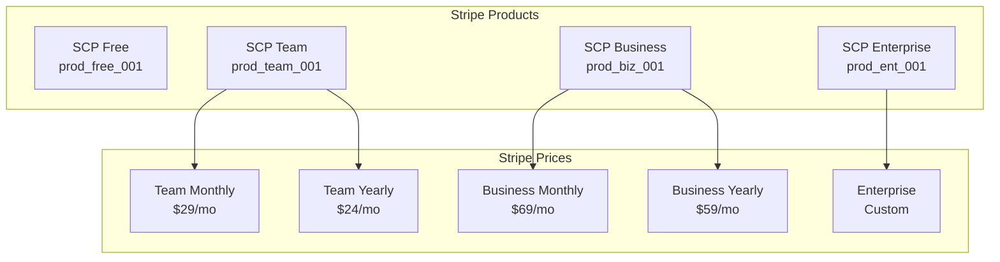
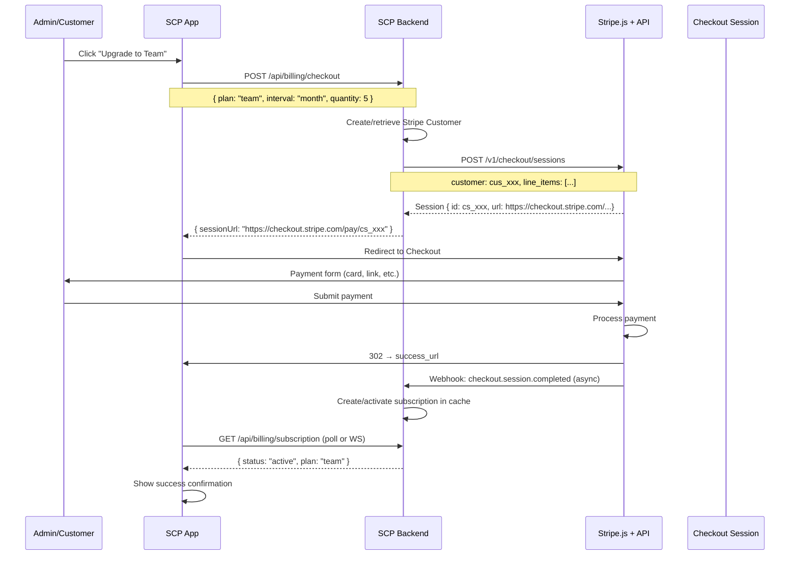
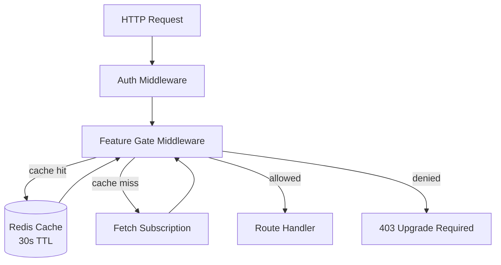
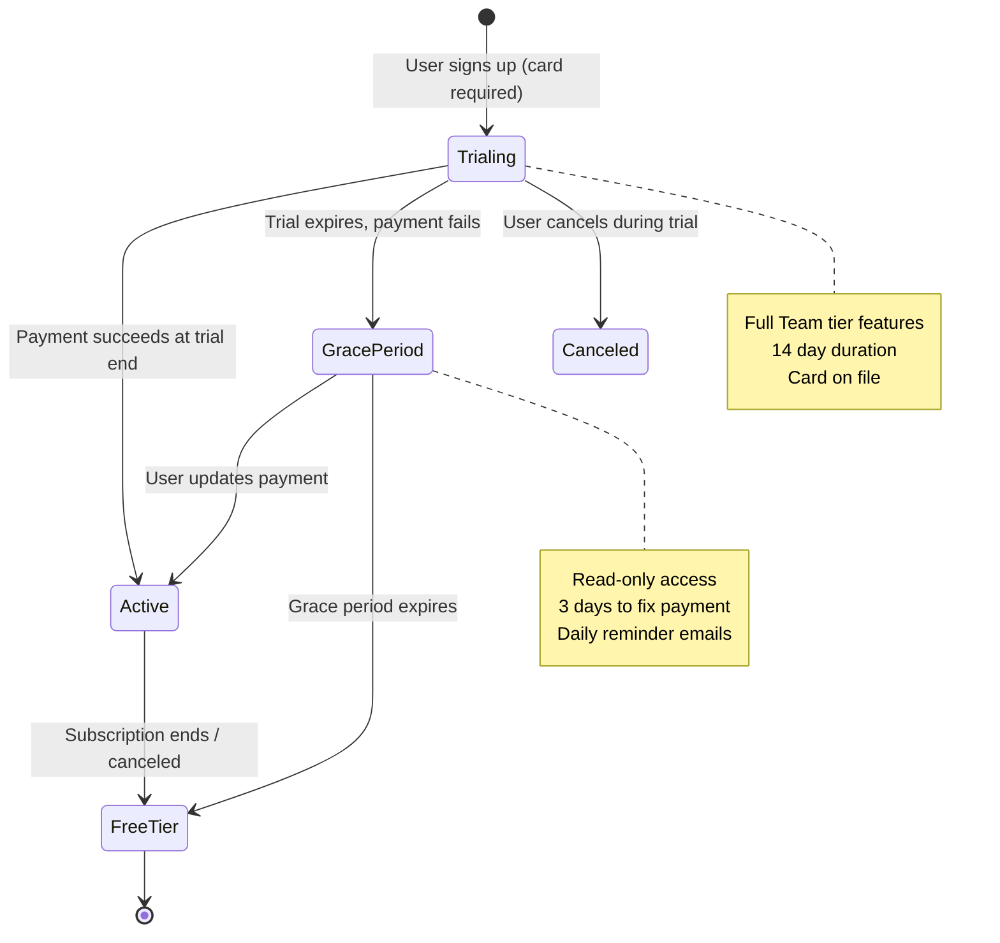
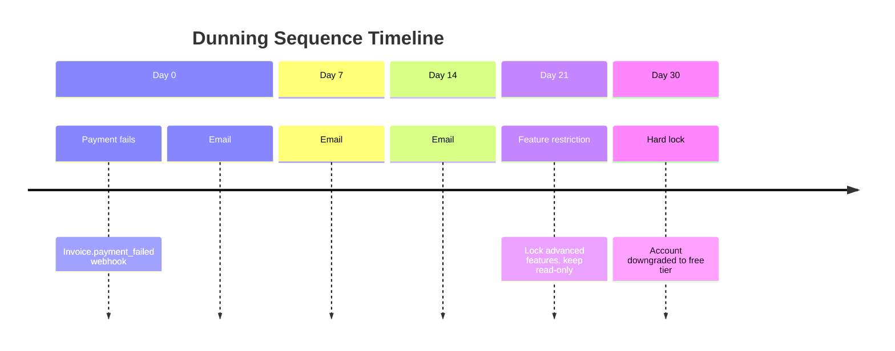

# Stripe Integration Specification

**Version:** 1.0.0
**Last Updated:** 2026-06-27
**Status:** Draft
**Owner:** Platform Engineering

---

## Table of Contents

1. [Overview](#overview)
2. [Product/Price Hierarchy](#productprice-hierarchy)
3. [Checkout Session Flow](#checkout-session-flow)
4. [Customer Portal](#customer-portal)
5. [Webhook Handling](#webhook-handling)
6. [Webhook Signature Verification](#webhook-signature-verification)
7. [Feature Gating by Plan](#feature-gating-by-plan)
8. [Trial Logic](#trial-logic)
9. [Dunning Management](#dunning-management)
10. [ERPNext Sync](#erpnext-sync)
11. [Testing Strategy](#testing strategy)
12. [Appendices](#appendices)

---

## 1. Overview <a name="overview"></a>

### 1.1 Purpose

This document specifies the Stripe Billing integration for the Scrum Ceremony Platform. It covers subscription management, payment processing, feature gating, trial management, dunning (failed payment recovery), and synchronization with ERPNext for financial record-keeping.

### 1.2 Design Principles

| Principle | Description |
|-----------|-------------|
| **Stripe as Source of Truth** | Stripe owns billing state; SCP caches subscription status |
| **Idempotent Webhooks** | Duplicate webhook events are safely ignored |
| **Zero-Downtime Upgrades** | Plan changes are applied immediately; proration is handled by Stripe |
| **Graceful Degradation** | Billing failures don't delete data; access is gracefully restricted |
| **Event-Driven Architecture** | Stripe events trigger downstream actions (emails, ERPNext sync) |

### 1.3 Scope

**In Scope:**
- Subscription creation and lifecycle management
- Checkout flows for upgrades
- Usage-based billing (per-seat)
- Self-serve customer portal
- Webhook processing
- Automated dunning
- Feature gating by plan tier

**Out of Scope:**
- Marketplace/multi-party payments
- Crypto payment methods
- Revenue recognition and accounting entries (ERPNext handles this)

---

## 2. Product/Price Hierarchy <a name="productprice-hierarchy"></a>

### 2.1 Plan Tiers

| Tier | Plan Code | Monthly Price | Annual Price (mo) | Target |
|------|-----------|--------------|-------------------|--------|
| **Free** | `free` | $0 | $0 | Individual Scrum Masters |
| **Team** | `team` | $29 | $24 ($288/yr) | Small teams (≤ 10) |
| **Business** | `business` | $69 | $59 ($708/yr) | Growing teams (≤ 50) |
| **Enterprise** | `enterprise` | Custom | Custom | Unlimited |

### 2.2 Feature Matrix

| Feature | Free | Team | Business | Enterprise |
|---------|:----:|:----:|:--------:|:----------:|
| Active ceremonies/month | 3 | ∞ | ∞ | ∞ |
| Team members | 1 | 10 | 50 | ∞ |
| AI summaries | ✅ | ✅ | ✅ | ✅ |
| Action extraction | — | ✅ | ✅ | ✅ |
| Sentiment analysis | — | — | ✅ | ✅ |
| Jira sync | — | — | ✅ | ✅ |
| Custom branding | — | — | — | ✅ |
| SSO/SAML | — | — | — | ✅ |
| Dedicated support | — | — | — | ✅ |
| Audit logs (90 days) | — | — | 90 days | 365 days |
| Data export | CSV | CSV/JSON | CSV/JSON/API | Full API + S3 |
| SLA | — | — | 99.9% | 99.99% |

### 2.3 Stripe Product/Price IDs

```yaml
# Configuration (stored in environment + config service)
stripe:
  products:
    free:
      id: prod_free_001     # Stripe Product ID
      name: "SCP Free"
    team:
      id: prod_team_001
      name: "SCP Team"
    business:
      id: prod_business_001
      name: "SCP Business"
    enterprise:
      id: prod_enterprise_001
      name: "SCP Enterprise"
  
  prices:
    team_monthly:
      id: price_team_m_001
      product: prod_team_001
      amount: 2900          # $29.00 in cents
      currency: usd
      interval: month
    team_yearly:
      id: price_team_y_001
      product: prod_team_001
      amount: 28800         # $288.00 in cents
      currency: usd
      interval: year
    business_monthly:
      id: price_biz_m_001
      product: prod_business_001
      amount: 6900
      currency: usd
      interval: month
    business_yearly:
      id: price_biz_y_001
      product: prod_business_001
      amount: 70800
      currency: usd
      interval: year
```

### 2.4 Product/Price Hierarchy Diagram



---

## 3. Checkout Session Flow <a name="checkout-session-flow"></a>

### 3.1 Upgrade/Purchase Flow



### 3.2 Checkout Session Parameters

```python
import stripe

def create_checkout_session(
    customer_id: str,
    plan_config: dict,
    quantity: int = 1,
    coupon_id: str = None,
    metadata: dict = None
) -> stripe.checkout.Session:
    """
    Create a Stripe Checkout Session for plan upgrade/purchase.
    """
    params = {
        "customer": customer_id,
        "payment_method_types": ["card"],
        "line_items": [{
            "price": plan_config["stripe_price_id"],
            "quantity": quantity,
        }],
        "mode": "subscription",
        "success_url": f"{settings.APP_URL}/billing/success?session_id={{CHECKOUT_SESSION_ID}}",
        "cancel_url": f"{settings.APP_URL}/billing/plans",
        "allow_promotion_codes": True,
        "billing_address_collection": "required",
        "tax_id_collection": {"enabled": True},
        "metadata": {
            "scp_team_id": metadata.get("team_id"),
            "scp_plan_code": metadata.get("plan_code"),
            "scp_quantity": str(quantity),
        },
        "subscription_data": {
            "trial_period_days": plan_config.get("trial_days", 0),
            "metadata": {
                "scp_team_id": metadata.get("team_id"),
            }
        },
        "consent": {
            "terms_of_service": "required"
        },
        "custom_text": {
            "terms_of_service_acceptance": {
                "message": "I agree to the [Terms of Service](https://scrumplatform.com/terms)"
            }
        }
    }
    
    if coupon_id:
        params["discounts"] = [{"coupon": coupon_id}]
        del params["allow_promotion_codes"]
    
    return stripe.checkout.Session.create(**params)
```

### 3.3 Post-Checkout Redirect

After successful checkout, the user is redirected to `/billing/success`. The frontend polls the subscription status endpoint until it confirms the subscription is active:

```javascript
// Frontend: Polling after checkout redirect
async function waitForSubscriptionActivation(teamId, maxAttempts = 30) {
    for (let i = 0; i < maxAttempts; i++) {
        const response = await fetch(`/api/billing/subscription/${teamId}`);
        const data = await response.json();
        
        if (data.status === 'active') {
            return data;  // Success - show dashboard
        }
        
        if (data.status === 'past_due' || data.status === 'incomplete') {
            throw new Error('Payment requires additional action');
        }
        
        await new Promise(resolve => setTimeout(resolve, 2000)); // 2s intervals
    }
    
    throw new Error('Subscription activation timeout - support notified');
}
```

---

## 4. Customer Portal <a name="customer-portal"></a>

### 4.1 Stripe Billing Portal Integration

SCP uses Stripe's hosted Customer Portal for self-serve billing management (update payment method, view invoices, switch plans).

### 4.2 Portal Session Creation

```python
def create_portal_session(customer_id: str, return_url: str) -> str:
    """
    Create a Stripe Customer Portal session URL.
    """
    session = stripe.billing_portal.Session.create(
        customer=customer_id,
        return_url=return_url,
        flow_data={
            "type": "subscription_update",
            "after_completion": {
                "type": "redirect",
                "redirect": {
                    "return_url": f"{return_url}?updated=true"
                }
            },
            "subscription_update": {
                "subscription": "{{subscription.id}}",
                "items": [{
                    "id": "{{subscription.items.data[0].id}}",
                    "price": "{{plan.price_id}}"
                }]
            }
        }
    )
    return session.url
```

### 4.3 Portal Configuration

| Setting | Value | Justification |
|---------|-------|---------------|
| Allow plan changes | Yes (same/higher tier) | Seamless upgrades |
| Allow downgrades | Yes (credit prorated) | Customer retention |
| Payment method update | Yes | Reduce churn |
| Invoice history | Yes | Self-service |
| Cancel subscription | Yes (retention flow) | But show alternatives first |
| Proration mode | "Prorate and credit" | Fair billing |

### 4.4 Pre-Portal Validation

Before redirecting to Stripe Portal, SCP checks the current subscription state to ensure the customer ID is valid:

```python
@app.get("/api/billing/portal/{team_id}")
async def get_portal_url(team_id: str, user: User = Depends(get_current_user)):
    team = await get_team(team_id)
    if not user_has_billing_access(user, team):
        raise HTTPException(403, "Not authorized")
    
    subscription = await get_subscription_via_vault(team_id)
    if not subscription or not subscription.stripe_customer_id:
        raise HTTPException(400, "No active subscription to manage")
    
    portal_url = create_portal_session(subscription.stripe_customer_id, 
                                        return_url=f"{settings.APP_URL}/billing")
    return {"portal_url": portal_url}
```

---

## 5. Webhook Handling <a name="webhook-handling"></a>

### 5.1 Event Types

| Event | Source | Action in SCP |
|-------|--------|--------------|
| `checkout.session.completed` | Checkout | Activate subscription, provision plan |
| `customer.subscription.updated` | Plan change / renewal | Update subscription status, adjust features |
| `customer.subscription.trial_will_end` | Trial ending (3 days before) | Send trial-ending email, prompt upgrade |
| `invoice.payment_failed` | Payment failure | Trigger dunning sequence |
| `customer.subscription.deleted` | Cancel / non-payment | Downgrade to Free, lock advanced features |
| `customer.subscription.created` | New subscription | Provision initial plan |
| `invoice.paid` | Successful payment | Clear dunning, provision extended access |
| `customer.updated` | Customer info change | Sync billing details |

### 5.2 Webhook Handler Implementation

```python
import stripe
from fastapi import Request, HTTPException

@app.post("/webhooks/stripe")
async def stripe_webhook(request: Request):
    payload = await request.body()
    sig_header = request.headers.get("stripe-signature")
    
    # Verify signature
    try:
        event = stripe.Webhook.construct_event(
            payload, sig_header, settings.STRIPE_WEBHOOK_SECRET
        )
    except (ValueError, stripe.error.SignatureVerificationError):
        raise HTTPException(status_code=400, detail="Invalid signature")
    
    # Process event
    handlers = {
        "checkout.session.completed": handle_checkout_completed,
        "customer.subscription.updated": handle_subscription_updated,
        "customer.subscription.trial_will_end": handle_trial_ending,
        "invoice.payment_failed": handle_payment_failed,
        "customer.subscription.deleted": handle_subscription_deleted,
        "invoice.paid": handle_invoice_paid,
        "customer.updated": handle_customer_updated,
    }
    
    handler = handlers.get(event["type"])
    if handler:
        result = await handler(event["data"]["object"])
        return {"status": "processed", "type": event["type"]}
    
    return {"status": "ignored", "type": event["type"]}
```

### 5.3 Event Handlers

#### checkout.session.completed

```python
async def handle_checkout_completed(session: dict):
    """Handle successful checkout - activate subscription."""
    customer_id = session.get("customer")
    subscription_id = session.get("subscription")
    metadata = session.get("metadata", {})
    team_id = metadata.get("scp_team_id")
    
    if not team_id:
        logger.warning("checkout_missing_team_id", session_id=session["id"])
        return
    
    # Retrieve full subscription from Stripe
    stripe_subscription = stripe.Subscription.retrieve(subscription_id)
    
    # Upsert subscription in SCP
    subscription = Subscription(
        team_id=team_id,
        stripe_customer_id=customer_id,
        stripe_subscription_id=subscription_id,
        stripe_price_id=stripe_subscription["items"]["data"][0]["price"]["id"],
        status=stripe_subscription["status"],  # "active", "trialing"
        current_period_start=datetime.fromtimestamp(stripe_subscription["current_period_start"]),
        current_period_end=datetime.fromtimestamp(stripe_subscription["current_period_end"]),
        plan_code=price_to_plan_code(stripe_subscription["items"]["data"][0]["price"]["id"]),
        quantity=stripe_subscription["items"]["data"][0]["quantity"],
        trial_end=datetime.fromtimestamp(stripe_subscription["trial_end"]) if stripe_subscription.get("trial_end") else None,
    )
    
    await subscription_repo.upsert(subscription)
    
    # Emit domain event
    await event_bus.emit("subscription.activated", {
        "team_id": team_id,
        "plan_code": subscription.plan_code,
        "subscription_id": subscription_id
    })
    
    # Send welcome email
    await email_service.send_template(
        team_id=team_id,
        template="subscription_activated",
        context={"plan": subscription.plan_code}
    )
```

#### customer.subscription.updated

```python
async def handle_subscription_updated(subscription_data: dict):
    """Handle subscription changes (plan upgrade/downgrade, renewal)."""
    stripe_sub = subscription_data["subscription_data"]
    previous_attributes = subscription_data.get("previous_attributes", {})
    
    subscription = await subscription_repo.get_by_stripe_id(stripe_sub["id"])
    if not subscription:
        logger.warning("subscription_update_unknown", stripe_id=stripe_sub["id"])
        return
    
    old_status = subscription.status
    new_status = stripe_sub["status"]
    
    # Update cached subscription state
    subscription.status = new_status
    subscription.current_period_start = datetime.fromtimestamp(stripe_sub["current_period_start"])
    subscription.current_period_end = datetime.fromtimestamp(stripe_sub["current_period_end"])
    
    # Handle plan/price change
    new_price_id = stripe_sub["items"]["data"][0]["price"]["id"]
    if new_price_id != subscription.stripe_price_id:
        subscription.stripe_price_id = new_price_id
        subscription.plan_code = price_to_plan_code(new_price_id)
        subscription.quantity = stripe_sub["items"]["data"][0]["quantity"]
        
        # Emit plan change event
        await event_bus.emit("subscription.plan_changed", {
            "team_id": subscription.team_id,
            "old_plan": price_to_plan_code(subscription.stripe_price_id),
            "new_plan": subscription.plan_code,
            "quantity": subscription.quantity
        })
    
    # Handle cancellation scheduled at period end
    if stripe_sub.get("cancel_at_period_end") and not subscription.canceled_at:
        subscription.canceled_at = datetime.utcnow()
        subscription.cancel_at = stripe_sub["cancel_at"]
        await event_bus.emit("subscription.cancel_scheduled", {
            "team_id": subscription.team_id,
            "effective_date": stripe_sub["current_period_end"]
        })
    
    await subscription_repo.save(subscription)
    
    # Provision/deprovision features
    if new_status != old_status:
        await feature_gating.refresh(subscription.team_id)
```

#### invoice.payment_failed

```python
async def handle_payment_failed(invoice: dict):
    """Trigger dunning sequence on payment failure."""
    customer_id = invoice.get("customer")
    attempt_count = invoice.get("attempt_count", 1)
    
    subscription = await subscription_repo.get_by_customer(customer_id)
    if not subscription:
        return
    
    # Update dunning state
    await dunning_record.increment(
        team_id=subscription.team_id,
        stripe_invoice_id=invoice["id"],
        attempt=attempt_count
    )
    
    # Emit dunning event (triggers email sequence)
    await event_bus.emit("payment.failed", {
        "team_id": subscription.team_id,
        "attempt_count": attempt_count,
        "invoice_id": invoice["id"],
        "amount_due": invoice["amount_due"],
        "next_payment_attempt": invoice.get("next_payment_attempt")
    })
```

#### customer.subscription.deleted

```python
async def handle_subscription_deleted(subscription_data: dict):
    """Handle subscription cancellation / non-payment termination."""
    stripe_sub = subscription_data["subscription_data"]
    
    subscription = await subscription_repo.get_by_stripe_id(stripe_sub["id"])
    if not subscription:
        return
    
    # Downgrade to free
    subscription.status = "canceled"
    subscription.plan_code = "free"
    subscription.stripe_price_id = None
    subscription.current_period_start = None
    subscription.current_period_end = None
    subscription.canceled_at = datetime.utcnow()
    subscription.cancel_reason = "subscription_deleted"
    
    await subscription_repo.save(subscription)
    
    # Emit cancellation event
    await event_bus.emit("subscription.canceled", {
        "team_id": subscription.team_id,
        "previous_plan": subscription.plan_code
    })
    
    # Refresh feature gating (lock paid features)
    await feature_gating.refresh(subscription.team_id)
    
    # Send feedback email
    await email_service.send_template(
        team_id=subscription.team_id,
        template="subscription_cancelled",
        context={"feedback_link": f"{settings.APP_URL}/feedback"}
    )
```

---

## 6. Webhook Signature Verification <a name="webhook-signature-verification"></a>

### 6.1 HMAC-SHA256 Verification

Stripe uses HMAC-SHA256 with the webhook signing secret to sign each webhook event.

```python
import stripe
from fastapi import Request, HTTPException, Header

async def verify_stripe_signature(
    request: Request,
    stripe_signature: str = Header(None, alias="Stripe-Signature")
) -> dict:
    """
    Verify Stripe webhook signature and return the constructed event.
    
    Security checklist:
    1. Verify the signature using the webhook secret
    2. Tolerate up to 5 minutes of clock skew
    3. Reject unsigned or malformed payloads
    """
    payload = await request.body()
    
    try:
        event = stripe.Webhook.construct_event(
            payload=payload,
            sig_header=stripe_signature,
            secret=settings.STRIPE_WEBHOOK_SECRET,
            tolerance=300  # 5 minutes
        )
    except ValueError as e:
        # Invalid payload
        raise HTTPException(status_code=400, detail=f"Invalid payload: {e}")
    except stripe.error.SignatureVerificationError as e:
        # Invalid signature
        raise HTTPException(status_code=403, detail=f"Invalid signature: {e}")
    
    return event
```

### 6.2 Webhook Endpoint Security

| Layer | Control | Implementation |
|-------|---------|----------------|
| Network | Allowlist Stripe IPs | AWS SG / Cloudflare |
| Transport | TLS 1.2+ enforced | Nginx/Load balancer |
| Application | HMAC-SHA256 signature | `stripe.Webhook.construct_event` |
| Application | Replay attack prevention | Idempotency key check (Redis, 24h TTL) |
| Payload | Size limit | 64KB max body size |

### 6.3 Idempotency for Webhooks

```python
async def process_webhook_idempotent(event: dict, idempotency_key_fn=None) -> dict:
    """
    Process a webhook event with idempotency guarantee.
    """
    event_id = event["id"]  # Stripe event ID is globally unique
    
    # Check if already processed
    processed = await redis.get(f"stripe:webhook:{event_id}")
    if processed:
        logger.info("webhook_duplicate", event_id=event_id)
        return {"status": "already_processed"}
    
    # Process within a lock to prevent race conditions
    lock_key = f"stripe:lock:{event_id}"
    async with distributed_lock(lock_key, timeout=60):
        # Double-check after acquiring lock
        if await redis.get(f"stripe:webhook:{event_id}"):
            return {"status": "already_processed"}
        
        # Process the event
        result = await dispatch_event(event)
        
        # Mark as processed (24h TTL - Stripe shouldn't retry after 24h)
        await redis.setex(f"stripe:webhook:{event_id}", 86400, json.dumps(result))
        return result
```

---

## 7. Feature Gating by Plan <a name="feature-gating-by-plan"></a>

### 7.1 Middleware Architecture



### 7.2 Feature Gate Implementation

```python
class FeatureGateMiddleware:
    """
    Middleware that enforces plan-based feature access.
    Applied to routes that require a paid plan.
    """
    
    FEATURE_PLAN_MAP = {
        # Route pattern -> minimum plan required
        "/api/summaries/*": {"min_plan": "team", "method": "GET"},
        "/api/actions/*": {"min_plan": "team", "method": "POST"},
        "/api/sentiment/*": {"min_plan": "business", "method": "GET"},
        "/api/integrations/jira": {"min_plan": "business", "method": "*"},
        "/api/export": {"min_plan": "business", "method": "POST"},
        "/api/sso/*": {"min_plan": "enterprise", "method": "*"},
        "/api/audit-logs": {"min_plan": "business", "method": "GET"},
    }
    
    PLAN_HIERARCHY = {
        "free": 0,
        "team": 1,
        "business": 2,
        "enterprise": 3,
    }
    
    async def __call__(self, request: Request, call_next):
        feature_config = self._match_route(request.url.path, request.method)
        
        if not feature_config:
            # No feature gate on this route
            return await call_next(request)
        
        # Get user's team subscription from cache
        team_id = request.state.team_id
        subscription = await self._get_subscription(team_id)
        plan_tier = self.PLAN_HIERARCHY.get(subscription.plan_code, 0)
        required_tier = self.PLAN_HIERARCHY[feature_config["min_plan"]]
        
        if plan_tier >= required_tier:
            response = await call_next(request)
            response.headers["X-Plan-Tier"] = subscription.plan_code
            return response
        
        # Upgrade required
        return JSONResponse(
            status_code=403,
            content={
                "error": "upgrade_required",
                "message": f"This feature requires the {feature_config['min_plan']} plan or higher.",
                "current_plan": subscription.plan_code,
                "required_plan": feature_config["min_plan"],
                "upgrade_url": f"/billing/plans?upgrade_to={feature_config['min_plan']}"
            }
        )
    
    def _match_route(self, path: str, method: str) -> dict:
        """Match request path against feature gate patterns."""
        for pattern, config in self.FEATURE_PLAN_MAP.items():
            if fnmatch.fnmatch(path, pattern):
                if config["method"] == "*" or config["method"].upper() == method.upper():
                    return config
        return None
```

### 7.3 Quota Enforcement

```python
class QuotaEnforcer:
    """Enforce per-plan rate limits and usage quotas."""
    
    QUOTAS = {
        "free": {
            "ceremonies_per_month": 3,
            "team_members": 1,
            "ai_summaries_per_ceremony": 1,
        },
        "team": {
            "ceremonies_per_month": None,  # Unlimited
            "team_members": 10,
            "ai_summaries_per_ceremony": 3,
        },
        "business": {
            "ceremonies_per_month": None,
            "team_members": 50,
            "ai_summaries_per_ceremony": None,
            "integrations": 3,
        },
        "enterprise": {
            "ceremonies_per_month": None,
            "team_members": None,
            "ai_summaries_per_ceremony": None,
            "integrations": None,
        },
    }
    
    async def check_and_increment(self, team_id: str, resource: str) -> dict:
        """
        Check quota and atomically increment if within limits.
        Returns {allowed: bool, limit: int, used: int, remaining: int}
        """
        plan = await self._get_plan(team_id)
        limit = self.QUOTAS[plan][resource]
        
        if limit is None:
            # No limit (unlimited)
            return {"allowed": True, "limit": None, "used": None, "remaining": None}
        
        # Atomic increment in Redis
        period_key = datetime.utcnow().strftime("%Y-%m")
        redis_key = f"quota:{team_id}:{resource}:{period_key}"
        
        pipe = redis.pipeline()
        pipe.incr(redis_key)
        pipe.expire(redis_key, 86400 * 32)  # Keep for 32 days
        results = await pipe.execute()
        
        used = results[0]
        
        if used > limit:
            return {
                "allowed": False,
                "limit": limit,
                "used": used - 1,  # Don't count this call
                "remaining": 0,
                "upgrade_url": f"/billing/plans"
            }
        
        return {
            "allowed": True,
            "limit": limit,
            "used": used,
            "remaining": limit - used
        }
```

---

## 8. Trial Logic <a name="trial-logic"></a>

### 8.1 Trial Configuration

| Parameter | Value |
|-----------|-------|
| Trial duration | 14 days |
| Payment method required | Yes (card upfront, no charge) |
| Grace period after trial | 3 days (limited access) |
| Trial plan | Team tier features |
| Trial extensions | 1 extension of 7 days (on request) |

### 8.2 Trial State Machine



### 8.3 Trial Provisioning

```python
async def start_trial(team_id: str, user: User, payment_method_id: str) -> Subscription:
    """
    Start a 14-day trial for a team.
    """
    # Create Stripe customer
    customer = stripe.Customer.create(
        email=user.email,
        name=user.organization_name,
        payment_method=payment_method_id,
        invoice_settings={"default_payment_method": payment_method_id},
        metadata={"scp_team_id": team_id}
    )
    
    # Create subscription with trial
    stripe_sub = stripe.Subscription.create(
        customer=customer.id,
        items=[{"price": settings.STRIPE_PRICES["team_monthly"]}],
        trial_period_days=14,
        trial_settings={
            "end_behavior": {"missing_payment_method": "pause_subscription"}
        },
        payment_settings={
            "save_default_payment_method": "on_subscription"
        },
        metadata={"scp_team_id": team_id},
        collection_method="charge_automatically",
        days_until_due=0,  # Payment method validated immediately
    )
    
    # Create subscription record
    subscription = Subscription(
        team_id=team_id,
        stripe_customer_id=customer.id,
        stripe_subscription_id=stripe_sub.id,
        stripe_price_id=settings.STRIPE_PRICES["team_monthly"],
        status="trialing",
        plan_code="team",
        quantity=team_member_count(team_id),
        trial_start=datetime.utcnow(),
        trial_end=datetime.utcnow() + timedelta(days=14),
        current_period_start=datetime.utcnow(),
        current_period_end=datetime.utcnow() + timedelta(days=14),
    )
    
    await subscription_repo.create(subscription)
    
    # Emit trial started event
    await event_bus.emit("subscription.trial_started", {
        "team_id": team_id,
        "trial_end_date": subscription.trial_end.isoformat()
    })
    
    return subscription
```

### 8.4 Trial End Workflows

```python
async def handle_trial_ending(subscription: Subscription):
    """
    Triggered by Stripe webhook: customer.subscription.trial_will_end
    Sent 3 days before trial ends.
    """
    await email_service.send_template(
        team_id=subscription.team_id,
        template="trial_ending_soon",
        context={
            "trial_end_date": subscription.trial_end.strftime("%B %d, %Y"),
            "plan_name": "Team",
            "monthly_price": "$29",
            "upgrade_url": f"{settings.APP_URL}/billing/plans",
            "features_used": await get_trial_usage_stats(subscription.team_id)
        }
    )
```

### 8.5 Grace Period Flow

```python
async def handle_trial_expired(subscription: Subscription):
    """
    When trial ends without successful payment, enter grace period.
    """
    # Calculate grace period end
    grace_end = datetime.utcnow() + timedelta(days=3)
    
    subscription.status = "trial_expired"
    subscription.grace_period_start = datetime.utcnow()
    subscription.grace_period_end = grace_end
    await subscription_repo.save(subscription)
    
    # Restrict to read-only (middleware handles this)
    await feature_gating.set_trial_expired(subscription.team_id)
    
    # Schedule grace period end job
    await scheduler.schedule_at(
        "grace_period_end_check",
        run_at=grace_end,
        payload={"team_id": subscription.team_id, "subscription_id": subscription.id}
    )
    
    # Send grace period email
    await email_service.send_template(
        team_id=subscription.team_id,
        template="trial_expired_grace_period",
        context={
            "grace_end_date": grace_end.strftime("%B %d, %Y"),
            "payment_url": f"{settings.APP_URL}/billing/payment?action=resume"
        }
    )
```

---

## 9. Dunning Management <a name="dunning-management"></a>

### 9.1 Dunning Sequence



### 9.2 Dunning Email Templates

| Day | Subject | Tone | CTA |
|-----|---------|------|-----|
| 0 | "We couldn't process your payment—let's fix this" | Friendly | Update payment method |
| 7 | "Your subscription needs attention" | Urgent | Update payment + get help |
| 14 | "Last step before your plan is paused" | Final warning | Update payment + contact support |
| 21 | "Your plan has been restricted—act now" | Informational | Restore plan |
| 30 | "Your account has been downgraded" | Accommodating | Resubscribe (20% discount) |

### 9.3 Dunning Implementation

```python
class DunningManager:
    """
    Manages the automated dunning sequence.
    Triggered by webhooks and scheduled reconciliation jobs.
    """
    
    DUNNING_SCHEDULE = [
        {"day": 0, "action": "send_email", "email_template": "payment_failed_friendly"},
        {"day": 7, "action": "send_email", "email_template": "payment_failed_urgent"},
        {"day": 14, "action": "send_email", "email_template": "payment_failed_final"},
        {"day": 21, "action": "restrict_features"},
        {"day": 30, "action": "hard_lock"},
    ]
    
    async def handle_payment_failed(self, event_data: dict):
        """Process an invoice.payment_failed webhook."""
        stripe_invoice = event_data["data"]
        attempt_count = stripe_invoice["attempt_count"]
        customer_id = stripe_invoice["customer"]
        
        subscription = await subscription_repo.get_by_customer(customer_id)
        if not subscription or subscription.status in ("canceled", "free"):
            return
        
        # Update dunning state
        dunning = await dunning_record.get_or_create(
            team_id=subscription.team_id,
            stripe_invoice_id=stripe_invoice["id"],
            defaults={
                "attempt": attempt_count,
                "first_failed_at": datetime.utcnow(),
                "amount_due": stripe_invoice["amount_due"],
                "next_payment_attempt": stripe_invoice.get("next_payment_attempt"),
                "status": "active_dunning"
            }
        )
        
        # Check if today matches a dunning schedule milestone
        days_since_failure = (datetime.utcnow() - dunning.first_failed_at).days
        
        for milestone in self.DUNNING_SCHEDULE:
            if days_since_failure == milestone["day"]:
                action = getattr(self, f"_dunning_action_{milestone['action']}")
                await action(subscription, stripe_invoice)
    
    async def _dunning_action_send_email(self, subscription, invoice, email_template):
        """Send dunning email."""
        admin_users = await team_admin_service.get_admins(subscription.team_id)
        
        for admin in admin_users:
            await email_service.send(
                to=admin.email,
                template=email_template,
                context={
                    "team_name": subscription.team.name,
                    "amount": f"${invoice['amount_due'] / 100:.2f}",
                    "attempt": invoice["attempt_count"],
                    "payment_url": f"{settings.APP_URL}/billing/payment",
                    "support_url": f"{settings.APP_URL}/support"
                }
            )
    
    async def _dunning_action_restrict_features(self, subscription, invoice):
        """Restrict to read-only access (21 days past due)."""
        subscription.status = "past_due_restricted"
        await subscription_repo.save(subscription)
        
        # Enable restricted mode (read-only ceremonies, no AI features)
        await feature_gating.set_restricted_mode(subscription.team_id)
        
        logger.warning("team_restricted_due_to_non_payment", 
                       team_id=subscription.team_id, 
                       days=21)
    
    async def _dunning_action_hard_lock(self, subscription, invoice):
        """Downgrade to free tier (30 days past due)."""
        stripe.Subscription.modify(
            subscription.stripe_subscription_id,
            cancel_at_period_end=True
        )
        
        subscription.status = "past_due_locked"
        subscription.plan_code = "free"
        await subscription_repo.save(subscription)
        
        # Fully lock paid features
        await feature_gating.set_free_tier_only(subscription.team_id)
        
        logger.critical("team_locked_due_to_non_payment",
                       team_id=subscription.team_id,
                       days=30)
```

### 9.4 Payment Recovery

When payment succeeds (via `invoice.paid` webhook), dunning is cleared:

```python
async def handle_invoice_paid(invoice: dict):
    """Clear dunning on successful payment."""
    customer_id = invoice.get("customer")
    
    subscription = await subscription_repo.get_by_customer(customer_id)
    if not subscription:
        return
    
    if subscription.status in ("past_due_restricted", "past_due_locked", "past_due"):
        # Restore full access
        subscription.status = "active"
        await subscription_repo.save(subscription)
        await feature_gating.refresh(subscription.team_id)
        
        # Clear dunning record
        await dunning_record.clear(subscription.team_id)
        
        # Send recovery email
        await email_service.send_template(
            team_id=subscription.team_id,
            template="payment_recovered",
            context={"subscription_end": subscription.current_period_end.isoformat()}
        )
```

---

## 10. ERPNext Sync <a name="erpnext-sync"></a>

### 10.1 Stripe → ERPNext Event Flow

| Stripe Event | ERPNext Action |
|--------------|----------------|
| `checkout.session.completed` | Create Lead (if new) or update existing |
| `invoice.paid` | Create posted Sales Invoice |
| `customer.subscription.deleted` | Mark subscription cancelled in ERPNext |
| `invoice.payment_failed` | Create dunning note on customer record |
| `customer.subscription.updated` | Update subscription/plan in ERPNext |

### 10.2 Webhook-to-ERPNext Bridge

```python
async def bridge_stripe_to_erpnext(stripe_event: dict):
    """
    Bridge Stripe webhook events to ERPNext sync.
    Adds events to the sync queue for the ERPNext integration worker.
    """
    event_type = stripe_event["type"]
    
    if event_type == "checkout.session.completed":
        data = stripe_event["data"]["object"]
        await eqpnext_sync_queue.enqueue(
            "trial_to_paid_conversion",
            {
                "team_id": data["metadata"].get("scp_team_id"),
                "customer_id": data["customer"],
                "subscription_id": data["subscription"],
                "amount": data["amount_total"],
                "source": "stripe"
            }
        )
    
    elif event_type == "invoice.paid":
        data = stripe_event["data"]["object"]
        await erpnext_sync_queue.enqueue(
            "payment_received",
            {
                "customer_id": data["customer"],
                "amount": data["amount_paid"],
                "reference": data["payment_intent"],
                "date": datetime.fromtimestamp(data["created"]).isoformat(),
                "source": "stripe"
            }
        )
    
    elif event_type == "customer.subscription.deleted":
        data = stripe_event["data"]["object"]
        await erpnext_sync_queue.enqueue(
            "subscription_cancelled",
            {
                "customer_id": data["customer"],
                "subscription_id": data["id"],
                "cancelled_at": datetime.fromtimestamp(data["canceled_at"]).isoformat() if data.get("canceled_at") else None
            }
        )
```

---

## 11. Testing Strategy <a name="testing-strategy"></a>

### 11.1 Test Pyramid

```
            ┌──────────┐
            │   E2E    │  2-3 tests (Stripe CLI + live test mode)
            ├──────────┤
            │ Integration│ 15+ tests (mocked Stripe API)
            ├──────────┤
            │   Unit   │  80+ tests (individual functions)
            └──────────┘
```

### 11.2 Stripe Test Mode

All tests run in Stripe's **test mode** (using `pk_test_...` and `sk_test_...` keys).

```
# Stripe CLI for local webhook forwarding
stripe listen --forward-to localhost:8000/webhooks/stripe

# Trigger specific webhook events for testing
stripe trigger invoice.payment_failed
stripe trigger customer.subscription.deleted
stripe trigger checkout.session.completed
```

### 11.3 Stripe Test Card Numbers

| Card Number | Scenario |
|-------------|----------|
| `4242424242424242` | Successful payment |
| `4000000000000002` | Card declined (generic) |
| `4000000000009995` | Card declined (insufficient funds) |
| `4000000000000069` | Expired card |
| `4000000000000127` | Incorrect CVC |
| `6011000990139424` | Discover (alternative brand) |

### 11.4 Unit Test Examples

```python
import pytest
from unittest.mock import patch, MagicMock, AsyncMock

@pytest.mark.asyncio
async def test_webhook_handler_valid_signature():
    """Test webhook handler accepts valid Stripe signatures."""
    with patch("stripe.Webhook.construct_event") as mock_construct:
        mock_construct.return_value = {
            "type": "invoice.paid",
            "data": {"object": {"id": "in_123"}}
        }
        
        # Mock request
        mock_request = AsyncMock()
        mock_request.body.return_value = b'{"type": "invoice.paid"}'
        mock_request.headers = {"Stripe-Signature": "valid"}
        
        response = await stripe_webhook(mock_request)
        assert response["status"] == "processed"

@pytest.mark.asyncio
async def test_feature_gate_blocks_insufficient_plan():
    """Test feature gate blocks access when plan is insufficient."""
    middleware = FeatureGateMiddleware()
    
    mock_request = MagicMock()
    mock_request.url.path = "/api/sentiment/analyze"
    mock_request.method = "POST"
    mock_request.state.team_id = "team-free"
    
    with patch.object(middleware, '_get_subscription') as mock_sub:
        mock_sub.return_value = MagicMock(plan_code="free")
        
        response = await middleware(mock_request, MagicMock())
        assert response.status_code == 403
        
        body = json.loads(response.body)
        assert body["error"] == "upgrade_required"
        assert body["required_plan"] == "business"

@pytest.mark.asyncio
async def test_checkout_session_creation():
    """Test Checkout Session is created with correct parameters."""
    with patch("stripe.checkout.Session.create") as mock_create:
        mock_create.return_value = MagicMock(
            id="cs_test_123",
            url="https://checkout.stripe.com/pay/cs_test_123"
        )
        
        session = create_checkout_session(
            customer_id="cus_test_123",
            plan_config={"stripe_price_id": "price_tm_123", "trial_days": 14},
            quantity=5,
            metadata={"team_id": "team-456", "plan_code": "team"}
        )
        
        mock_create.assert_called_once()
        call_kwargs = mock_create.call_args[1]
        assert call_kwargs["customer"] == "cus_test_123"
        assert call_kwargs["line_items"][0]["quantity"] == 5

@pytest.mark.asyncio
async def test_dunning_sequence_day_7():
    """Test dunning sends correct email at day 7."""
    dunning = DunningManager()
    
    subscription = Subscription(
        team_id="team-123",
        status="past_due",
        stripe_customer_id="cus_123",
        plan_code="team"
    )
    
    invoice = {
        "amount_due": "2900",
        "attempt_count": 2
    }
    
    with patch.object(dunning, '_dunning_action_send_email') as mock_email:
        # Simulate day 7
        with patch("stripe_integration.datetime") as mock_dt:
            mock_dt.utcnow.return_value = datetime(2026, 6, 27) + timedelta(days=7)
            mock_dt.side_effect = lambda *args, **kw: datetime(*args, **kw)
            
            await dunning.handle_payment_failed({
                "data": {
                    "subscription_data": {"id": "sub_123"}
                }
            })
        
        # Verify correct email template sent
        mock_email.assert_called_once()
```

### 11.5 Integration Test

```python
# tests/integration/test_stripe_sync.py
import responses

@responses.activate
async def test_stripe_subscription_created_flow():
    """Test end-to-end subscription creation via Stripe API."""
    # Mock Stripe API
    responses.add(
        responses.POST,
        "https://api.stripe.com/v1/customers",
        json={"id": "cus_test_123", "email": "test@company.com"},
        status=200
    )
    responses.add(
        responses.POST,
        "https://api.stripe.com/v1/subscriptions",
        json={
            "id": "sub_test_123",
            "status": "active",
            "current_period_start": 1719500000,
            "current_period_end": 1722178400,
            "items": {"data": [{"price": {"id": "price_tm_123"}}]}
        },
        status=200
    )
    
    result = await start_trial(
        team_id="team-456",
        user=User(email="test@company.com", organization_name="Test Co"),
        payment_method_id="pm_test_123"
    )
    
    assert result.status == "trialing"
    assert result.plan_code == "team"
    assert result.trial_end is not None
```

### 11.6 E2E Test (Stripe CLI)

```python
# tests/e2e/test_checkout_e2e.py
import subprocess
import pytest

@pytest.mark.e2e
@pytest.mark.stripe
def test_checkout_and_webhook_flow(env):
    """
    E2E test using Stripe CLI in test mode.
    Requires: stripe CLI installed + logged in
    """
    # Step 1: Create checkout session
    response = client.post("/api/billing/checkout", json={
        "plan": "team",
        "interval": "month",
        "team_id": env.test_team_id
    })
    session_url = response.json()["session_url"]
    session_id = response.json()["session_id"]
    
    # Step 2: Complete checkout using test card
    # (Simulated via Stripe test tokens)
    completed_event = trigger_stripe_test_event(
        env.stripe_cli_path,
        "checkout.session.completed",
        session_id=session_id
    )
    
    # Step 3: Wait for webhook processing
    wait_for(
        lambda: get_subscription_status(env.product_url, env.test_team_id) == "active",
        timeout=30
    )
    
    # Step 4: Verify state
    sub = get_subscription(env.product_url, env.test_team_id)
    assert sub["plan_code"] == "team"
    assert sub["status"] == "active"
```

### 11.7 Test Checklist

- [ ] All webhook event types handled without errors
- [ ] Idempotent processing of duplicate webhooks
- [ ] Feature gate correctly blocks/enforces per-plan access
- [ ] Trial provisioning works end-to-end
- [ ] Grace period triggers at correct time
- [ ] Dunning sequence sends emails at 0/7/14/21/30 days
- [ ] Hard lock downgrades successfully
- [ ] ERPNext sync enqueues for all Stripe events
- [ ] All test cards (succeed, decline, insufficient funds) tested
- [ ] Stripe webhook signature validation rejects tampered payloads

---

## 12. Appendices <a name="appendices"></a>

### Appendix A: Environment Variables

| Variable | Purpose | Example |
|----------|---------|---------|
| `STRIPE_API_KEY` | Secret key (test mode for CI) | `sk_test_51...` |
| `STRIPE_PUBLISHABLE_KEY` | Client-side public key | `pk_test_51...` |
| `STRIPE_WEBHOOK_SECRET` | Webhook signing secret | `whsec_...` |
| `STRIPE_PRICE_MAP` | JSON map of plan→price IDs | `{"team_monthly": "price_..."}` |
| `DUNNING_ENABLED` | Toggle dunning automation | `true` |
| `TRIAL_DAYS` | Configurable trial length | `14` |
| `GRACE_PERIOD_DAYS` | Grace period after trial | `3` |

### Appendix B: Stripe API Version

Integration uses Stripe API version **2024-12-18.acacia** (latest stable at time of writing).

```python
stripe.api_version = "2024-12-18.acacia"
```

### Appendix C: PCI Compliance

SCP is PCI DSS compliant at **SAQ A** level (the lowest scope) because:
- All payment data is handled by Stripe.js (client-side tokenization)
- SCP servers never see, process, or store raw card numbers
- Stripe.js loads from Stripe's domain (not our CDN)
- No payment data touches our database
- Annual SAQ A compliance questionnaire completed

### Appendix D: Revision History

| Version | Date | Author | Changes |
|---------|------|--------|---------|
| 1.0.0 | 2026-06-27 | Platform Engineering | Initial specification |
